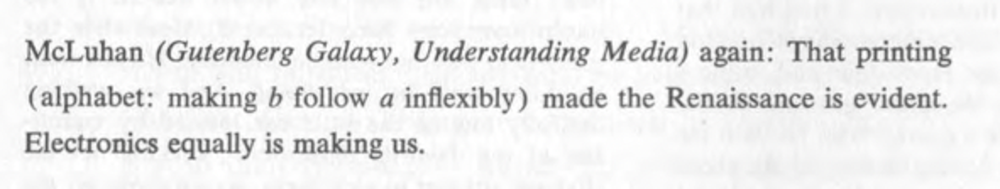
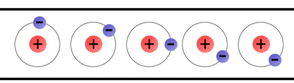
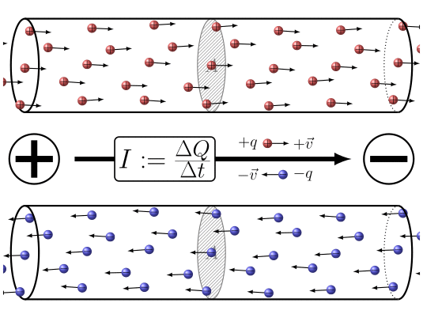
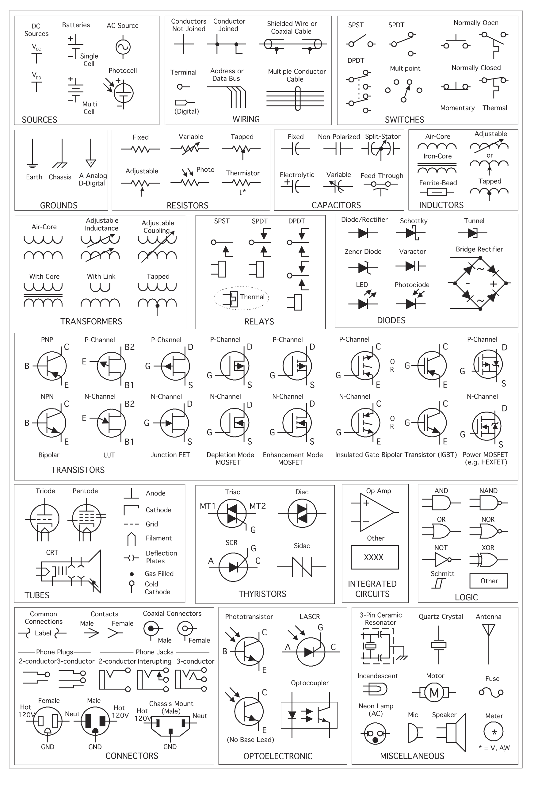
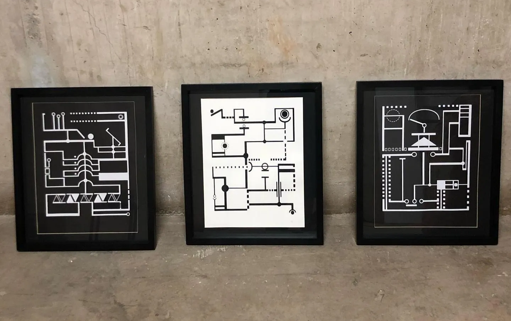

# Presentación : Introducción a la Electricidad

“McLuhan (*La Galaxia Gutenberg, Comprender los medios de comunicación*) de nuevo: que la imprenta (alfabeto: haber que la b siga siempre a la a) creó el Renacimiento es evidente. De igual modo, la electrónica nos está creando a nosotros” (pag. 26)

Cage, J. (1985). Seriously Comma. En A year from Monday: New lectures and writings (1. paperback ed., 5. print). Wesleyan Univ. Pr.

## 🎨 4 hitos de la electricidad, la teoría de medios y el arte contemporáneo en el Siglo XX

1964 Marshall McLuhan publica [“Comprender los medios de comunicación”](https://archive.org/details/mcluhanmarshallcomprenderlosmediosdecomunicacion)

1968 Exposición [Cibernetic Serendipity](https://www.historyofinformation.com/detail.php?id=863), primera exposición de arte digital

1997 [Documenta X](https://rhizome.org/editorial/2017/mar/02/the-copy-and-the-paste/) y el uso de internet como soporte en el Arte Contemporáneo

2001 Lev Manovich publica [El Lenguaje de los Nuevos Medios](https://uea1arteycomunicacion.wordpress.com/wp-content/uploads/2013/09/manovich-el-legunaje-de-los-nuevos-medios.pdf)

## 🧲 Primeros acercamientos al magnetismo

~ 600 A.C.

Tales de Mileto descubre las propiedades electrostáticas del ámbar (elektrón, en griego)

Mencionado por William Gilbert en *Sobre los imanes, los cuerpos magnéticos y el gran imán terrestre* (1600 D.C.)

## 🪨 Materiales conductivos, aislantes y semiconductores

No existen materiales 100% conductivos o aislantes, sino que mas bien se clasifican según cuanto se oponen al paso de la electricidad.

La tabla de la izquierda muestra tanto elementos como materiales compuestos (Ej. Acero inoxidable = Acero + Cromo)

## ⚛️ Átomos y materiales

La tabla periódica de los elementos ordena la materia según la cantidad de protones

Los átomos se componen de protones (cargas positivas) y neutrones (cargas neutras) en el núcleo, y de una nube de electrones (carga negativa)

## 🥇 El cobre

Un átomo en estado Neutro tiene la misma cantidad de Protones que Electrones

El átomo de Cobre tiene 29 protones y electrones

En la capa más externa de su nube de electrones solo tiene 1 electrón, y tiene el potencial de transformarse en un electrón libre

Un átomo que ganó un electrón es un Catión, y uno que perdió Anión

## ⚡ La electricidad como flujo de electrones

## 🚀 Electrones libres

Electrones más alejados de la órbita central, y que da propiedad eléctrica a los átomos. “Circulan” a lo largo de conductores eléctricos

Si se ubican cargas positivas y negativas a los extremos de un conductor (como el cobre), los electrones se alejan de las negativas y se mueven hacia las positivas

Los electrones más externos están atraídos con menos fuerza al núcleo. Pueden salir de un átomo y moverse a otro.

## (-)  (+)

La cantidad de corriente que un material permite dejar circular se denomina RESISTENCIA

La diferencia de carga entre los polos extremos que ubicamos se llama VOLTAJE.

La cantidad de flujo de electrones se denomina CORRIENTE

Ley de OHM

Ecuación que describe la relación de corriente (I), voltaje (V) y resistencia (R) en cualquier elemento de un circuito eléctrico

$$
I = V/R
$$

### 🚂 Algunos hitos de la electricidad en la época de la revolución industrial

1752 Benjamin Franklin y el experimento con volantín y llave

1791 Galvani descubre la relación entre los músculos del cuerpo y la electricidad

1800 Alessandro Volta crea la primera batería eléctrica

1831 Faraday crea el generador eléctrico (principio Henry-Faraday)

1878 Edison inventa la ampolleta incandescente (la más eficiente a la fecha)

1900 Nikola Tesla desarrolla la Corriente Alterna (AC)

Material audiovisual recomendado: Cosmos S01E10 - The Electric Boy

<https://archive.org/details/cosmos-s01e10-the-electric-boy-with-subtitles-by-vaibhav-khade>

## 📏 Unidades de medida y ejemplos de V, I y R

## 🔋 Voltaje (V)

La tensión eléctrica o diferencia de potencial es una magnitud física que cuantifica la diferencia de potencial eléctrico entre dos puntos.

Se mide en Volts (V)

Fuentes de voltaje DC

Fuentes de voltaje AC

Fuente poder típica: Adaptador AC (220V) a DC (24V)

_16.02.46.png)

## ⚡ Corriente (I)

Flujo de partículas cargadas, como electrones o iones, que se mueven a través de un conductor eléctrico o un espacio

Se mide en Amperes (A)

Alargador típico de 10A (a 220V)

Cargador USB de 3A (a 5v)

## ✊🏽 Resistencia (R)

Oposición que presenta un elemento al paso de la corriente eléctrica.

Se mide en Ohms (Ω)

La ampolleta genera luz y calor al oponerse a la corriente eléctrica

El hervidor eléctrico de agua funciona en base a una resistencia

## 🔀 Circuito eléctrico

Arreglo de resistencias, cables, u otros componentes eléctricos, conectados en forma de lazo cerrado, que generan que la energía fluye a través de él.

Trabajaremos con un arreglo sencillo de 2 pilas, un interruptor y una ampolleta

Circuito abierto (interrumpido)

Circuito cerrado

Representación de esquemático como dibujo

Representación gráfica (esquemático)

## 🪄 Potencia eléctrica (W)

$$
Potencia = Voltaje (V) * Corriente (I)
$$

La potencia nos permite saber fácilmente el consumo de un circuito. Se mide en Watts (W)

Ej. Una extensión eléctrica (alargador) puede dejar pasar hasta 10A de corriente, y funciona a 220V

$$
P = 220V*10A

$$

$$
P = 2200 W
$$

_12.32.58.png)

## Consumo de potencia (lo que mide la compañía eléctrica)

La electricidad se cobra según el nivel de consumo por hora, con la unidad **kilo watt hora** (kWh)

Al 12 de noviembre de 2024 el costo de valor hora en Chile es de $192.

<https://www.enel.cl/es/clientes/tarifas-y-regulacion/consumo-artefactos-electricos.html>

## 🏃🏽‍♂️ Circuitos serie y paralelo

_12.10.48.png)

Ambos interruptores son dependientes. Su relación es de tipo AND (y)

SW1 Y SW2 encendidos → Ampolleta encendida

_12.09.28.png)

Ambos interruptores son independientes. Su relación es de tipo OR (o)

SW1 o SW2 encendidos → Ampolleta encendida

### Como leer componentes electrónicos

Serigrafías de María Ignacia Valdebenito basadas en símbolos electrónicos

---

`Presentación creada para el curso de Medios II (Universidad de Chile) por Matías Serrano. 2024`
