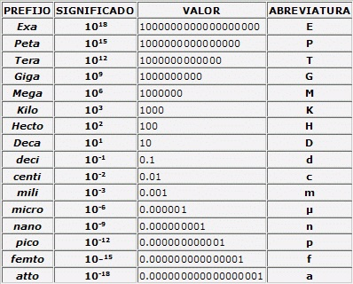

# sesion-03a

martes 25 marzo 2025

## primera mitad

Prefijos científicos

repaso de serie y paralelo

[Datasheet del 555](./archivos/lm555-datasheet.pdf)

circuitos integrados (IC)

chip 555

## segunda mitad

circuito astable con chip 555

Revisar proceso de armado en [miprimer555.md](./miprimer555.md)

calculadora de circuito astable con chip 555

agregar potenciómetro

## encargo06: cultura electrónica europea de los 1980s y 1990s

escoger una de estas dos:

* escuchar un disco de la banda alemana einstürzende neubauten, incluyendo investigación en los instrumentos que usan.
* escuchar un disco de la banda francesa stereolab, incluyendo investigación sobre los sintetizadores y teclados que usan, además de las referencias estílisticas que citan de otras bandas y contextos.

## encargo07: apuntes sobre digerir, reflexión y expansión del chip 555

explicar en palabras, imágenes, video, diagramas, etc, lo que hicimos hoy día con el chip 555, incluyendo el circuito astable 555.

agregar sus apuntes a GitHub, incluyendo fotos, diagramas, tanto de lo que hicimos en clase, como de otras configuraciones y aplicaciones del chip 555.
