# Circuito electrónico aplicado: Oscilador Astable con 555

## 〰️ Oscilador astable

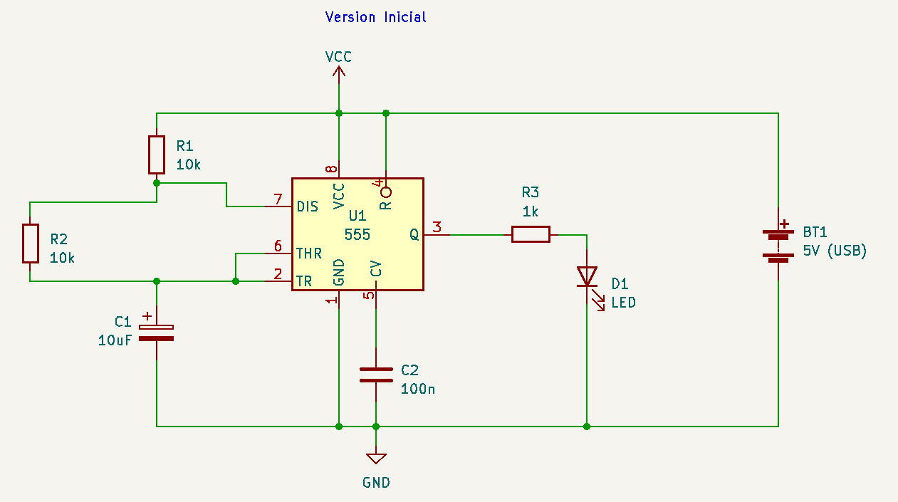

### 🎱 Lista de materiales (BOM)

| **TIPO**                  | **VALOR**    | **CANTIDAD** |
| ------------------------- | -----------  | ------------ |
| Circuito integrado        | NE555        | 1            |
| Protoboard                |              | 1            |
| LED                       | 5mm rojo     | 1            |
| Resistencia               | 10k 1/4w     | 2            |
| Resistencia               | 1k 1/4w      | 2            |
| Fotoresistencia           | LDR          | 1            |
| Potenciómetro             | 100k o 500k  | 1            |
| Condensador cerámico      | 470nF (474)  | 2            |
| Condensador electrolítico | 100uF        | 1            |
| Condensador electrolítico | 10uF         | 1            |
| Condensador electrolítico | 1uF          | 1            |
| Cables                    | Dupont (M-M) | 15           |
| Cables                    | Caimanes     | 4            |
| Parlante                  | 8ohm 0.5W    | 1            |

## Base para circuito: La protoboard

Base para instalar componentes electrónicos, probar circuitos y poder reemplazarlos rápidamente

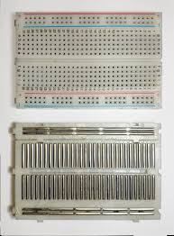

Una protoboard por dentro

## 🚶🏽‍♂️ Paso a paso*

**Algunos colores de resistencias de la imagen y valores de condensadores no conciden con los que utilizaremos*

1. Ubicamos 555

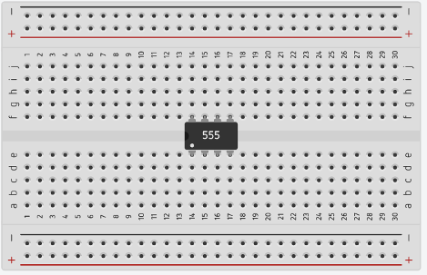

1. Conectamos la pata 8 al carril [+] y la 1 al carril [-]

1. Interconectamos entre ellas las patas 2 y 6, luego la pata 4 hacia el carril [+]

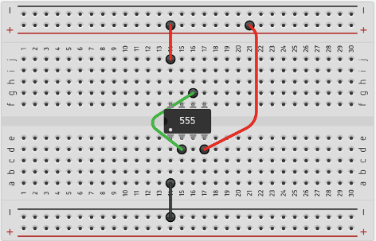

1. Conectamos una pata del condensador de 100nF en la pata 5, y la otra a un lado. Luego con un cable la llevamos al carril [-] (Dice **104**)

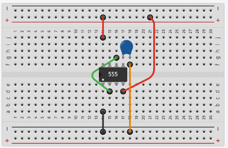

1. Conectamos el condensador de 10uF en la pata 2 hacia el carril [-]. Ojo con la polaridad: la pata corta va hacia negativo

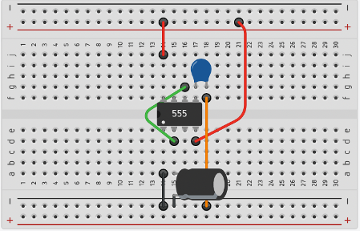

1. Conectamos R1, resistencia de 10k, entre la pata 7 y el carril [+]
**Código de color de resistencia de 10k:**

    **Café - Negro - Naranjo - Dorado**

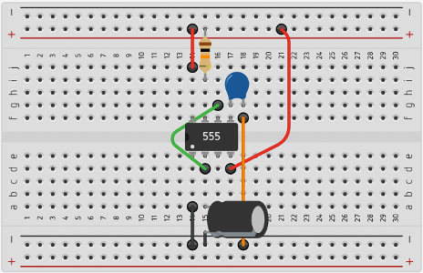

1. La resistencia R2 la conectaremos un poco alejada, y luego la llevaremos con cables a las patas 7 y 2

    **Código de color de resistencia de 10k:**

    **Café - Negro - Naranjo - Dorado**

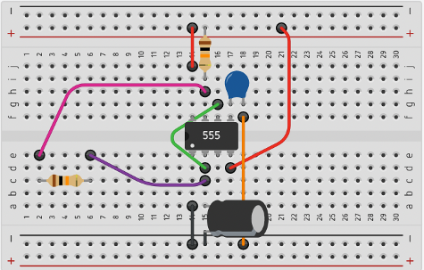

1. Agregaremos en la pata 3 una resistencia de 1k y un LED de la siguiente forma

    **Código de color de resistencia de 1k:**

    **Café - Negro - Rojo - Dorado**

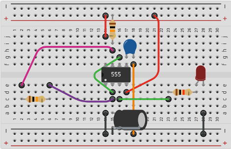

### Circuito final

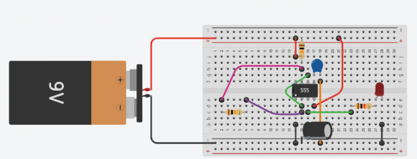

## Modificaciones

### 1. Uso de potenciómetro

Reemplacemos R2 por un potenciómetro, en las patas 1 y 2 de éste. ¿Qué pasa con el LED cuando giro la perilla?

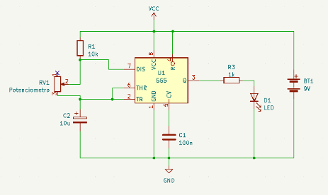

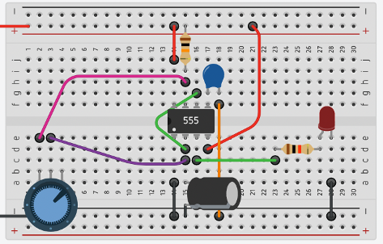

### 1. ¿Parpadea DEMASIADO lento?

Reemplacemos el valor de por un potenciómetro, en las patas 1 y 2 de éste. ¿Qué pasa con el LED cuando giro la perilla?

### 3. Incluir un parlante

Podemos reemplazar el led de salida por un parlante. Para mayor seguridad, se debe ubicar un condensador entre la pata 3 y el parlante (100uF o más)

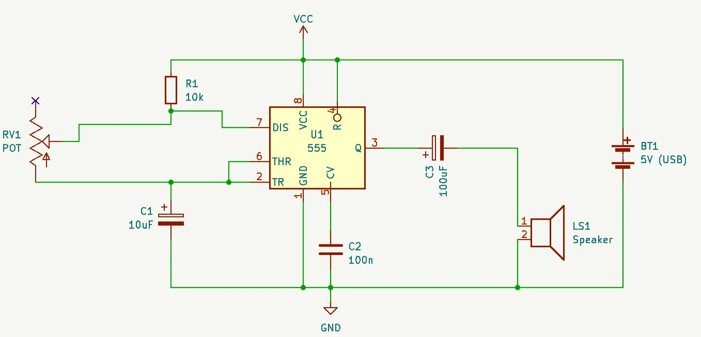

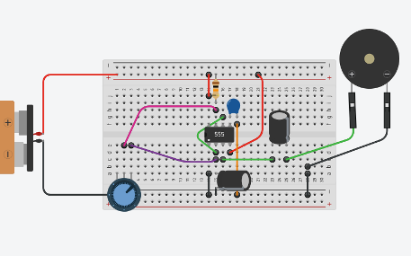

### 4. Uso de LDR (Theremin de luz)

Si reemplazamos el potenciómetro por un LDR, la luz que le llegue al LDR determinará la frecuencia de oscilación

### 5. Resistencias experimentales (plantas, líquidos, piel, etc)

Puedes reemplazar la resistencia que está entre las patas 2 y 7 del 555 por cualquier material orgánico. ¡Experimenta!

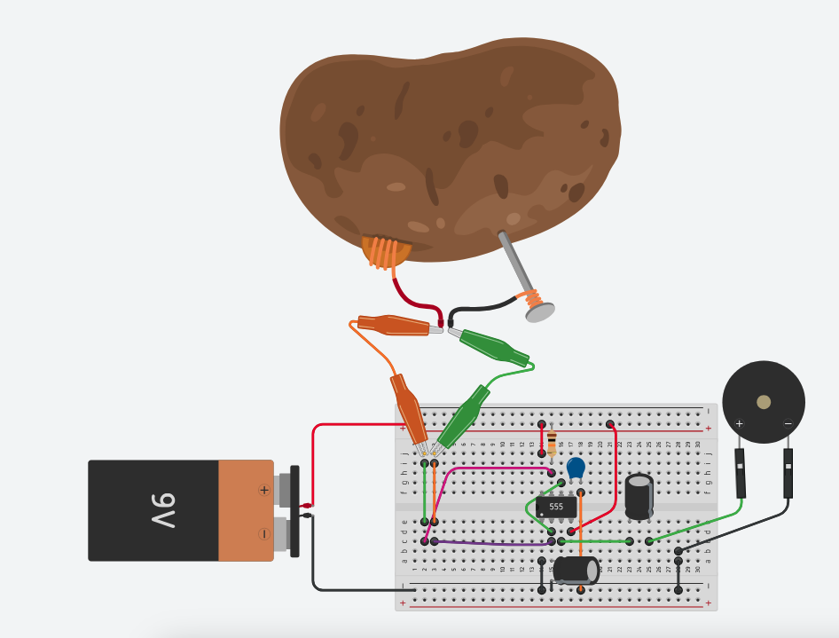

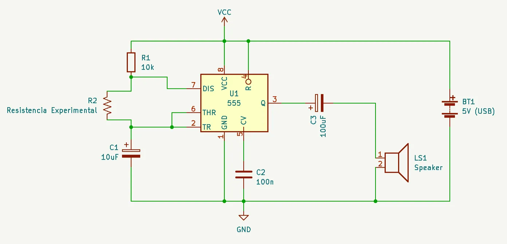

### Tip: Ajustar rango de frecuencia

A veces nuestro circuito suena de forma muy lenta, y podríamos querer que fuera más agudo. Para ello, reemplaza el condensador que va en la pata 2 del 555.

* Condensador más grande → Baja la frecuencia (suena más grave)**

* Condensador más pequeño → Aumenta la frecuencia (suena más agudo)**

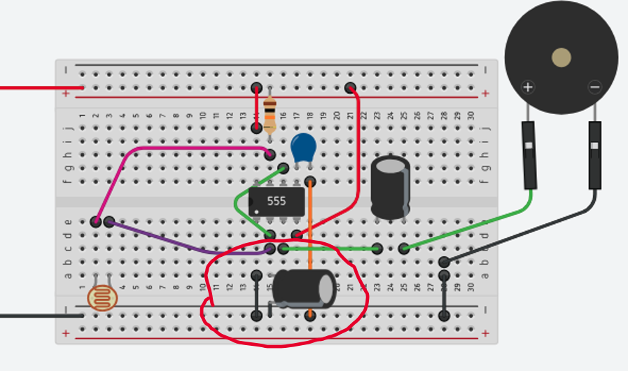

## Calculadora de frecuencia

La oscilación de este circuito está determinada por los valores de R1, R2 y C1. Esta web te ayudará a calcular qué frecuencia se puede obtener

<https://ohmslawcalculator.com/555-astable-calculator>

La frecuencia se calcula según la siguiente fórmula

$$
f =  \frac{1.44}{(R1 + 2* R2)*C1}
$$

*(recuerda ignorar los prefijos. Si el valor es 10k, considéralo como 10000, y que 10uF corresponde a $10 * 10^{-6}$
)*

## Muchos circuitos para explorar en base al 555

    + info sobre el 555

<https://www.555-timer-circuits.com/>

    + atari punk console
<https://www.instructables.com/Atari-Punk-Console-Synthesizer/>

    + Crea tus propios sintetizadores:

<https://hackaday.com/2015/02/04/logic-noise-sweet-sweet-oscillator-sounds/>

    + Libro de electrónica relativamente amigable (Practical electronics for inventors)**

<http://instrumentacion.qi.fcen.uba.ar/libro/Scherz.pdf>

---

Guía diseñada en octubre de 2024 y actualizada en noviembre de 2024 por Matías Serrano Acevedo para el Programa de Estudios Libres del Museo de Arte Contemporáneo.

<http://misaa.cc>
