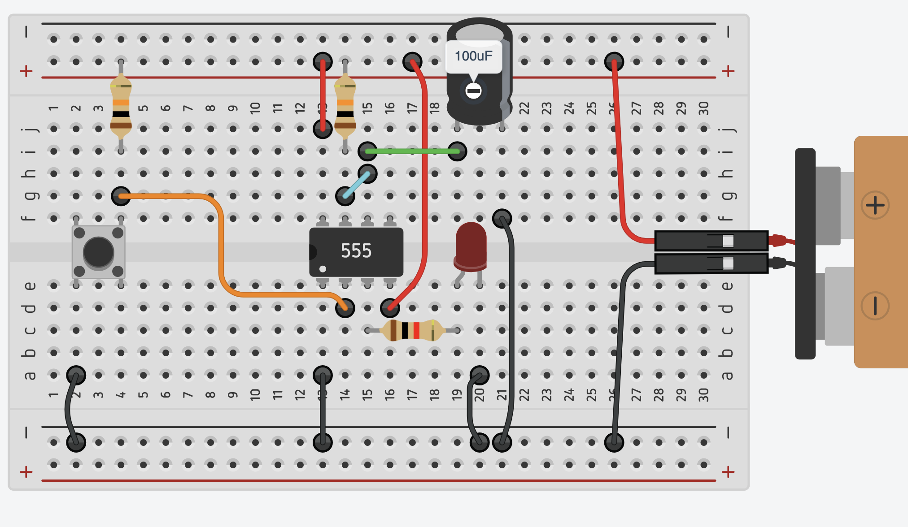

# sesion-04b

viernes 04 de abril 2025

[atari punk console en circuits.js](https://www.falstad.com/circuit/circuitjs.html?ctz=CQAgjCAMB0l3BWEBmayxgQFgWAnAgBwBseATOmSApNSFstQKYC0GAUGMUsVuOSEK18VYlE7cUCKiJTFC-UfWh5VagvHhh2Ac3DFayafsOE+tSOwBK4Mgq7C7thRfq0krmAl30sC5PK+-mZQ4gBOKFRkZHzIMgahYPDsAO6RJs4ZlmlxINF8vHkx4jlRhAqFdi7sAMbpcYZUAQp8YKwKZNAA7F28eF1k8gREXZAesJAQlnq5zfUhFqn1ZLSFDSXLjXnlG7L5illLsg6ZJ9kHJ1hch2l+tPt3N-RCGVdiZ0cCZAhiZAN5Pw2RiixXW+3O60u1w+dXWcJWKBCrQmmlRmjaLC6UGg5SIyACkG4hDA+II2LgUx8cJC6ywcFCEIRcOM60Z91BTIR5z+UUBPO21TS-KqUjKgqCchaflF4gA8nl-t9foq6Qz2PLHkrnvdVYswF0+Cxclq2L8dhAkppyWMQFYmABnACW9oALgBDAB2NSYSyNYvSIvOpoVTSi-0ZIYDxUs+r4Wr2iuKFtR2LwYzwtodzvdXp9Qr5HPZ5iWwsg-gRK3FYLLkWECUsAHttoJQnS8ApxlNwOwm2QMy56EkxJ3EuwgA)

## Circuito Monoestable

¿cómo funciona un botón push? (normalmente abierto / N.O.)

## recursos y referencias

[calculadora monoestable](https://ohmslawcalculator.com/555-monostable-calculator)

[app para android](https://play.google.com/store/apps/details?id=it.android.demi.elettronica&hl=es_CL)

[pedales lehle](https://www.lehle.com/lehle-dual-expression)

[katode - tienda de electrónica para pedales](https://www.katode.cl/)

## encargo-10: wendy carlos

escuchar y analizar álbum switched on bach

## encargo-11: bajando opacidad a la caja negra

Escoger un aparato electrónico, que no funcione (o este dispuestx a destruir), y abrirlo para explorar su interfaz. Diseccionar. Analizar.  OBVIAMENTE APARATO DEBE ESTAR DESCONECTADO Y APAGADO ❗ NI TRABAJAR A PATA PELÁ 🦶

DOCUMENTAR EN FOTOGRAFÍAS

* ¿Cómo se utiliza al aparato? ¿Cómo me indica esa manera de uso? Gestos, contexto (Función indicativa y simbólica)
* ¿Quién es el usuario esperado? Condiciones de accesibilidad
* ¿Qué interacción ofrece desde fuera? ¿Hay botones, perillas? ¿Cuántos? ¿Qué grados de control entrega? EXHAUSTIVIDAD
* ¿De donde obtiene energía este aparato?
* ¿Hay una PCB principal? ¿No hay? ¿hay varias? ¿Cómo se interconectan?  ¿Hay números, textos, dibujos? ¿versiones, números de serie?
* Realizar diagrama de flujo: ¿Qué placas requieren alimentación? ¿Dónde llegan las interacciones? Usar lenguaje simbólico propio
* Bill of materials. ¿Qué y cuantas partes tiene? de manera general
