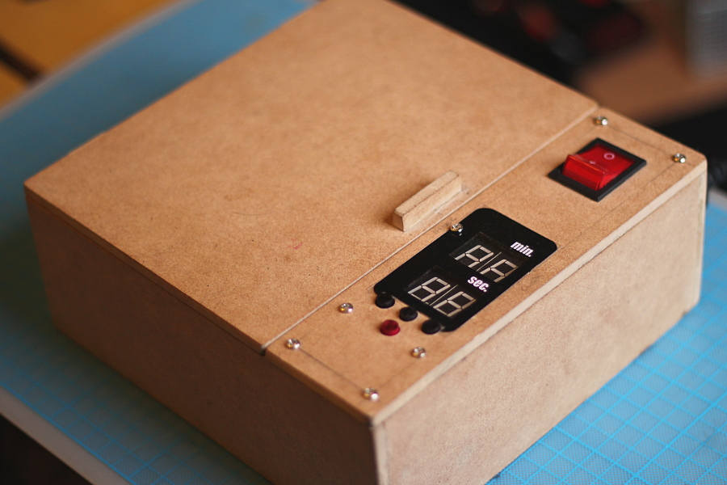
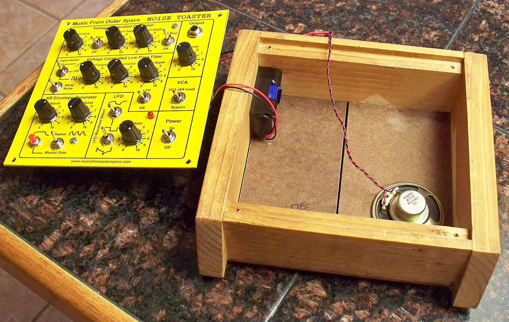
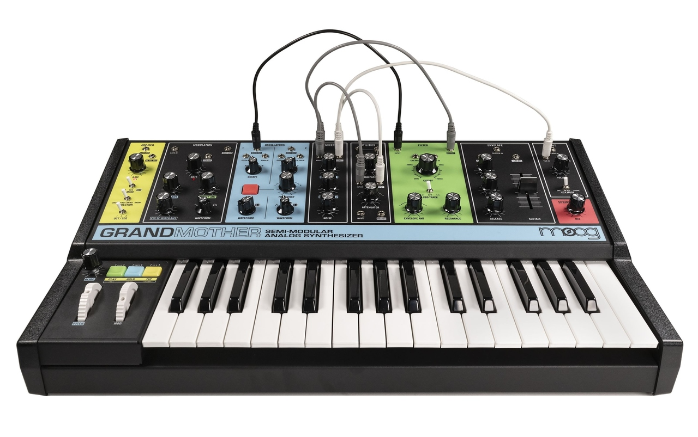
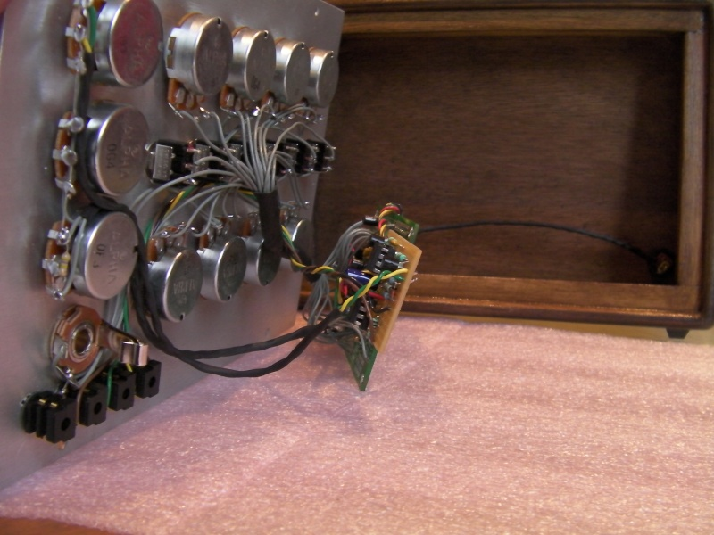
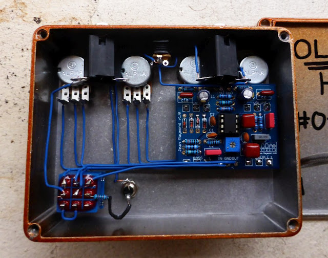

# Referencias enclosures

[Insoladora UV pt.1 (battlecoder)](https://bitofmystery.com/uv-exposure-box-project-part-1/)

[Insoladora UV pt.2 (battlecoder)](https://bitofmystery.com/uv-exposure-box-project-part-2/)

[Noise toaster (MFOS)](https://musicfromouterspace.com/analogsynth_new/NOISETOASTER/NOISETOASTER.php)

[MOOG Grandmother](https://colleenplays.org/2022/07/18/inside-the-moog-grandmother/)

[Weird Sound Generator](https://musicfromouterspace.com/analogsynth_new/WSG2010/OLD_WEIRDSOUNDGENERATORREBORN.html)

[Stompbox wiring guide](https://musicfromouterspace.com/analogsynth_new/WSG2010/OLD_WEIRDSOUNDGENERATORREBORN.html)