# sesion-05b

viernes 11 de abril 2025

## Dos tipos de componentes: para PCB y para Panel

Los componentes para pcb están pensados para conectarse directamente en las placas (pcb o perfboard)

Potenciómetro para PCB

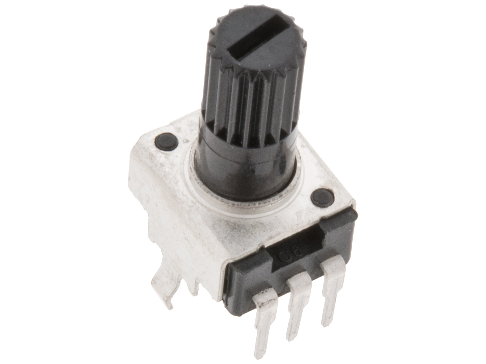

Potenciómetro para Panel (incluye un hilo para colocar una tuerca, y debe llevarse con cables)

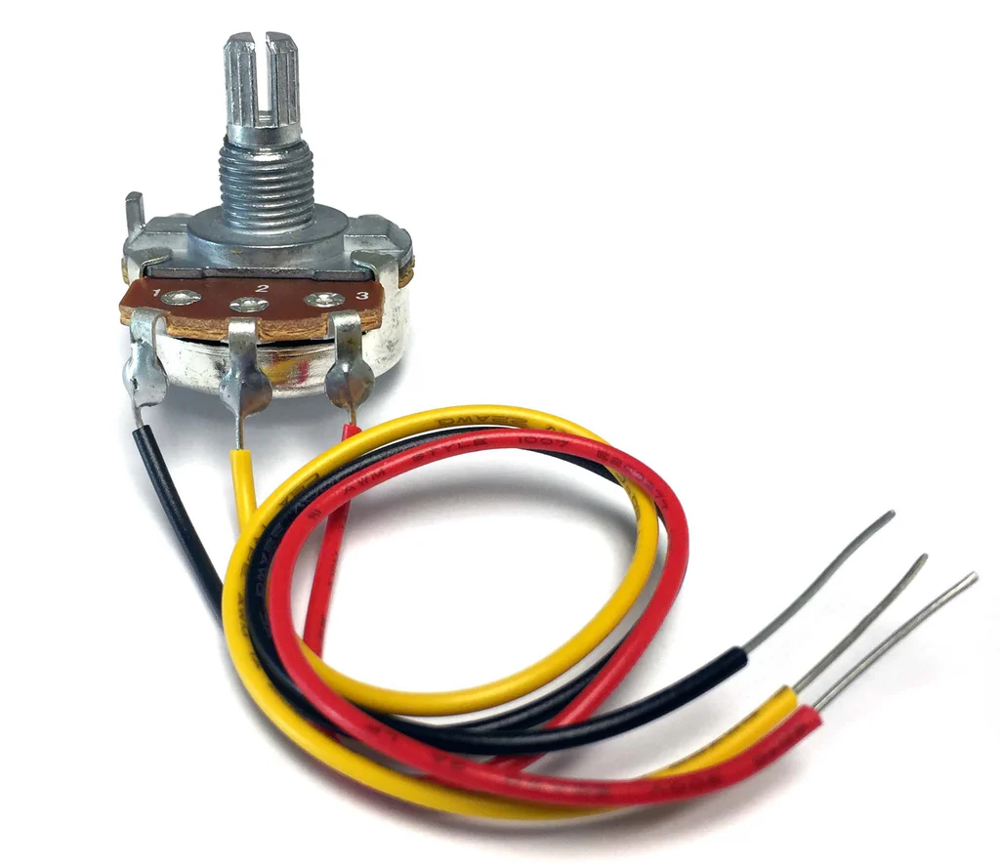

### Placa perforada

Placa que viene perforada de fábrica para fijar componentes de forma más permanente. Hay de distintos tamaños y colores.

Algunos traen los hoyitos aislados.

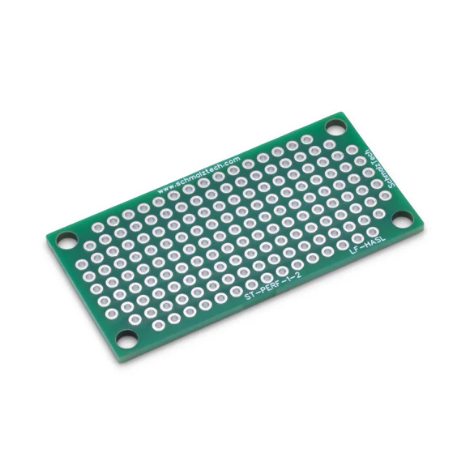

Otras los traen pre-conectados

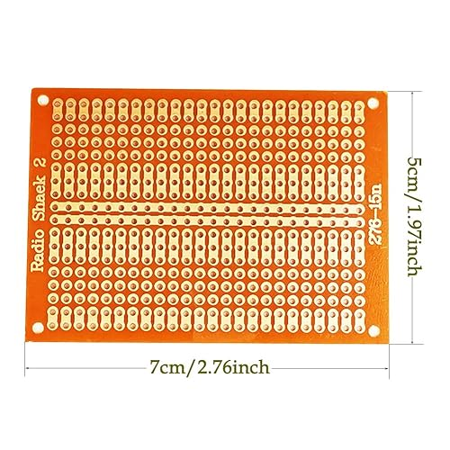

Así se ve una perfboard terminada por encima (top)

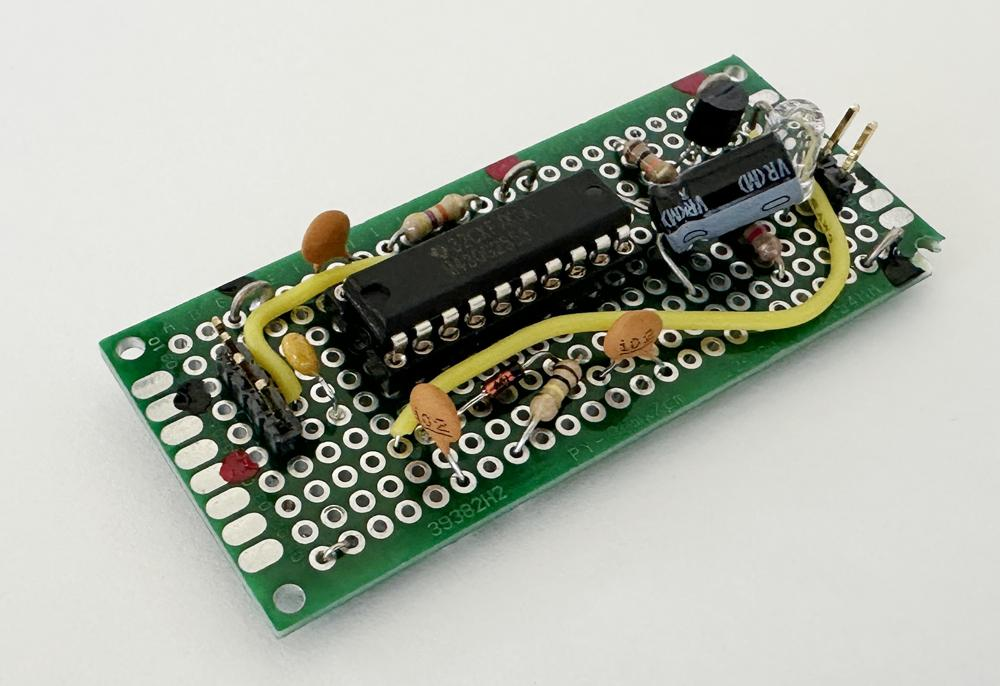

Así se vería por debajo (bottom)

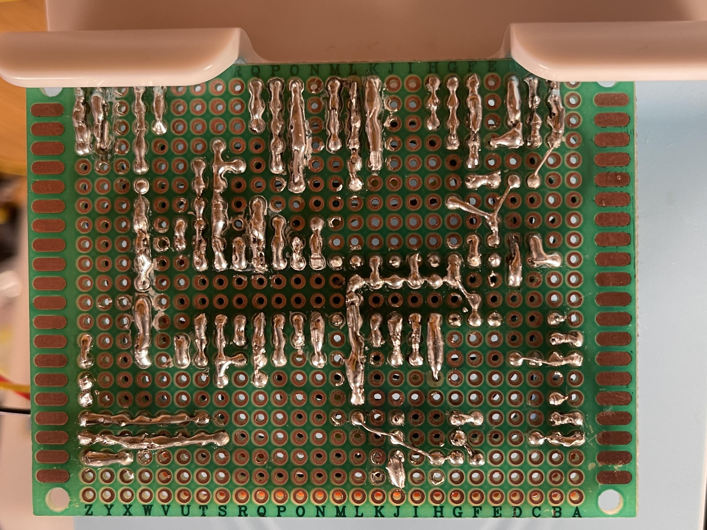

En una perfboard deben ser conectados los componentes a través de cables. Se puede hacer poco a poco, o también planear con antelación

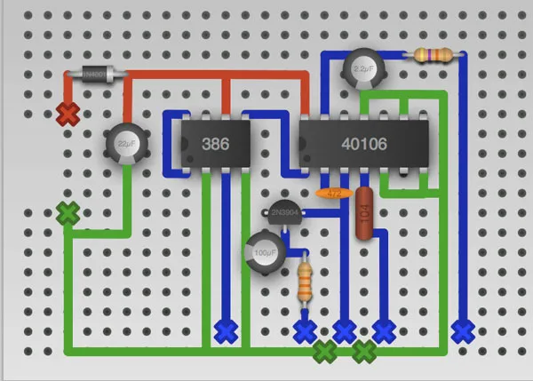

Es MUY importante no soldar los IC (como el 555) de forma directa a la perfboard, sino que instalar una base DIP como intermediaria. Éstas permiten reemplazar el componente con facilidad sin necesidad de desoldar en caso de falla. ¡Es más fácil soldar que desoldar!

En la imagen hay una base DIP de 20 pines (DIP-20). DIP significa Double In-Line Package

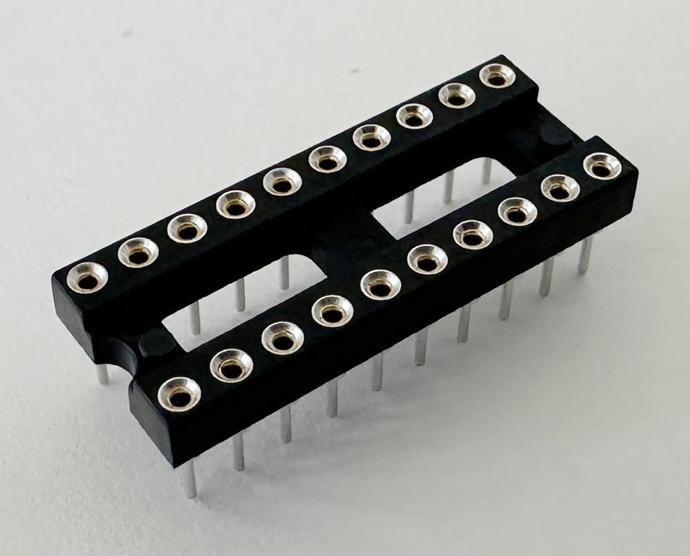

Conocer y escoger los conectores correctos y precisos se aprende con la práctica. Inicialmente utilizaremos cable directo soldado a a la PCB.

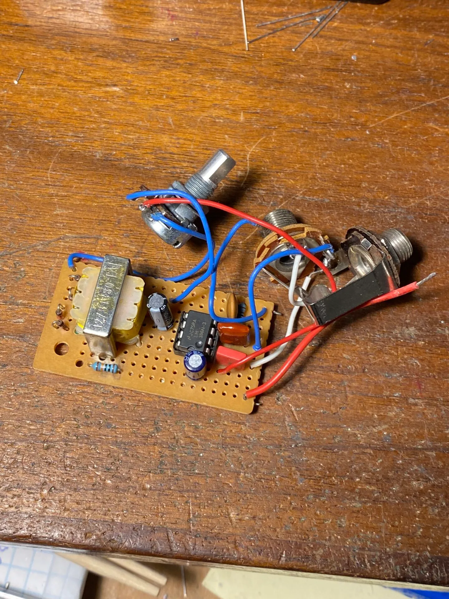

Con el tiempo lograrán planificar y elegir conectores apropiados para cada tipo de señal.

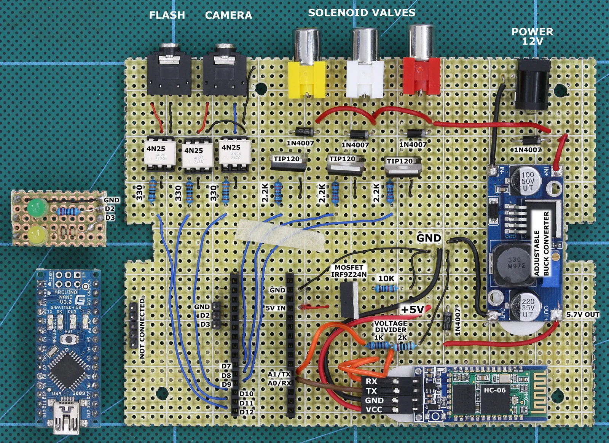

### Soldar

Para soldar hay que seguir 4 pasos:

1. Pasar alambre o cable a través de PAD
2. Calentar alambre Y pad al mismo tiempo con el cautín (3 seg)
3. Sin retirar el cautín, insertar soldadura
4. Sin sacar cautín, sacar soldadura
5. Esperar 3 segundos, luego retirar el cautín

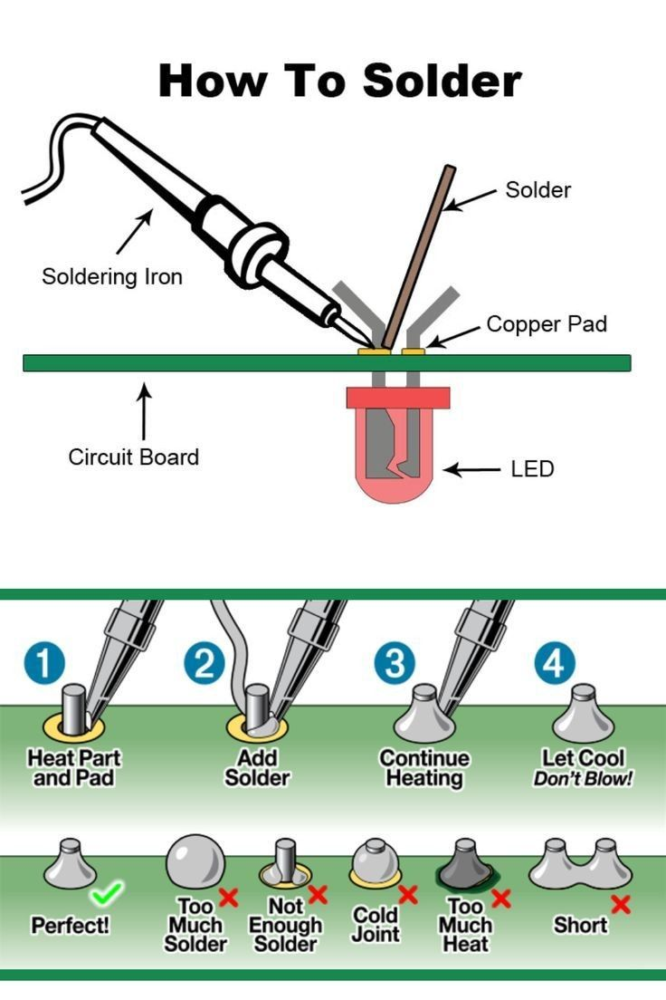

Puedes visitar el [manual para soldar](./archivos/nasa_soldar.pdf) con recomendacioens de la NASA

## Video tutoral para soldar placa perforada (en inglés)

[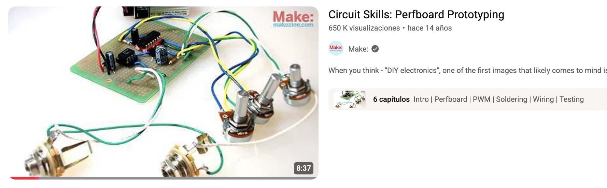](https://youtu.be/3N3ApzmyjzE?t=228)
