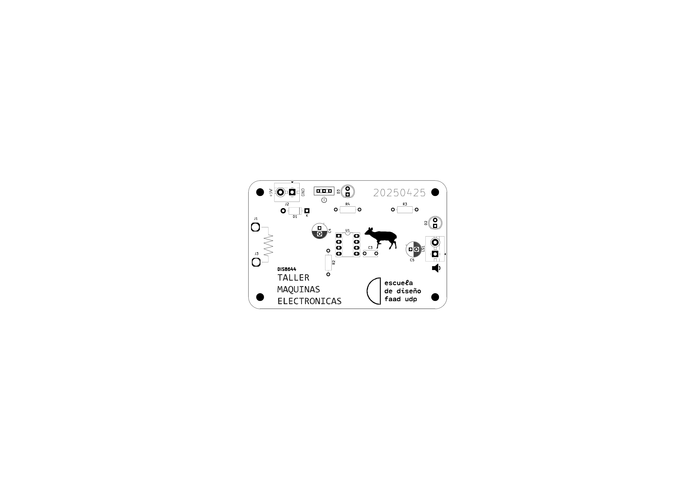
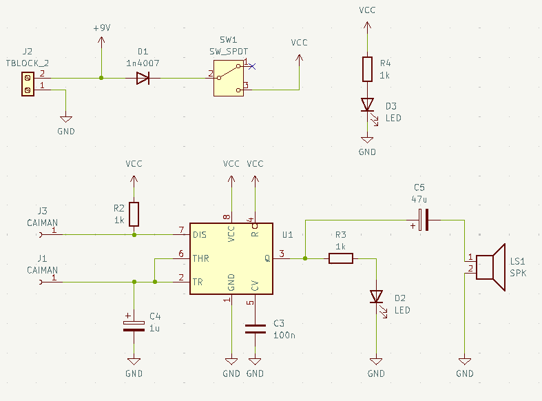

# sesion-10b

viernes 16 de mayo 2025

## bom udpudu

|Referencia  |Valor   |Huella                   |Qty|OBS               |
|------------|--------|-------------------------|---|------------------|
|U1          |~       |Socket 8 pines           |1  |                  |
|R2,R3,R4    |1k      |Resistencias             |3  |                  |
|D1          |1n4007  |Diodo                    |1  |                  |
|C3          |100n    |Condensador cerámico     |1  |104               |
|C4          |1u      |Condensador electrolítico|1  |                  |
|C5          |47u     |Condensador electrolítico|1  |                  |
|D2,D3       |LED     |Led 5mm                  |2  |                  |
|J2          |TBLOCK_2|Terminal Block 2         |1  |                  |
|LS1         |SPK     |Terminal Block 2         |1  |                  |
|SW1         |SW_SPDT |Switch spdt              |1  |                  |
|U1          |NE555   |DIP-8                    |1  |Va en el socket U1|
|Clip batería|9v      |                         |1  |                  |
|Parlante    |8ohm    |                         |1  |                  |
|J1,J3       |CAIMAN  |Cables caimán            |2  |                  |

## encargo-22: documentación textual del proceso de ensamblado de udpudu

escribir manual con pasos a seguir, receta, de los pasos que siguieron para ensamblar la PCB.

incluir aciertos y errores, aprendizajes y consejos.

## encargo-23: documentación visual del proceso de ensamblado de udpudu

complementar encargo 22 con fotos explicativas de los materiales usados, de los pasos, etc.
