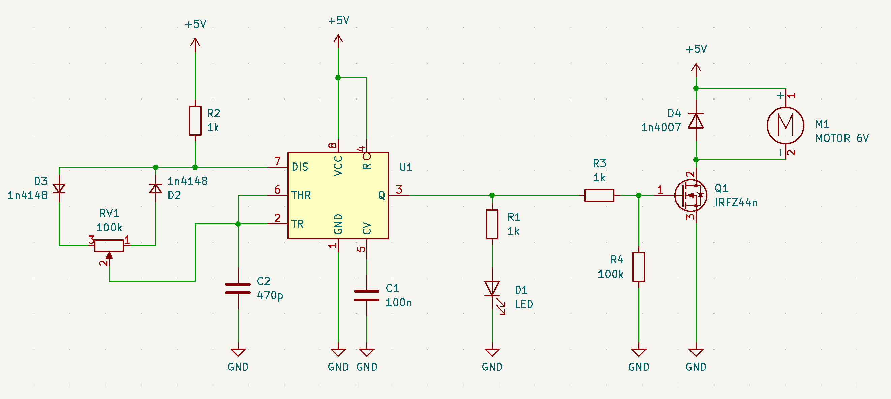

# sesion-11a

martes 20 mayo 2025

no hay encargos por ser semana de solemne

partimos hoy hablando de OOO: ontología orientada a objetos.

nos visitó la profesora Merry Fáundez, acompañada de 2 estudiantes de enseñanza media interesades en diseño UDP, y les hicimos una visita guiada por el trabajo de taller de hoy.

hoy usamos un transistor MOSFET <https://en.wikipedia.org/wiki/MOSFET> para controlar la velocidad de un motor de corriente continua. partimos con la salida de un 555 haciendo PWM en un LED, y vimos que el motor necesita más corriente que la que el 555 es capaz de emitir.

por eso usamos un MOSFET, donde conectamos a su terminal Gate la salida del 555. Conectamos a tierra la terminal Source del MOSFET, y la terminal Drain la conectamos a 9V a través de un diodo.

Finalmente conectamos el motor en paralelo al diodo, y aprendimos que podemos invertir el sentido de giro del motor al invertir la conexión del motor.

