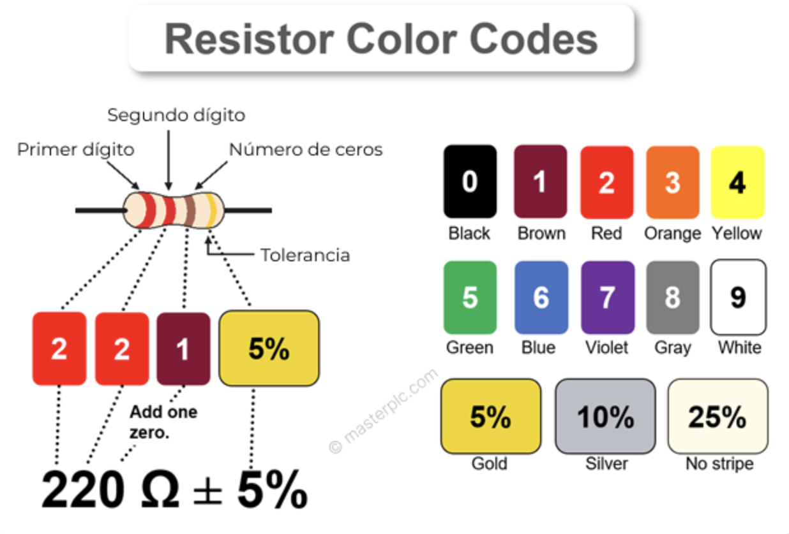
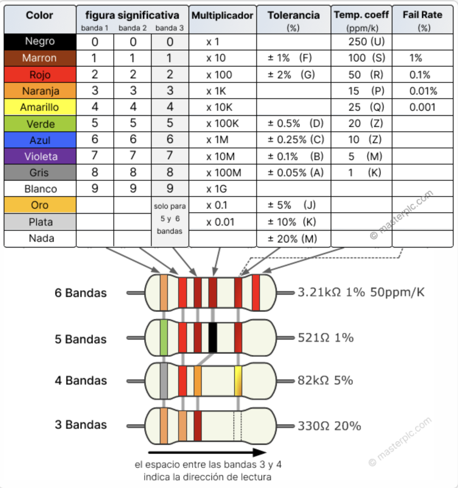
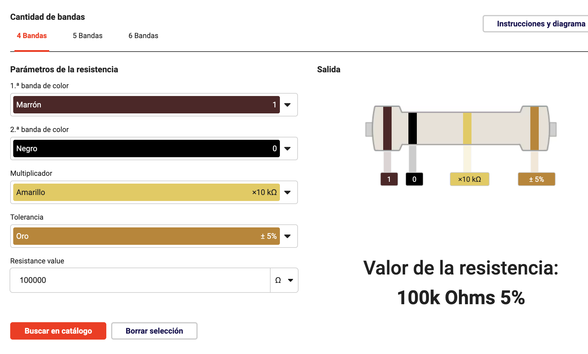
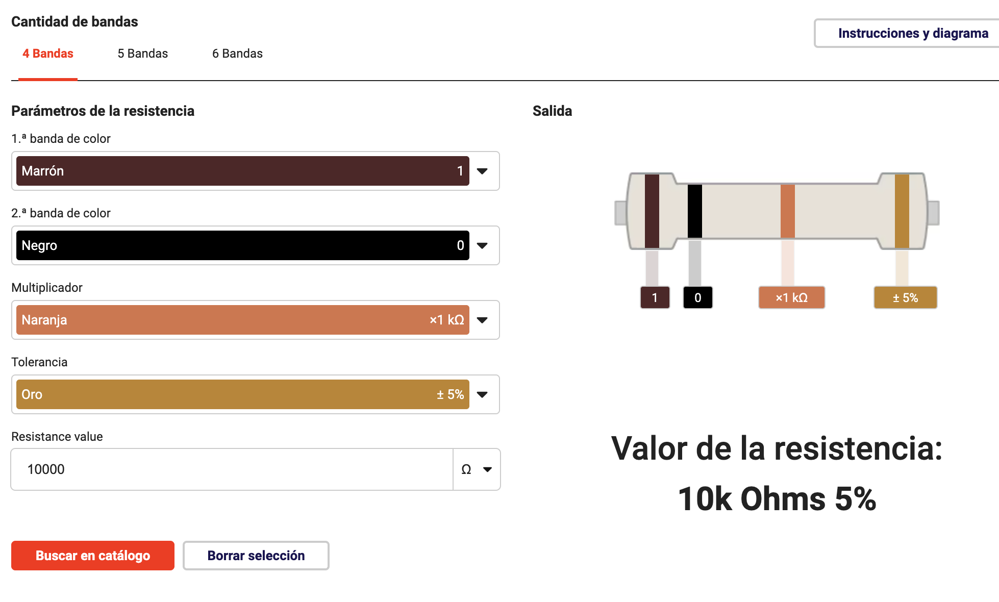
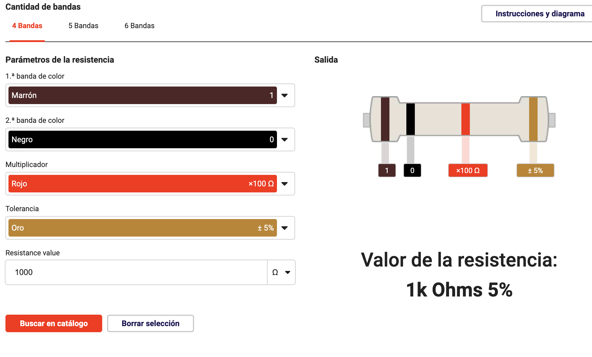
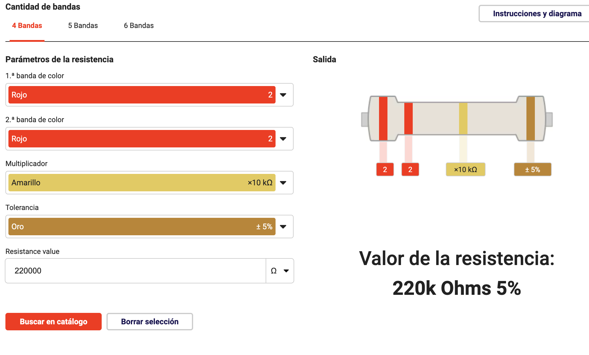
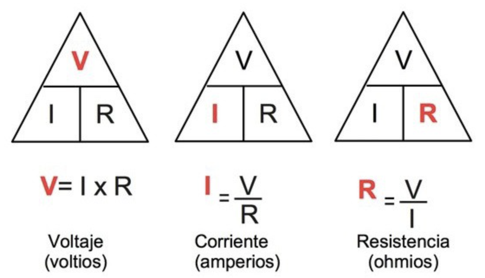
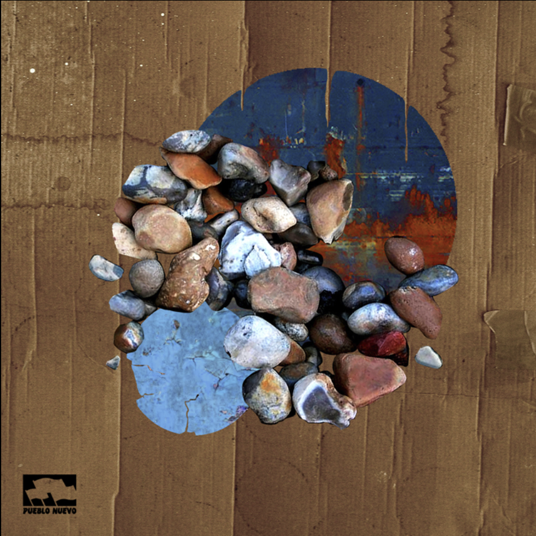
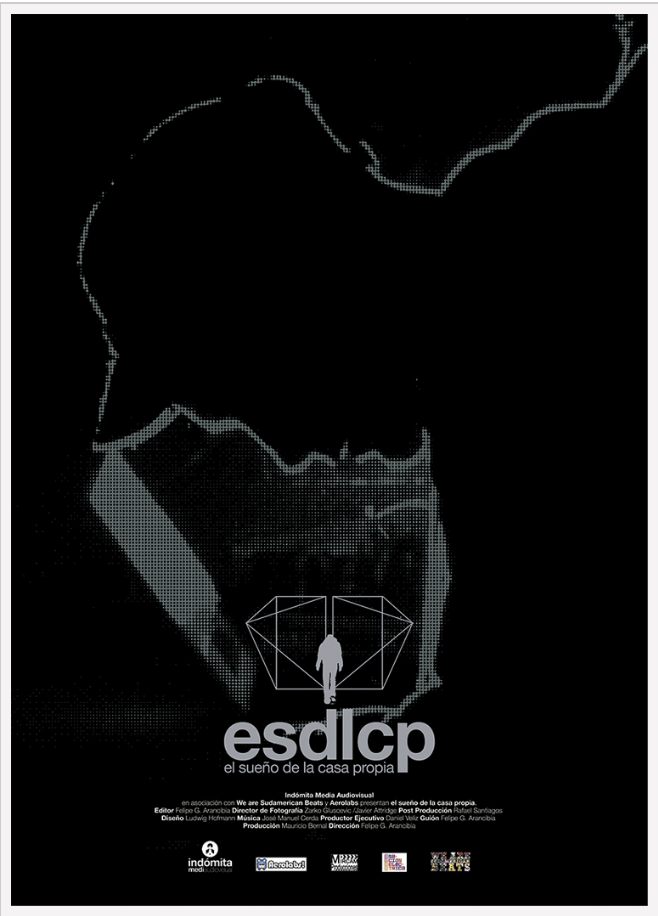

# sesion-02a

## APUNTES 18/03

ejercicio práctico 18/03
  

### circuito en serie ejercicio
  
  
  

### resistencias

¿cómo leer una resistencia?
  

imágenes tomadas de <https://masterplc.com/calculadora/codigo-de-colores-de-resistencias/>

### Calculadora de código de colores de resistencias de 4 bandas
  
100k Ω

10k Ω

1k Ω

220k Ω

* ### ley de Ohm (Ω)

se usa para determinar la relación entre tensión, corriente y resistencia en un circuito eléctrico.

* **V** es el potencial eléctrico en voltios.
* **I** es la corriente en amperios.
* **R** es la resistencia en ohms.
  

### disco a elección, pueblo nuevo

El Sueño de la Casa Propia (Chile)

El autor del disco es José Manuel Cerda, nació en Valparaíso, Chile.

"El Sueño de la Casa Propia" fue realizado a principios del 2005 y publicado en pueblo nuevo el 30 octubre de 2020.

Este disco esta compuesto por instrumentos tradicionales y mezclado con la electrónica, dándole un estilo experimental mezclando distintos estilos, por ejemplo: pop, floktronica, sampleadelia,
house, entre otros. Estos sonidos llevan a la cotidianidad de los barrios, de su ciudad natal.
También, ha formado parte de festivales como; el Primavera Fauna, Mutek, Lollapalooza, Nrmal y SXSW.

Este disco cuenta con un documental <https://cinechile.cl/pelicula/el-sueno-de-la-casa-propia/>

Personalmente me gustó bastante el disco, no conocia a este artista y me llamó bastante la atención por el nombre del disco. Porque me transmitió el poder realizar las metas personales con lo que está a nuestro alrededor.

Por otra parte, encontré en una página que decidió hacer este disco después de un intento de suicidio. Por esto, es muy significativa la música y que puede realizar cambios en la vida de uno.

La canción que más me gusto fue "A la velocidad del amor".
