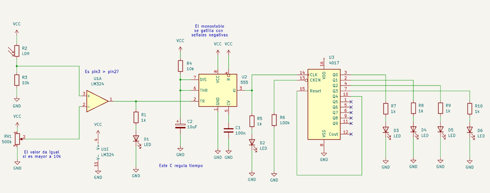

# sesion-12a 27/05

## Detector de sombra

Detector de sombras + Temporizador + Secuenciador
pasos:

1. primero tiene que funcionar el detector de sombras
2. si esta bien deberia funcionar el temporizador
3. agregar el secuenciador.

se desarrollo en base al esquemático mostrado en clases y se realizo con los siguientes chips:

* LM-324
* 555
* 4017
  
## Trabajo en clases

<https://github.com/user-attachments/assets/b7fd7b76-2303-49da-9972-a71614eecb09>
