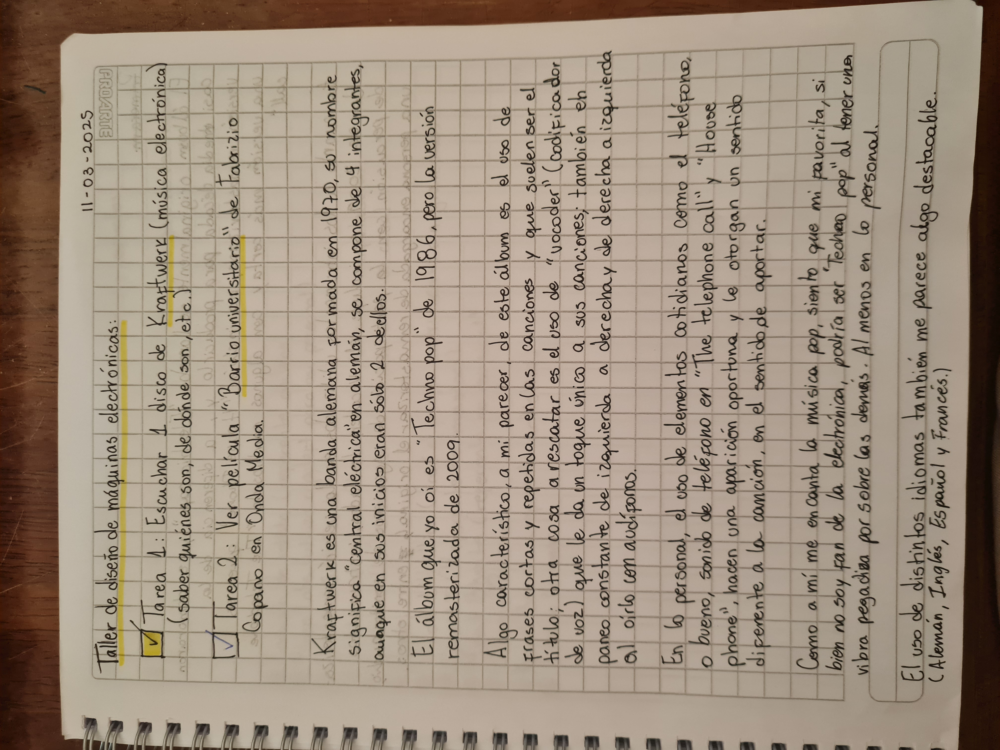
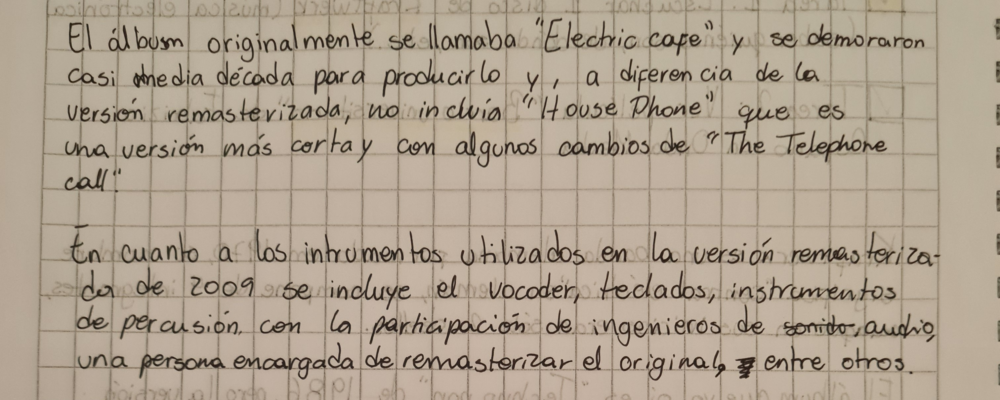
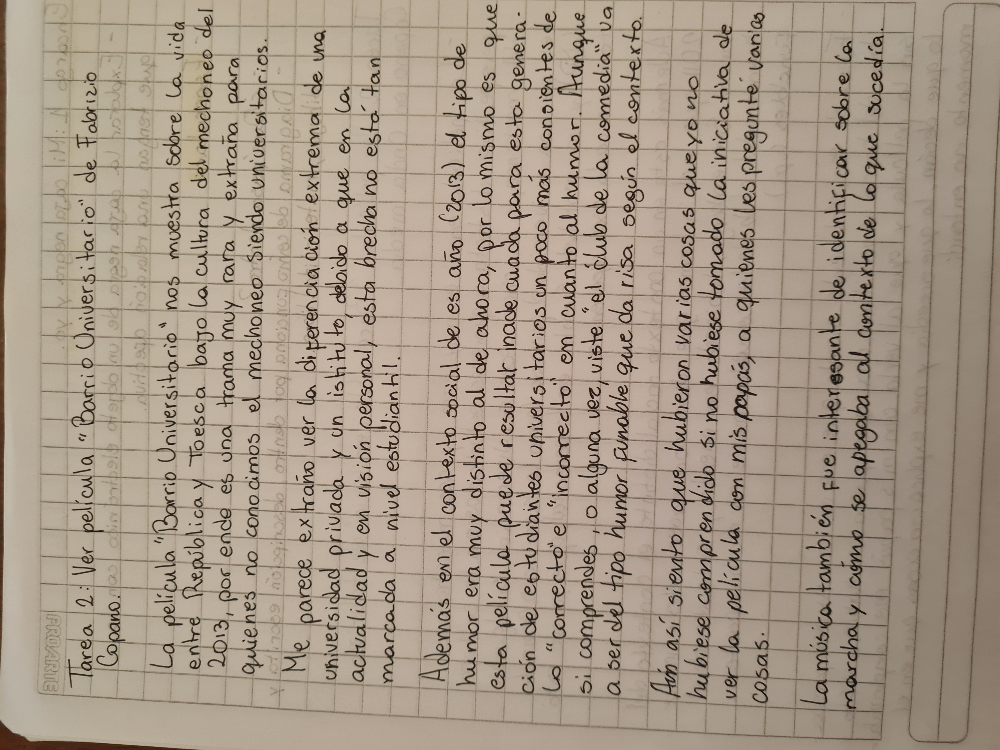
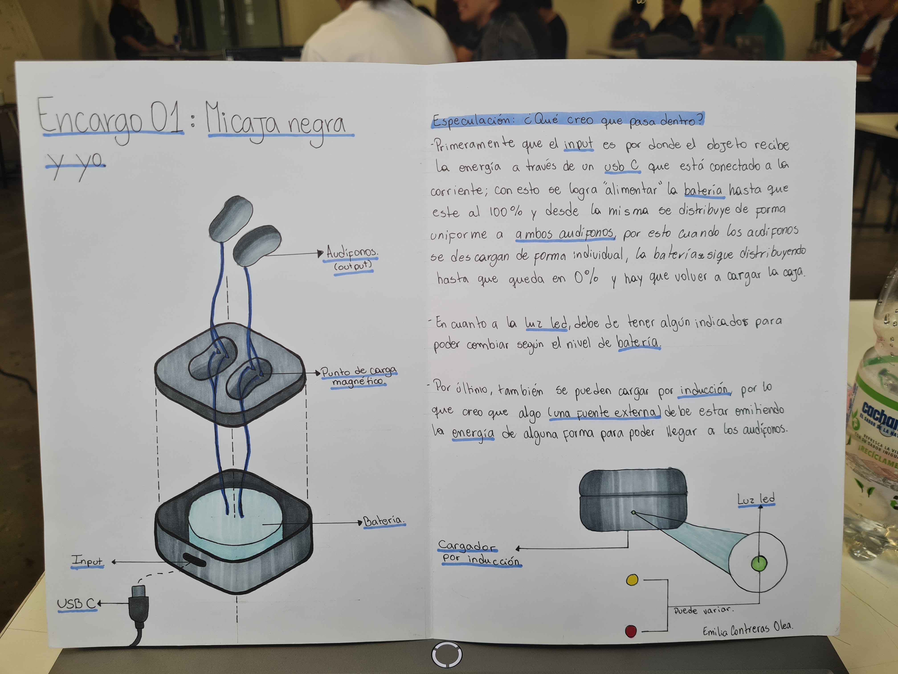

# sesion-01a

11 de Marzo de 2025.

## encargo-00: escuchar disco de Kraftwerk y ver película Barrio Universitario

Escuchar un álbum de **Kraftwerk** (música electrónica).

Foto de mi croquera 01:

Foto de mi croquera 02:

Ver película **Barrio Universitario** de Fabrizio Copano en OndaMedia.

Foto de mi croquera 03:

## encargo-01: Mi caja negra y yo

- Explorar la caja negra de un objeto electrónico con la que tengan una relación afectiva.
- Especular: ¿Qué pasa dentro?
- Diagramar cómo funciona por dentro, tanto dibujos como descripción escrita. Materialidad libre.

Foto diagrama de "mi caja negra"

