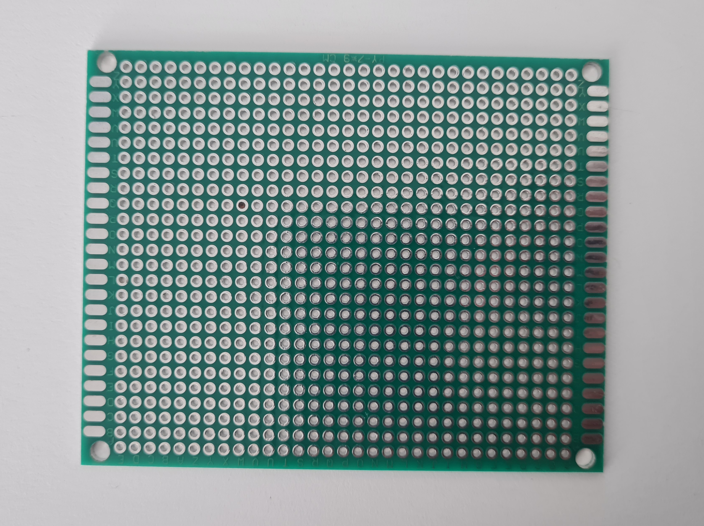

# sesion-05b

11 de Abril de 2025.

## Apuntes de clase: Componentes

Existen dos tipos de componentes: PCB y para panel; los que son para PCB están directamente pensados para conectarse a una perfboard o a una placa PCB.

### 1. Placa perforada o Perfboard

- Es un paso entre la protoboard y la placa PCB.
- No tiene un lado específico de uso.
- Una vez soldados los componentes se les determina **Top** (en donde están los componentes) y **Bottom** (en donde se sueldan los componentes).
- Para conectar los componentes entre sí se utilizan cables.
- Un punto importante antes de soldar es el planificar el orden de los componentes y los cables.

Foto placa perforada.

### 2. Base DIP (Double In-Line Package)

- Es una base para el chip 555 que se suelda a la placa perforada o PBC para no soldar directamente el chip.

Foto base DIP.

### 3. Potenciómetro para PCB

- Está pensado para ser utilizado en una placa PCB o una perfboard.

Foto de potenciómetro para PCB.

## Trabajo en clase: Aprender a soldar con cautín en perfboard

Como elementos básicos para soldar con cautín necesitamos estaño, sea con plomo o sin plomo, el cautín, un lugar o superficie para apoyarlo y una esponja humedecida para limpiar la punta.

También hay que tener en consideración los 3 pasos más importantes para lograr una buena soldadura:

- Calentar tanto la perfboard como la patita del componente a soldar por 3 segundos.
- Sin retirar cautín aplicar estaño.
- Retirar estaño y mantener cautín por 3 segundos.

Video primera soldadura.

<https://github.com/user-attachments/assets/9c042101-76e8-43cc-85a9-c996dc019309>

Posterior a esto, con mi grupo, terminamos de soldar todas las patitas de ambos DIP a la perfboard.

Foto de la soldadura final de los DIP  a la perfboard.

### Diferencia en soldadura con plomo y sin plomo

En el caso de la soldadura con plomo, tal como su nombre lo indica, contiene plomo que en grandes cantidades es altamente tóxico tanto para las personas como para el medioambiente. En cambio, la soldadura sin plomo no resulta tóxica al respirar ya que se reemplaza el plomo por otros metales como cobre o plata.

En algo que afecta el uso de plomo o no, es en el nivel de humectación. Esto debido a que el estaño con plomo es más humectante y fluye con más facilidad en comparación a la aeación de estaño con otros metales.
