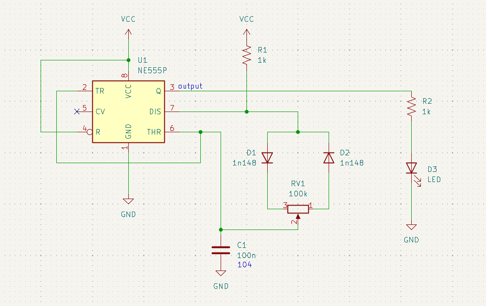
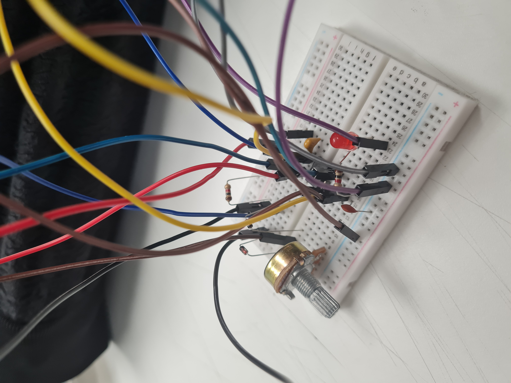
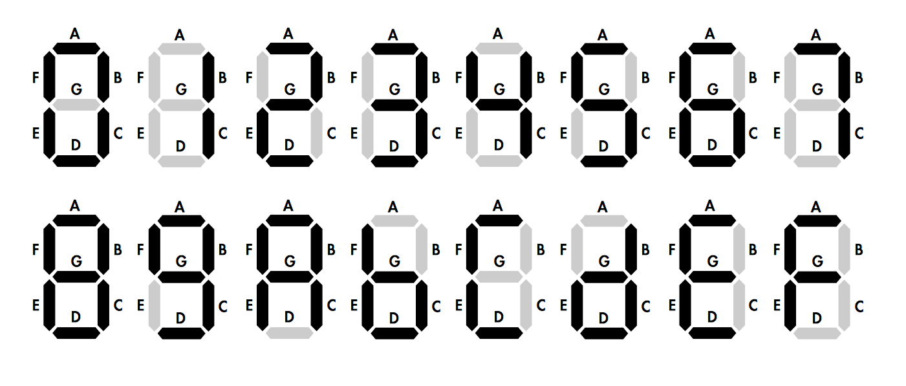
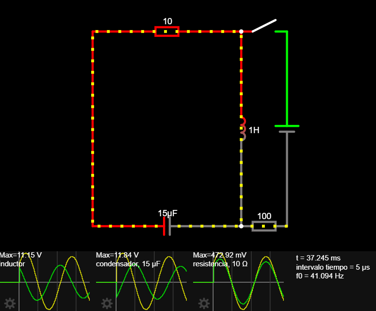
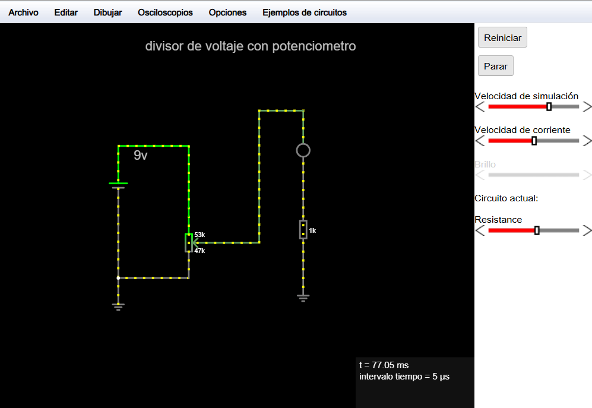
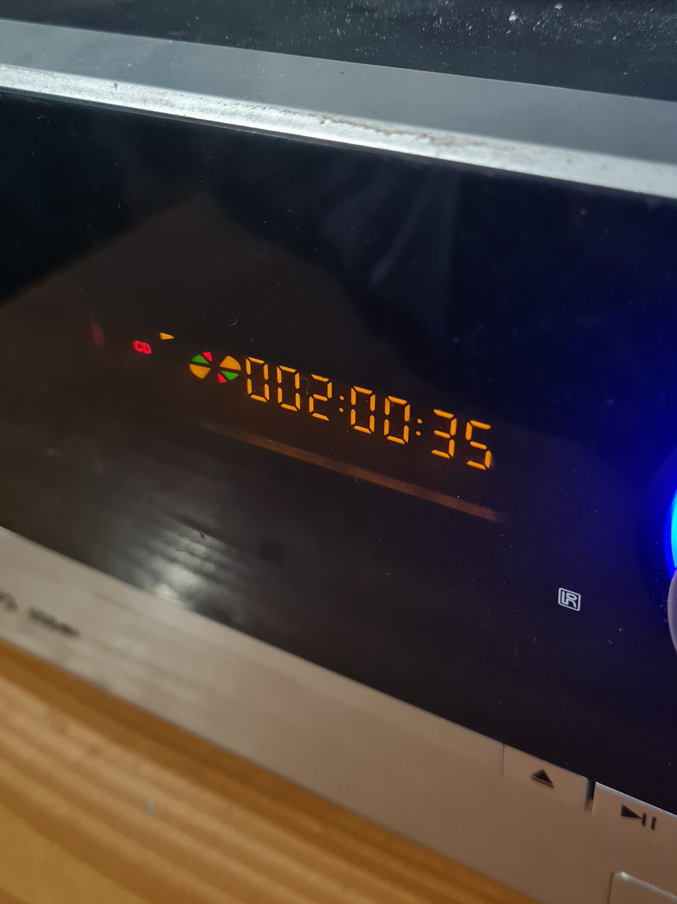
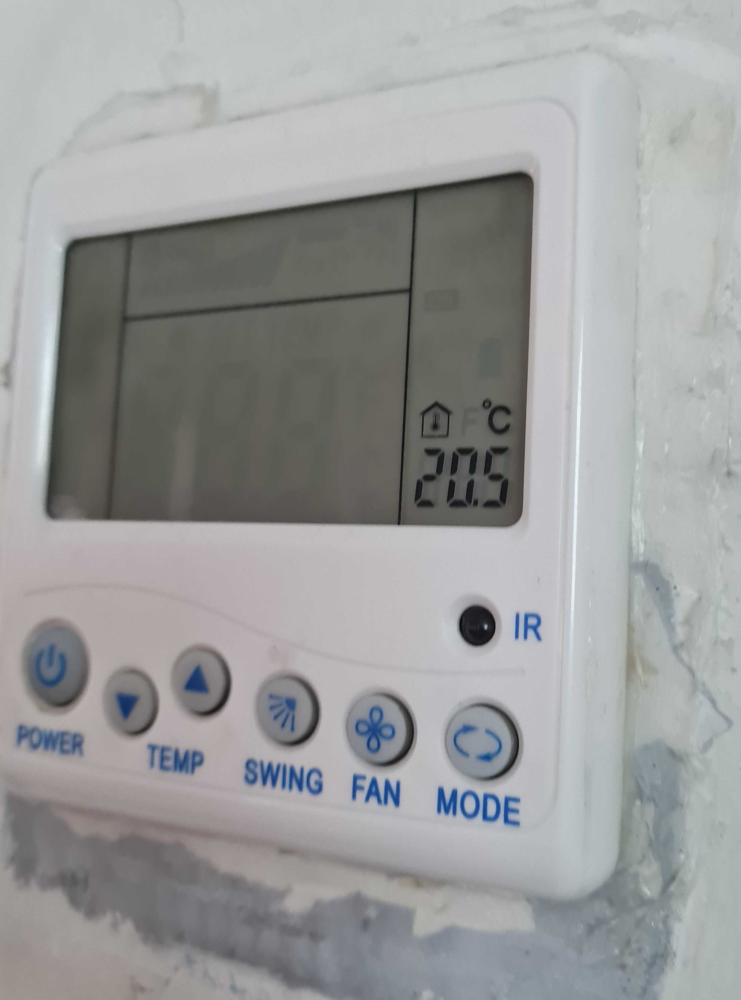
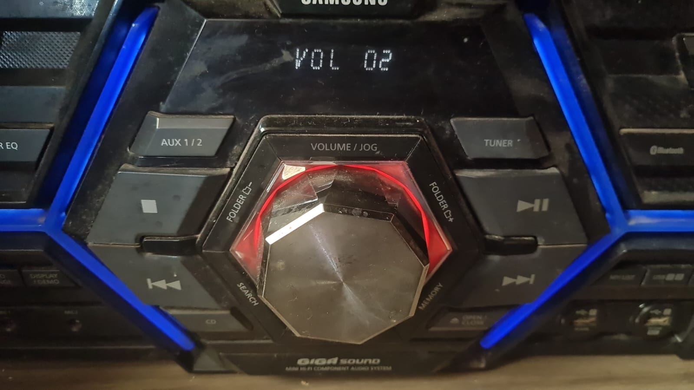
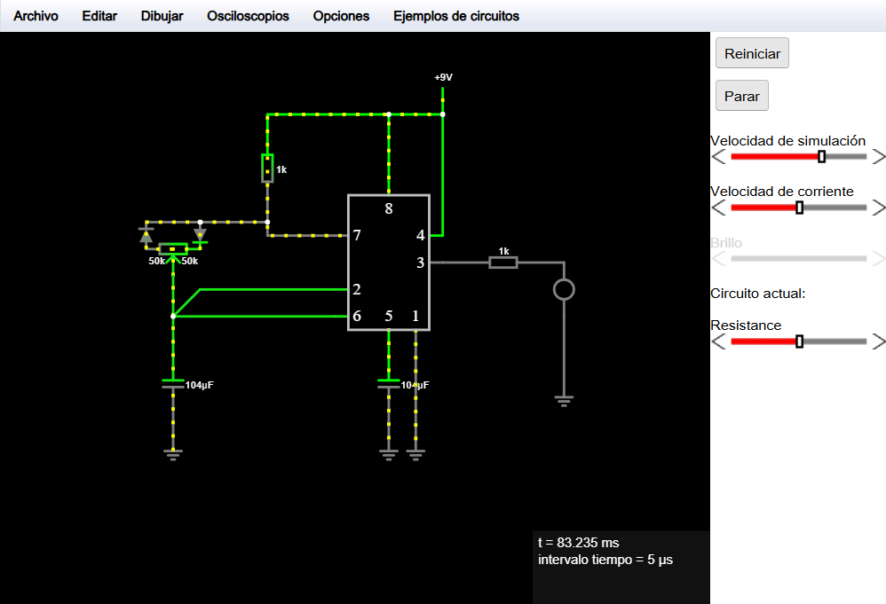

# sesion-10a

13 de Mayo de 2025.

## Trabajo en clases 1:

 - Armar circuito **PWM** (Pulse Width Modulation)
 - Juntar LEDs rojo, verde y azul y combinar colores.

Foto esquemático PWM.



Foto del circuito PWM en protoboard.



## Pantallas de 7 segmentos:

¿Qué son?

 - La pantalla de 7 segmentos es un aparato electrónico que utiliza 7 segamnetos LED que se pueden encender o apagar de manera individual para representar números del 0 al 9 en un formato de cifras arábigas.
  
 - Este sistema está diseñado para números, no para letras. Esto es debido a que algunas letras no son compatibles y se pueden llegar a confundir con números.

Foto alfabeto sistema arábigo en 7 segmentos.



Foto rescatada de [edupython](https://edupython.blogspot.com/2015/04/visualizador-de-siete-segmentos.html).

## Apuntes de clase: Falstad

 - **Falstad** es un simulador de circuitos, pensada especialmente para estudiantes. 

Al abrir Falstad podemos ver automáticamente el circuito **RESONADOR RCL**

Foto resonador RCL.



Para agregar un nuevo circuito para simular, debemos de presionar "Archivo" > "Importar desde archivo de texto..." > Pegamos el texto .txt que copiamos con la información del nuevo circuito > "OK" > Listo!

 - Código agregado: Divisor de voltaje con potenciómetro.

```txt
$ 1 0.000005 10.20027730826997 50 5 50 5e-11
162 816 240 816 384 2 default-led 1 0 0 0.01
r 816 384 816 528 0 1000
g 816 528 816 576 0 0
v 480 448 480 304 0 0 40 5 0 0 0.5
w 480 304 608 304 0
w 608 304 608 320 0
w 608 544 480 544 0
w 480 544 480 448 0
174 608 432 608 528 1 100000 0.5297000000000001 Resistance
w 608 416 608 432 0
w 608 528 608 544 0
w 608 416 608 320 0
w 624 480 736 480 0
w 736 480 736 288 0
w 736 288 736 240 0
w 736 240 816 240 0
g 480 544 480 592 0 0
403 400 144 656 288 0 12_64_0_4099_50.0001953125-1_2_12_3
x 508 329 533 332 4 24 9v
x 529 131 911 134 4 24 divisor\sde\svoltaje\scon\spotenciometro
```

Foto circuito divisor de voltaje con potenciómetro en Falstad.



## Trabajo en clases 2:

Tomar fotografías de pantallas con 7 segmentos que encontremos en la FAAD o alrededores y subirlas a discord.

## Encargo 20: Fotografías de pantallas de 7 segmentos

Fotografía 1: **Reproductor de CDs**

Fecha: 16 de Mayo de 2025.

Ubicación: Mi casa.



Fotografía 2: **Regulador de aire acondicionado**

Fecha: 16 de Mayo de 2025.

Ubicación: Facultad de Odontología, Universidad Diego Portales.



Fotografía 3: **Radio**

Fecha: 19 de Mayo de 2025.

Ubicación: Mi casa.



## Encargo 21: Simulación de circuitos con 555 y/o comparadores hechos con opamps en Falstad

 - Realizar algún circuito realizado en clases con el chip555.

Foto circuito PWM en Falstad.



**Código .txt PWM**

```txt
$ 1 0.000005 10.20027730826997 50 5 50 5e-11
165 320 304 464 304 14 0
R 448 192 448 144 0 0 40 9 0 0 0.5
w 384 272 384 192 0
w 384 192 448 192 0
w 448 336 448 192 0
r 448 368 592 368 0 1000
162 592 368 592 432 2 default-led 1 0 0 0.01
g 592 432 592 528 0 0
c 384 464 384 560 4 0.000104 5.999108982982355 0.001 0
g 384 560 384 592 0 0
g 416 464 416 592 0 0
w 320 432 128 432 0
w 320 400 160 400 0
174 96 352 160 384 1 100000 0.5 Resistance
w 128 432 128 384 0
d 160 320 160 352 2 default
d 96 352 96 320 2 default
w 96 320 160 320 0
w 160 320 240 320 0
w 240 320 240 336 0
w 240 336 320 336 0
g 128 560 128 592 0 0
c 128 464 128 560 4 0.000104 4.234031265341355 0.001 0
w 128 464 128 432 0
w 160 400 128 432 0
r 240 320 240 192 0 1000
w 240 192 384 192 0
```

Fotos de mi autoría.
