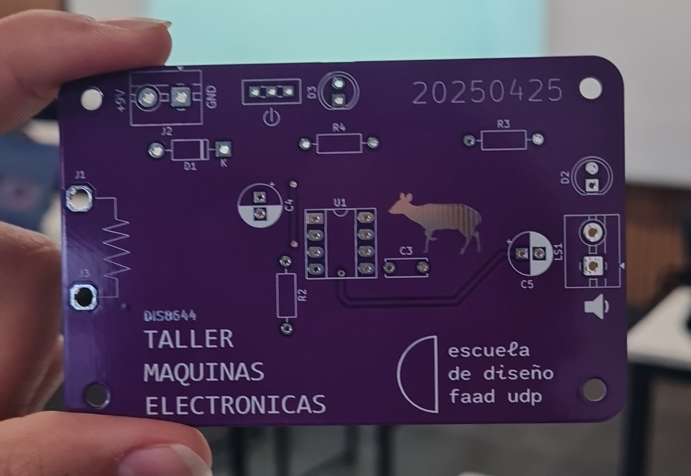
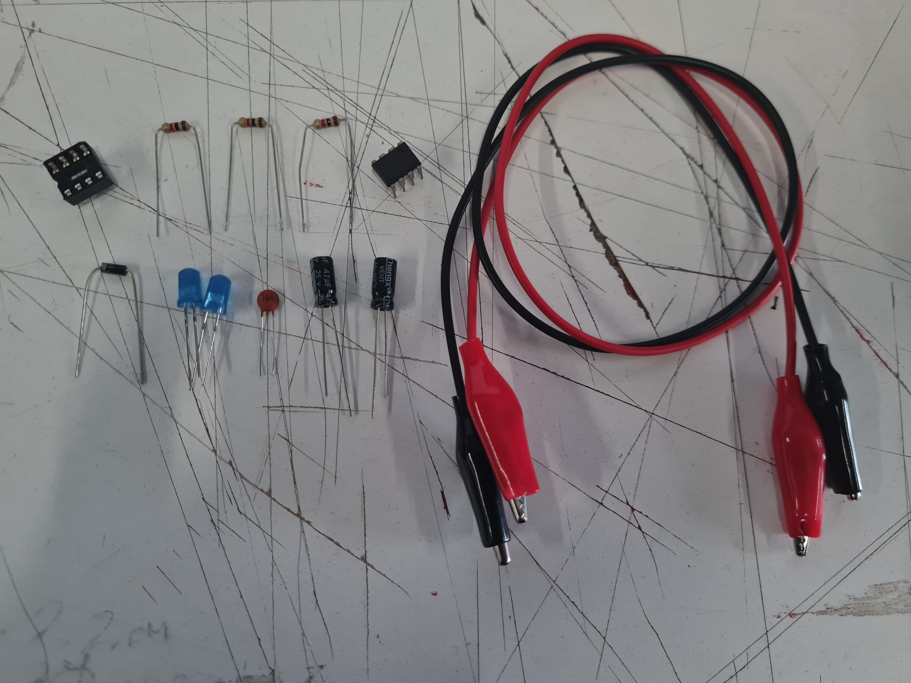

# sesion-10b

16 de Mayo de 2025.

## Trabajo en clase

 - En clase nos entregaron la placa UDPudu, para soldar sus componentes. Para esto realizamos un BOM de materiales del UDPudu original.

BOM CVS Original.

|Reference|Value                        |Datasheet|Footprint                                    |Qty|DNP|
|---------|-----------------------------|---------|---------------------------------------------|---|---|
|C3       |100n                         |~        |Capacitor_THT:C_Disc_D6.0mm_W2.5mm_P5.00mm   |1  |   |
|C4       |1u                           |~        |Capacitor_THT:CP_Radial_D6.3mm_P2.50mm       |1  |   |
|C5       |47u                          |~        |Capacitor_THT:CP_Radial_D6.3mm_P2.50mm       |1  |   |
|D1       |1n4007                       |~        |Diode_THT:D_DO-41_SOD81_P10.16mm_Horizontal  |1  |   |
|D2,D3    |LED                          |~        |LED_THT:LED_D5.0mm                           |2  |   |
|J1,J3    |CAIMAN                       |~        |modules_teee2025:caiman                      |2  |   |
|J2       |TBLOCK_2                     |~        |TerminalBlock:TerminalBlock_MaiXu_MX126-5.0-02P_1x02_P5.00mm|1  |   |
|LS1      |SPK                          |~        |TerminalBlock:TerminalBlock_MaiXu_MX126-5.0-02P_1x02_P5.00mm|1  |   |
|R2,R3,R4 |1k                           |~        |Resistor_THT:R_Axial_DIN0207_L6.3mm_D2.5mm_P10.16mm_Horizontal|3  |   |
|SW1      |SW_SPDT                      |~        |modules_teee2025:SPDT_PCB_small_P2.5mm       |1  |   |
|U1       |~                            |         |Package_DIP:DIP-8_W7.62mm_Socket_LongPads    |1  |   |

BOM para armar UDPudu.

|Referencia  |Valor   |Huella                   |Qty|OBS               |
|------------|--------|-------------------------|---|------------------|
|U1          |~       |Socket 8 pines           |1  |                  |
|R2,R3,R4    |1k      |Resistencias             |3  |                  |
|D1          |1n4007  |Diodo                    |1  |                  |
|C3          |100n    |Condensador cerámico     |1  |104               |
|C4          |1u      |Condensador electrolítico|1  |                  |
|C5          |47u     |Condensador electrolítico|1  |                  |
|D2,D3       |LED     |Led 5mm                  |2  |                  |
|J2          |TBLOCK_2|Terminal Block 2         |1  |                  |
|LS1         |SPK     |Terminal Block 2         |1  |                  |
|SW1         |SW_SPDT |Switch spdt              |1  |                  |
|U1          |NE555   |DIP-8                    |1  |Va en el socket U1|
|Clip batería|9v      |                         |1  |                  |
|Parlante    |8ohm    |                         |1  |                  |
|J1,J3       |CAIMAN  |Cables caimán            |2  |                  |

## Encargo 22: Documentación textual del ensamblado de la placa PBC UDPudu

 1. Como primer paso tuvimos la entrega de las placas, en dónde hicimos un reconocimiento general de la placa y un posterior documentado.
 2. En el paso dos tenemos la extracción del BOM del UDPudu, y su conversión en hojas de cálculo para obtener una versión más sintetizada.
 3. Para el tercer paso busqué los componentes necesarios para poder ensamblar nuestra PCB. Considerar que en este momento aún no  la tenía la totalidad de los materiales.
 4. Ya cuando estuve segura de la cantidad de componentes inicial pude comenzar a preparar mi área de trabajo; preparar cautín y accesorios, además de la placa.
 5. En el quinto paso comenzamos con el **socket de 8 pines**, que se ubica en la parte central de la placa.
 6. Luego del socket me puse a soldar los **resistores** necesarios, y que son tres.
 7. Ya habiendo puesto los resistores de 1k ohm continué con el **diodo** número 1.
 8. Con el D1 ya ubicado y soldado, seguí con los **condensadores**, tanto los cerámicos como los electrolíticos.

Para ser sincera hubo una pausa de como 2 clases porque no volvímos a soldar, y yo no tengo cautín personal. Continuamos en la 11b.

 9. Primeramente como segunda sesión de soldado en la placa recibí los componentes faltantes para soldar a la placa (switch, terminal block).
 10. Como paso siguiente volví a juntar los componentes necesarios para terminar la placa.
 11. Utilicé un cautín que ya había sido preparado con anterioridad, el cual ya tenía su pañito húmedo y una base adecuada para soldar.
 12. Ya lista y segura de los componentes, soldé los **LEDs**, que yo elegí blancos, ambos.
 13. Después de los LED continué con con los **terminal block**, para los que pregunté para asegurarme de que estuviera del lado correcto.
 14. Finalmente soldé el **switch** como componente final.

## Encargo 23: Documentación visual del ensamblado de la PCB UDPudu

Dentro de las fotos que tomé olvidé ciertas partes del proceso, así que hay ciertas lagunas entre algunas de ellas.

Y también incluiré en medio, porque fue cuando las tomé, fotos de la placa con fondo amarillo.

Foto de la placa vacía.

Foto de los componentes ordenados.

Foto soldadura parte posterior del socket de 8 pines.

Video de la soldadura del socket de 8 pines.

Video de mi soldando el socket de 8 pines.

Foto de la placa con el socket y los resistores.

Fotos mini sesión fotográfica en amarillo.

Foto favorita de la mimi sesión.

Foto detalle terminal block, LED y condensador electrolítico.

Foto placa terminada con todos sus componentes superior.

Foto placa terminada con todos sus componentes posterior.

Fotos y vídeos de mi autoría.
