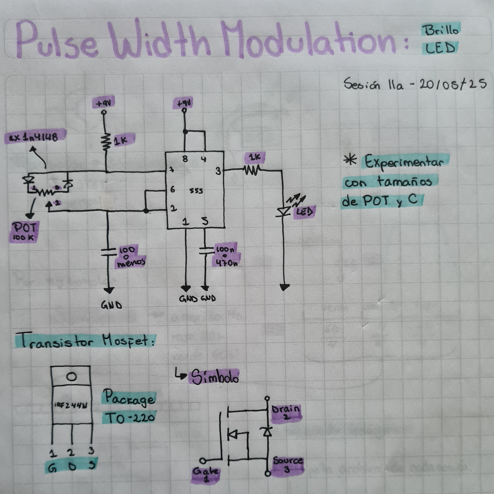
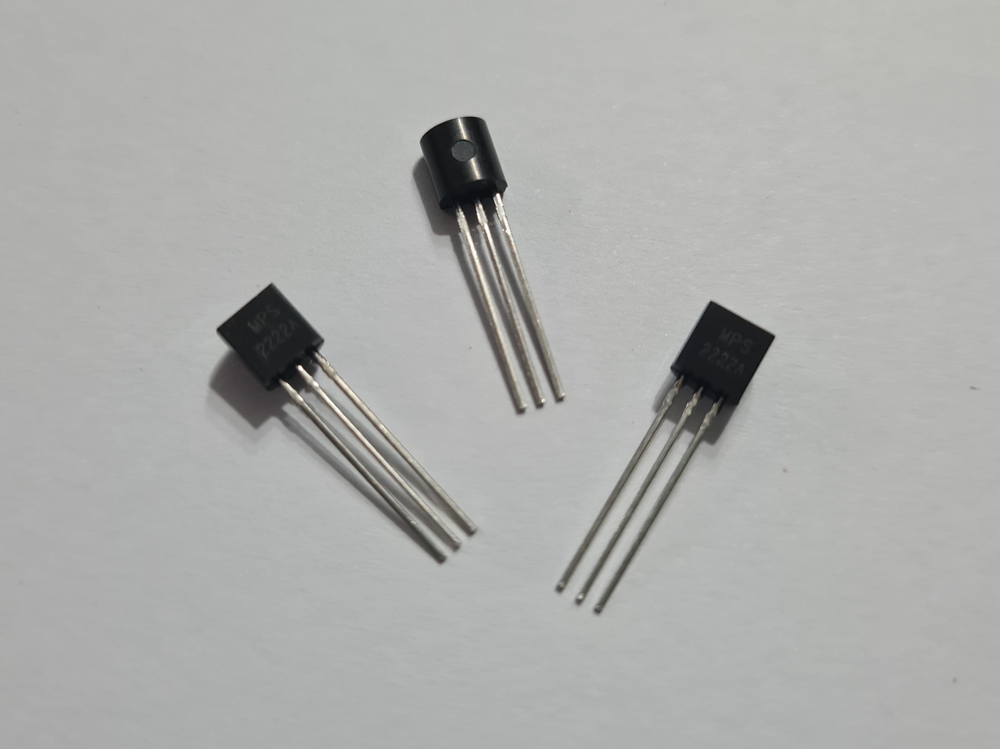
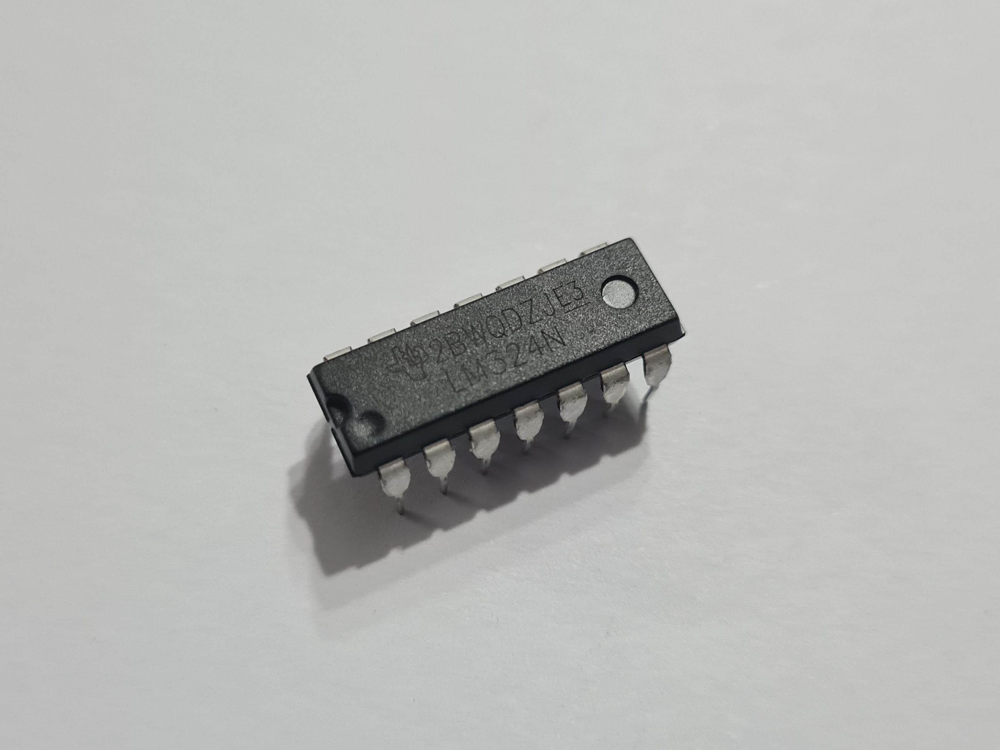
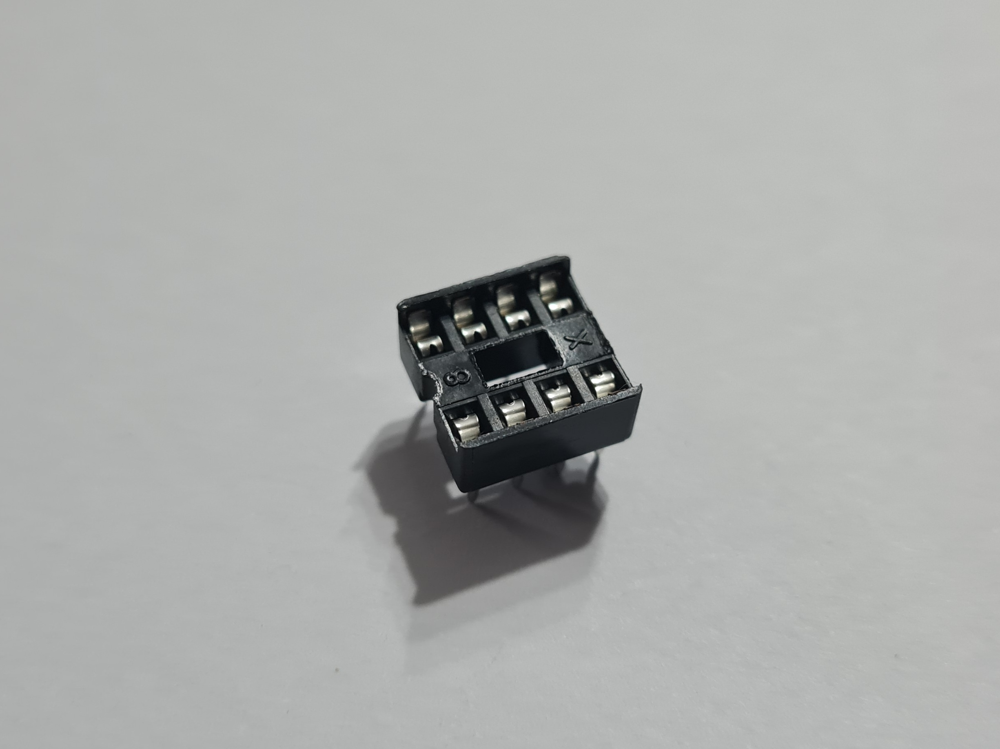
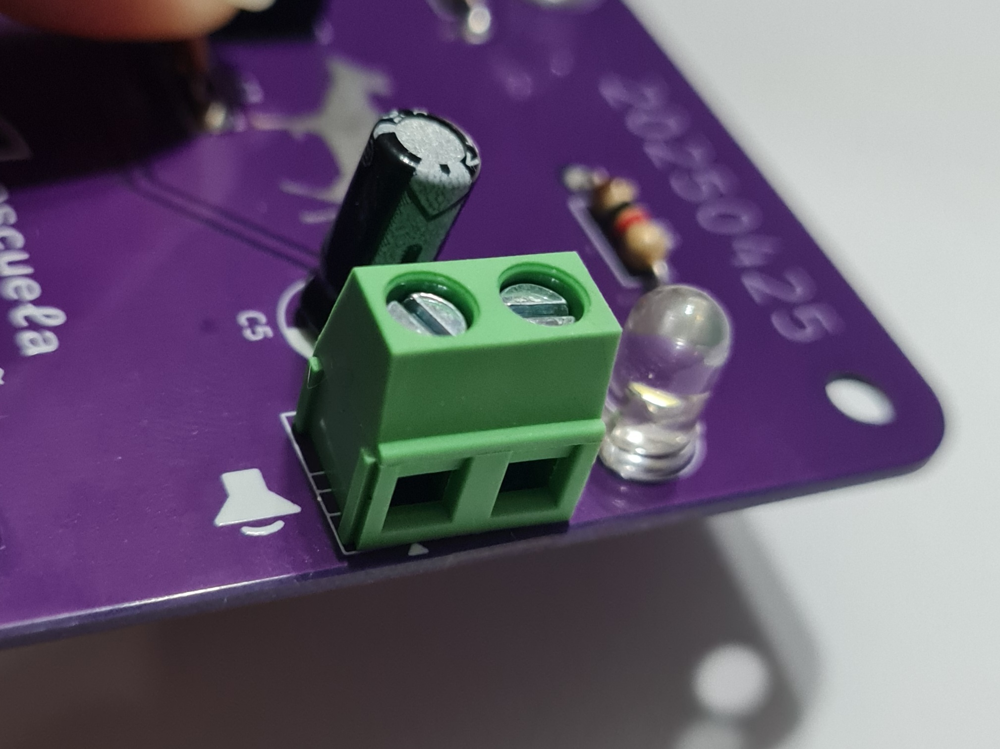
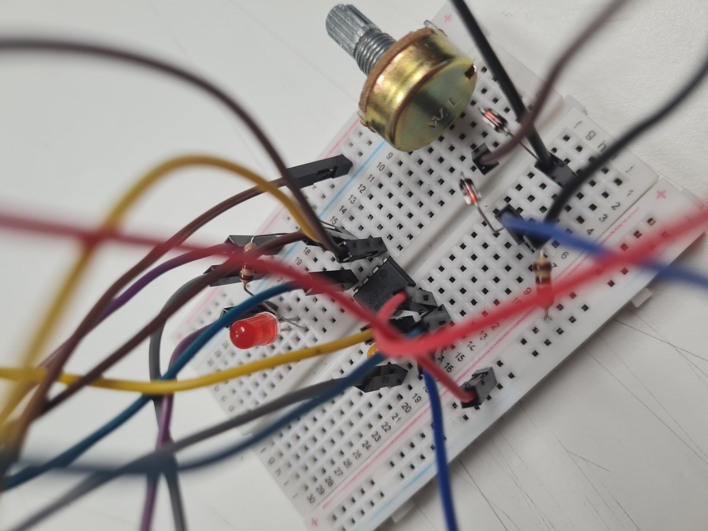
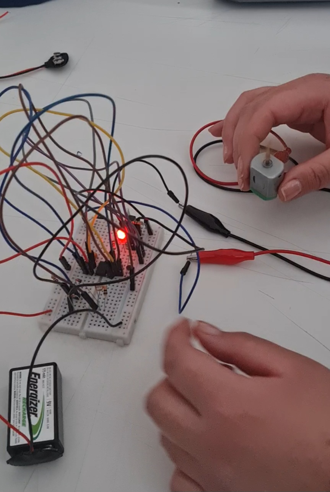

# sesion-11a

20 de Mayo de 2025.

## Componentes

 -  R: Resistencia
 -  C: Condensador
 -  D: Diodo
 -  IC: Circuito integrado
 -  POT: Petenciómetro
 -  BAT: Batería
 -  PS: Power supply
 -  +9V: Corriente
 -  GND: Tierra
 -  LED: Diodo 
 -  OP AMP: Amplificador operacional
 -  LDR: Fotorresistor
 -  PROTO: Prtotoboard
 -  Sn, Cu, Si, Au: Estaño, Cobre, Silicio, Oro
 -  PCB: Placa de circuito impreso
 -  PERF: Perfboard
 -  RELÉ (MÓDULO): Interruptor que abre y cierra corriente

## Circuitos

 - PWM: Pulse Width Modulation
 - ASTABLE 
 - MONOESTABLE

## Aplicaciones

 - APC
 - BRILLO LED
 - ON/OFF AMPOLLETA
 - SINTE R. EXP

## Apuntes clase

Foto de mi croquera.

## Componentes nuevos

 - **Transistor Mosfet (Package TO-220):** Es un transistor utilizado para amplificar o conmutar señales electrónicas.

Foto Transistor Mosfet.

 - **Transistor bipolar de unión (MPS2222):** Es un componente semiconductor que se utiliza para amplificar o conmutar señales.

Foto Transistor bipolar de unión.

 - **Chip 4017:** Es un contador que sirve para proyectos de electrónica que van desde una secuencia de LEDs, contador, cerraduras, etc.

Foto chip 4017.

 - **Chip LM324:** El chip LM324 es un amplificador operacional cuádruple, lo que significa que contiene cuatro amplificadores operacionales independientes en un solo paquete.

Foto chip LM324.

 - **Zócalo DIP:** Se utiliza para alojar CI con encapsulado DIP de 8 pines, facilitando su conexión y desconexión en prototipos y pruebas.

Foto de zócalo DIP.

 - **Conector terminal PCB:**  Este conector sirve para conectar dos cables o componentes a una placa de circuito impreso, o PCB, sin necesidad de soldadura.

 Foto de conector terminal PCB

## Armado circuito PWM en protoboard

Foto de circuito PWM en protoboard.

Vídeo de circuito PWM en protoboard.

https://github.com/user-attachments/assets/3426cb94-73da-4f21-a022-adab3d22a260

 - **Modificación 1:** Integración de transistor y motor al circuito PWM

 - Observación: Al agregar el motor podemos notar como de enseguida comienza a girar fuertemente y de modo constante, con el potenciómetro logramos controlar su velocidad. En un momento pensé que mi batería personal de 9V se había descargado, pero en realidad, volvió a funcionar cuando coloqué en la proto el condensador cerámico de 103n, ya que tenía uno de alrededor de 70n y no estaba funcionando correctamente.

Foto circuito PWM en protoboard con modificación 1.

Video circuito PWM en protoboard con modificación 1.

https://github.com/user-attachments/assets/c5d6653a-d400-4ffd-bfb6-422935ee674a

 - **Modificación 2:** Cambio de Potenciómetro a LDR

 - Observación: Apenas cambié el potenciómetro por el LDR se notó un cammbio en el giro inicial del motor, esto debido a que la luz de la sala no le llegaba directamente, pero en cuanto si llegó de forma adecuada logramos tener un giro más rápido.

Foto circuito PWM en protoboard con modificación 2.

Video circuito PWM en protoboard con modificación 2.

https://github.com/user-attachments/assets/9402f6c0-0b04-441d-b2a2-bc80ba3d8889

Fotos y vídeos de mi autoría.
