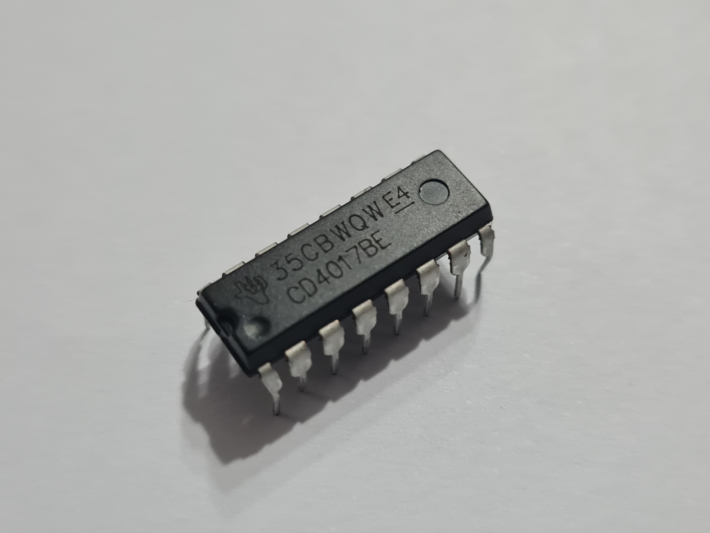
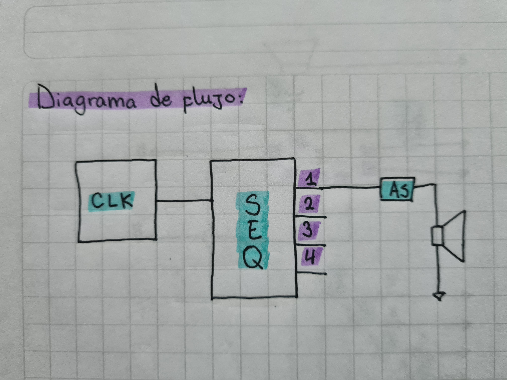
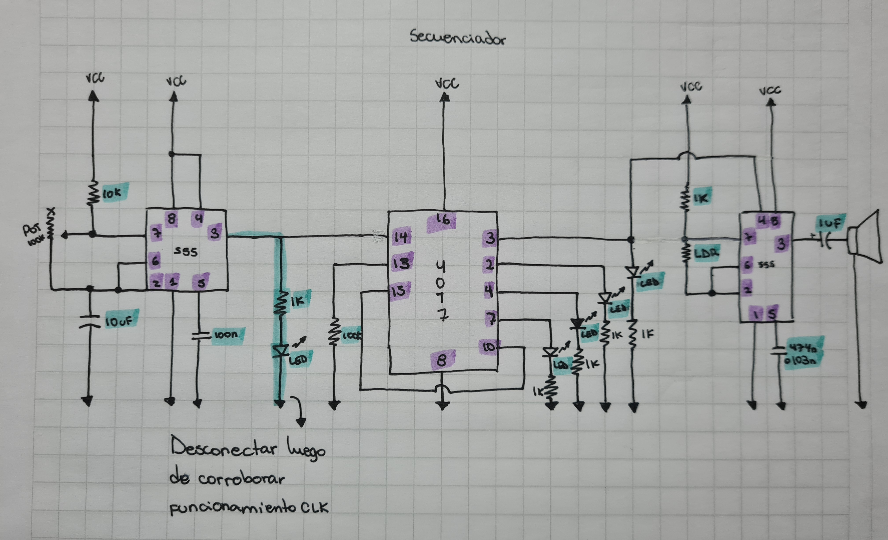
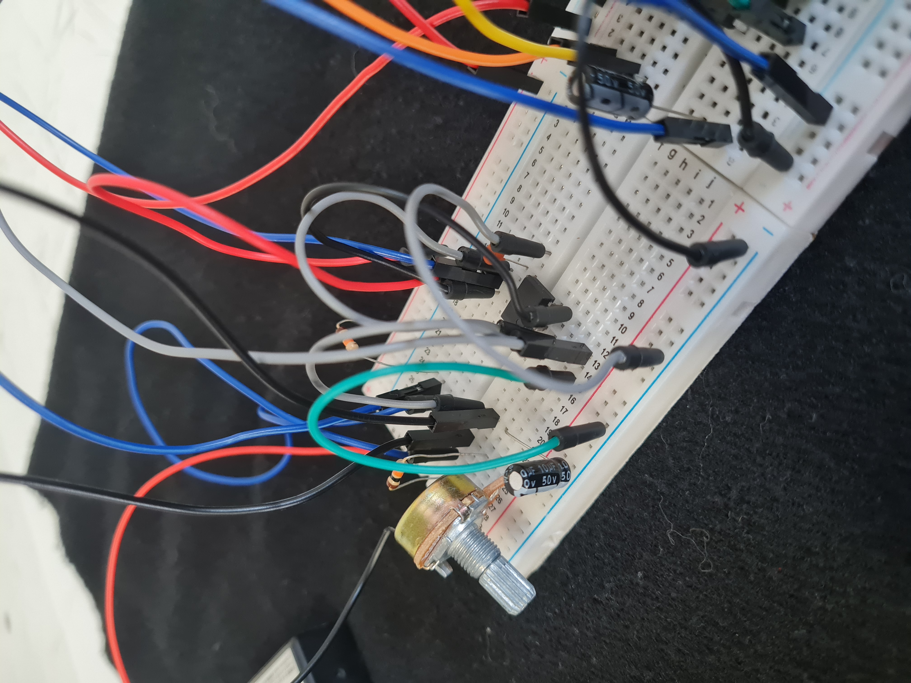
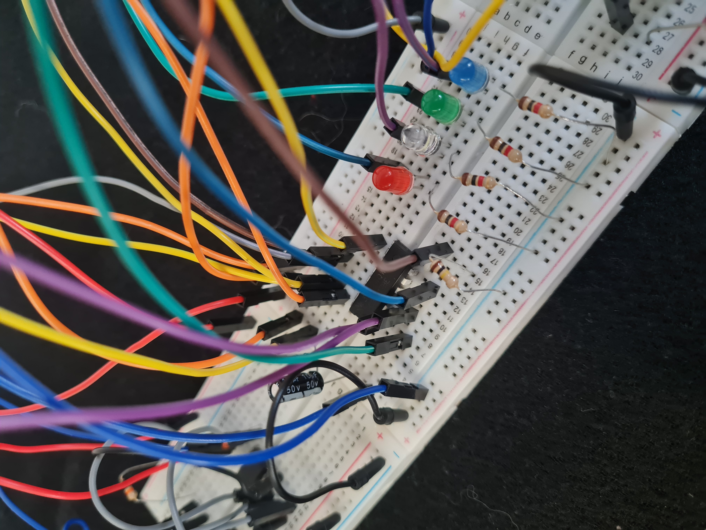
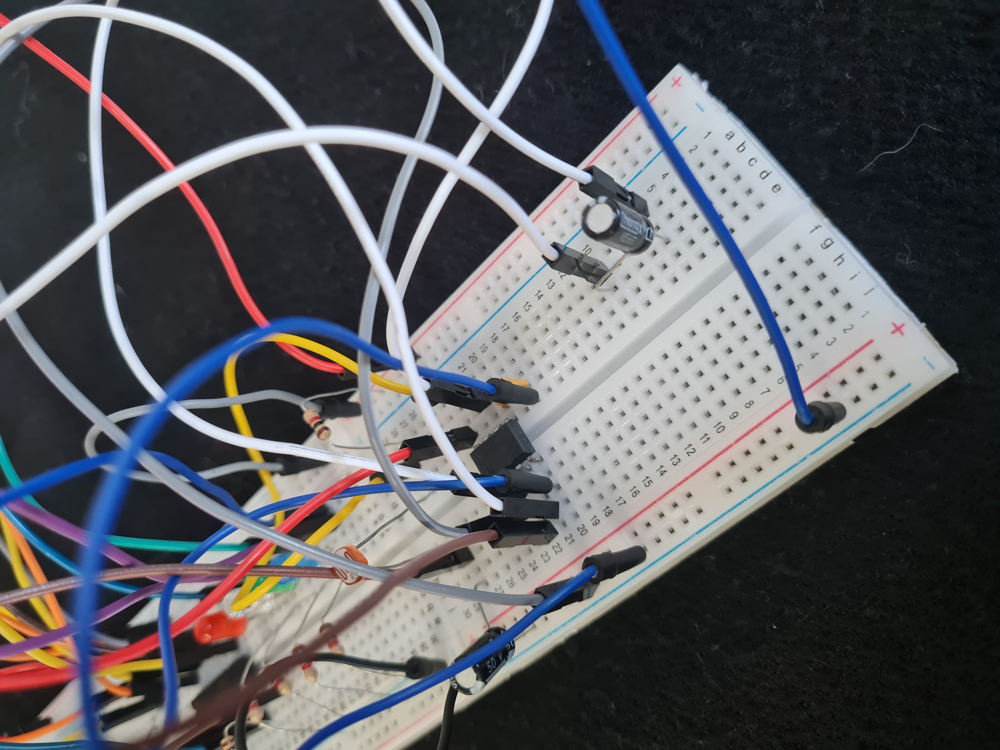
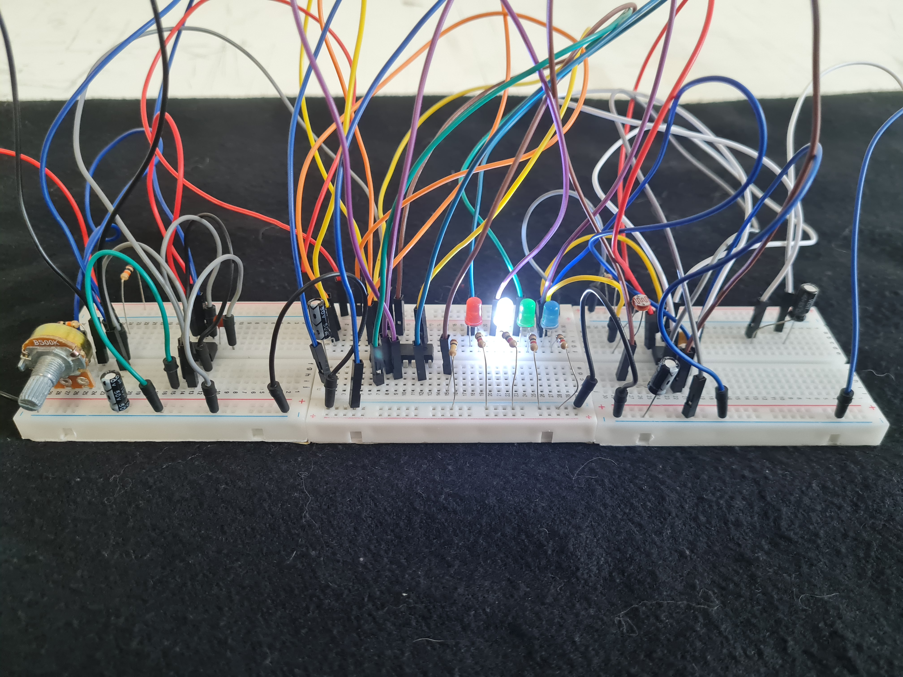
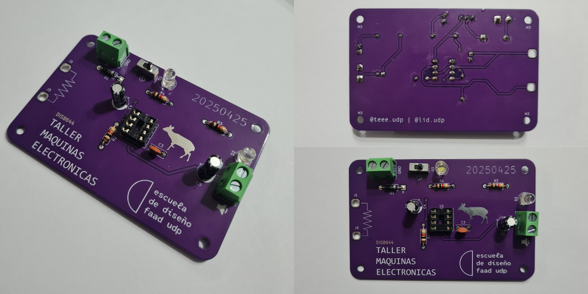

# sesion-11b

23 de Mayo de 2025.

## Chip 4017

El chip 4017 es un circuito integrado, también conocido como contador de décadas o divisor, que cuenta hasta diez pulsos de entrada y luego vuelve a empezar. Tiene 10 salidas que se activan secuencialmente con cada pulso de entrada.

Foto del chip 4017.

## Diagrama de flujo

Para empezar podemos ver el diagrama de flujo del circuito a trabajar en clase, en donde podemos ver el primer 555 que actúa como un reloj, luego el 4017 que nos entrega una secuencia, seguido del segundo 555 que está configurado en modo astable, y finalmente conectado a un parlante que emite sonido segun la frecuencia con la que se prendan los LED del secuenciador.

Foto del diagrama de flujo.

## Trabajo en clase:

Foto circuito esquemático del circuito en mi croquera.

Foto circuito realizado en protoboard parte 1.

Foto circuito realizado en protoboard parte 2.

Foto circuito realizado en protoboard parte 3.

Foto circuito realizado en protoboard completo.

Video circuito realizado en protoboard.

https://github.com/user-attachments/assets/c4acdc4f-7205-48b5-bab5-951466bad94a

**Observación:** Me pareció muy interesante los sonidos que emitió el circuito, porque aun si con mi compañeros habíamos hecho lo mismo, no todos sonaban igual y esparte del aprendizaje también. Además el que prenda las luces en secuencia me sigue pareciendo muy fantástico, sobretodo en el sentido de que yo fui capaz de hacerlo cuando al empezar el semestre no sabía nada al respecto jsjsjs. Y es una reflexión en base a una chica de primer año que me hizo unas preguntas sobre el taller, posterior a la clase, y ahí me di cuenta de los conocimientos que he adquerido a lo largo de este tercio de semestre y que no había notado.

## Soldadura final UDPudu

Al final de la clase terminé finalmente mi placa PCB UDPudu porque no tengo cautín en mi casa, y me encantó el resultado.

Fotos de la placa PCB UDPudu con todos los componentes soldados.

Fotografías de mi autoría.
