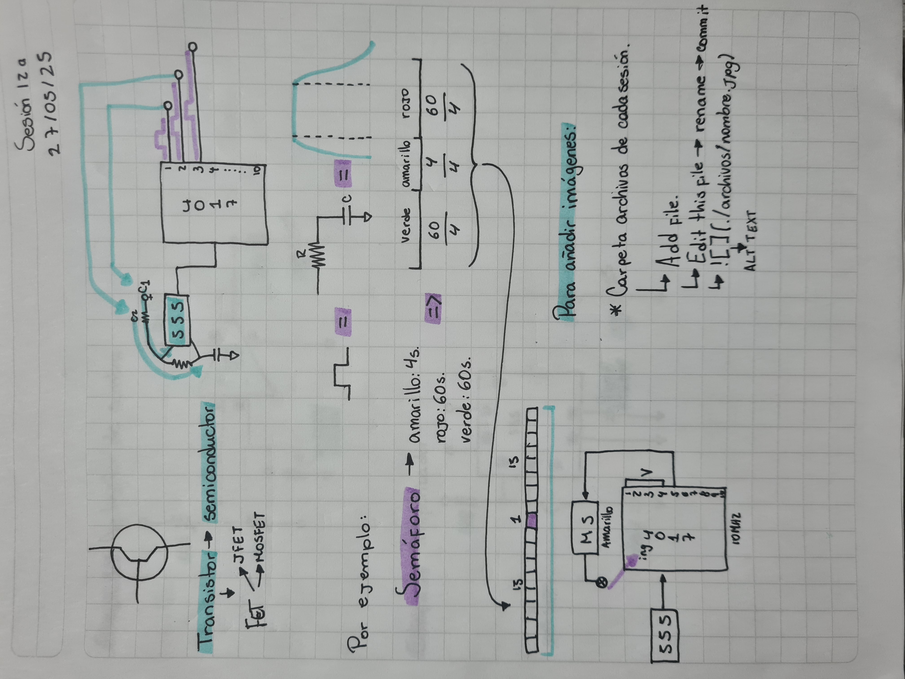
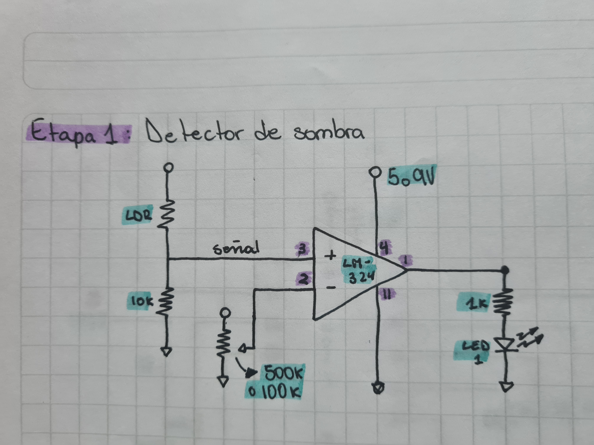
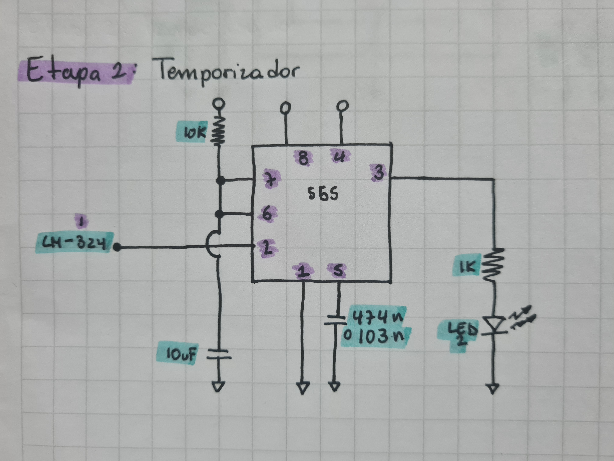
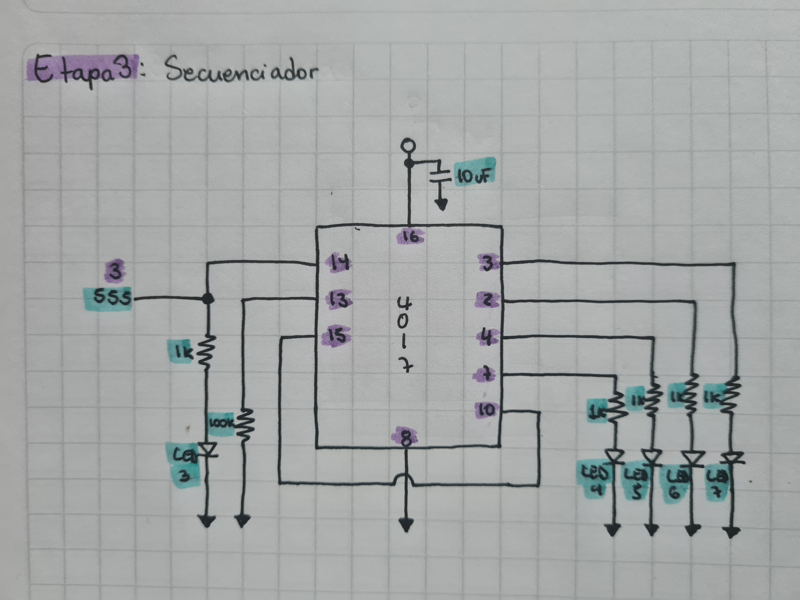

# sesion-12a

27 de Mayo de 2025.

## Apuntes primera parte

Foto de mi croquera.

## Detector de sombra

Foto circuito esquemático Detector de sombra por Matías Serrano.

**Etapa 1: Detector de sombra**

 - Inicialmente con un potenciómetro controlamos el punto en donde el LED casi se apaga, dejándolo justo ahí. Luego generando sombra sobre el LDR deberíamos lograr que el LED se apague, y que cada vez que el mismo LDR sea estimulado con luz se vuelva a prender.

Foto esquemático en mi croquera.

Foto circuito etapa 1 en protoboard.

Video funcionamiento circuito etapa 1 en protoboard.
 
**Etapa 2: Temporizador**

- En esta segunda etapa ubicamos un segundo LED en la protoboard conectado a un chip 555 configurado en monoestable, que al momento de hacer sombra sobre el LDR provoca que se apague el primer LED y se active el segundo LED, y viceversa.

**Observación:** Para obtener un circuito más estable cambié el condensador electrlítico 2 de 10uF por uno de 100uF.

Foto esquemático en mi croquera.

Foto circuito etapa 2 en protoboard.

Video funcionamiento circuito etapa 2 en protoboard.

**Etapa 3: Secuenciador**

- Al añadir un chip 4017 logramos incorporar un secuenciador de LEDs que se prenden en orden cada vez que se ubica una sombra sobre el LDR, esto quiere decir que cada vez que se hace sombra sobre el LDR cambia el LED de la etapa 3 que se enciende de forma odenada.
  
**Observación:** Tal como el esquemático no funciona correctamente, pero al añadir un condensador electrolítico de 10uF del pin 16 a tierra logramos una configuración más estable.

Foto esquemático en mi croquera.

Foto circuito etapa 3 en protoboard.

Video funcionamiento circuito etapa 3 en protoboard.

