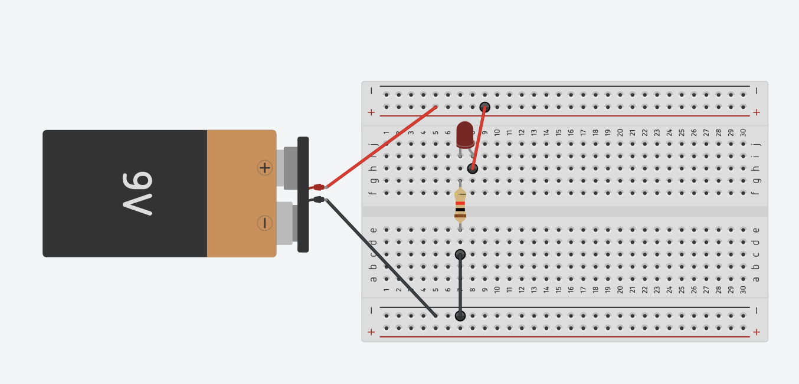
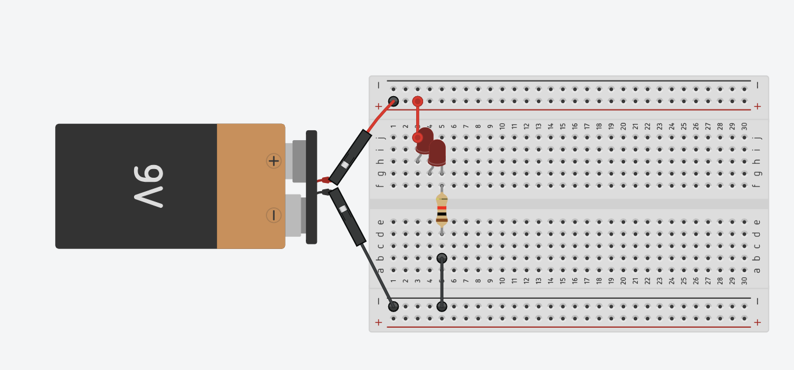

# sesion-02a

## apuntes

* energía Potencial
* energía Cinética
* altura= voltaje
* caudal =corriente(i)
* corriente= voltaje / resistencia
* ley de OHM
* sin resistencia puede hacer cortocircuito
* anodo = positivo
* catodo= negativo
* LED se prenden con 10ma

revisar codigo de color de las resistencias

las azules tienen 5 rayitas

## circuito electrico

un LED

dos LEDS en serie

