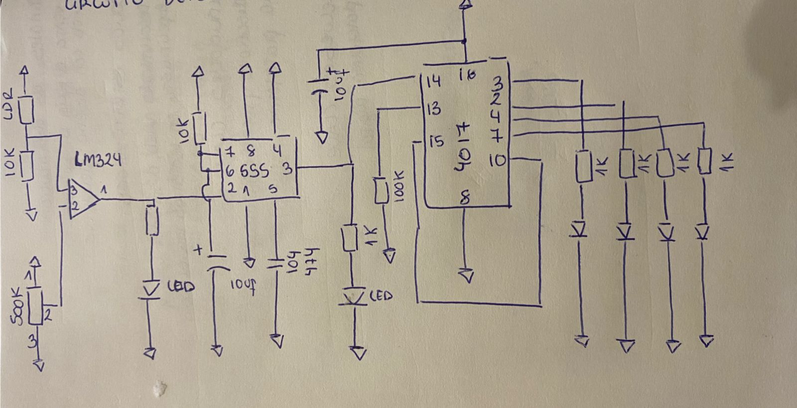

# sesion-12a

## Apuntes 

Voltaje se entrega, corriente se pide

motorreductor 

motores stepper unipolares y bipolares 

servomotor: preciso, sabe donde está; aveces inestable 

### En la clase trabajamos el circuito detector de sombra y activador de frecuencia

https://github.com/user-attachments/assets/1b226fa5-9950-4c44-93bf-01220d28ebe0

