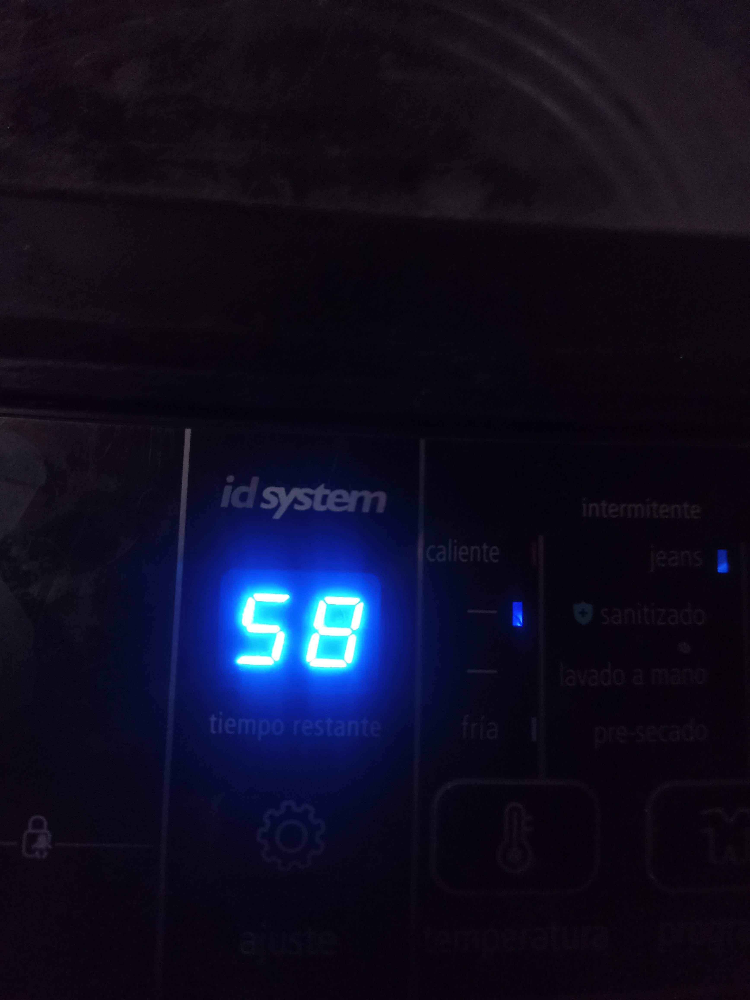
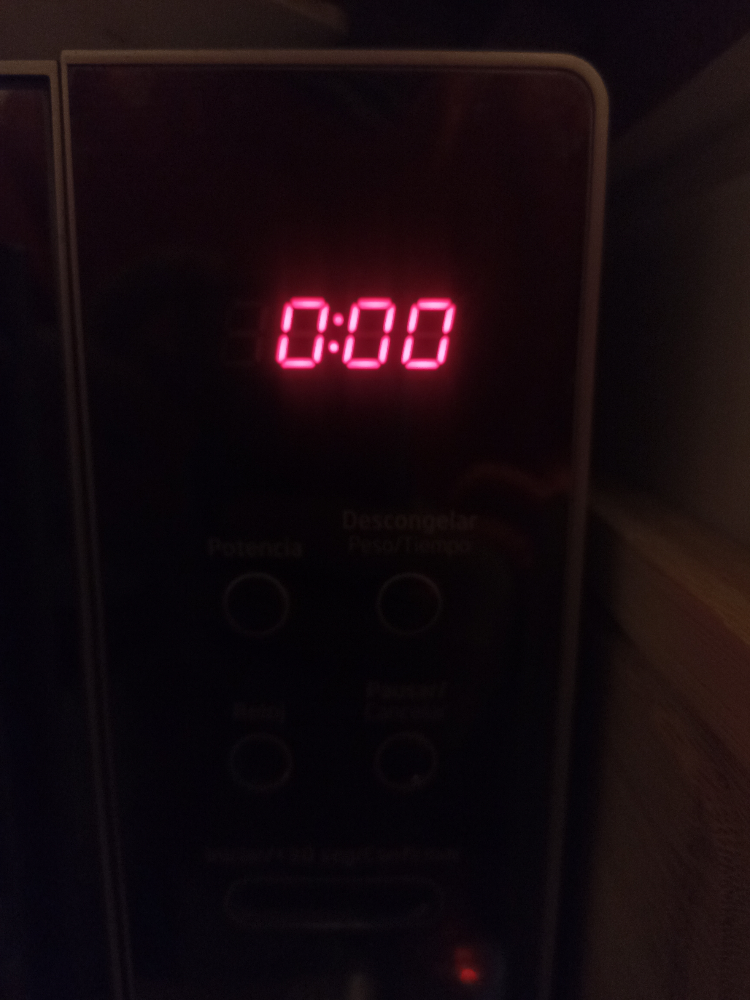
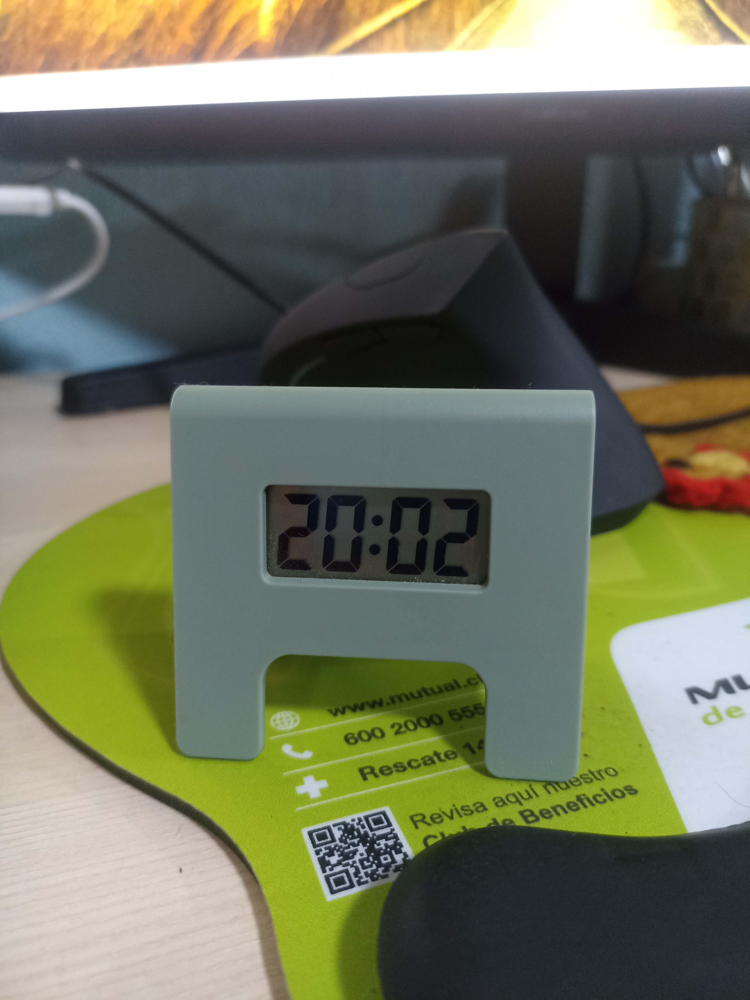
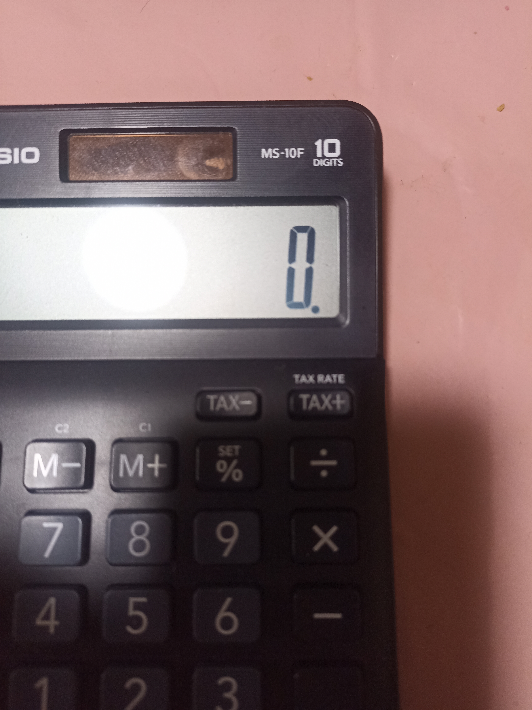
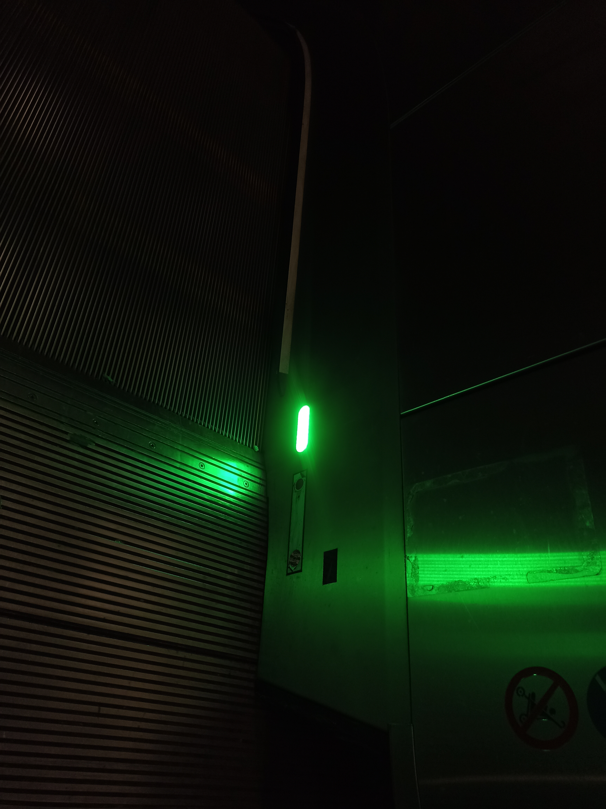

# sesion-10a

## taller martes 13 de mayo

El día martes 13 no asistí a las clases de taller por lo que quedé bastante perdido, pese a esto y viendo apuntes de mis compañeros en github, desarrollaré lo que entendí de los encargos.

## encargo 20: pantallas de 7 segmentos

pantalla de 7 segmentos de una lavadora, lugar donde saqué la foto: la casa de mi polola, fecha: 14 de mayo

pantalla de 7 segmentos de un microondas, lugar donde saqué la foto: la casa de mi polola, fecha: 14 de mayo

pantalla de 7 segmentos de un reloj digital de escritorio, lugar donde saqué la foto: la casa de mi polola, fecha: 14 de mayo

pantalla de 7 segmentos de una calculadora digital, lugar donde saqué la foto: la casa de mi polola, fecha: 14 de mayo

pantalla de 7 segmentos de una luz de la escalera mecánica del metro, no estoy seguro si sirve pero es un bonus, lugar donde saqué la foto: metro laguna sur, fecha: 15 de mayo

## encargo 21: simulación de circuitos con 555 y/o comparadores hechos con opamps en Falstad
