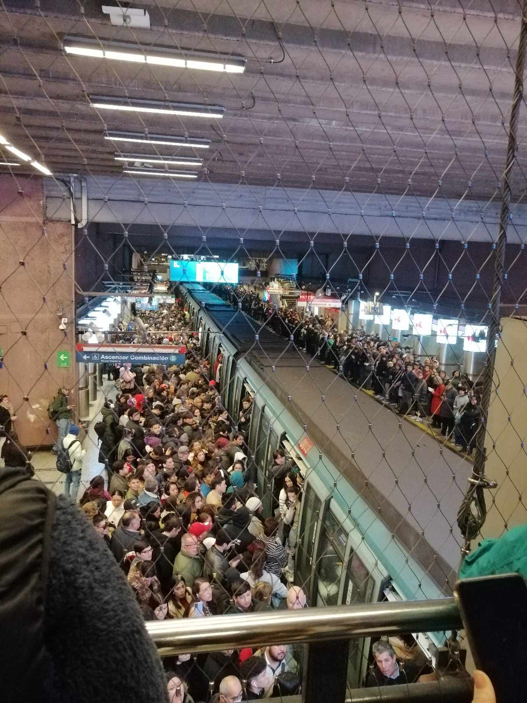
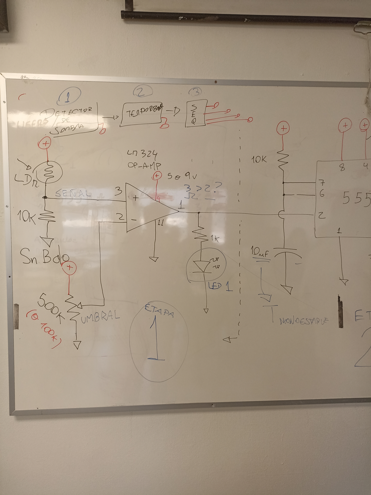
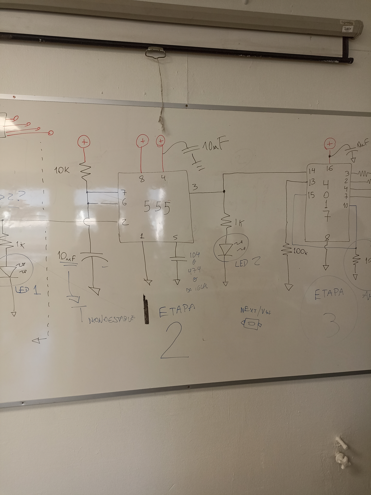

# sesion-12a
### taller martes 27 de mayo

**un día que partió extremadamente caótico con una falla eléctrica en metro escuela militar, yo que iba desde san pablo hasta república sufrí las consecuencias. Estaba asquerosamente lleno y no me podía mover, mi estrategia para que no me empujaran al fondo del vagón consistió en pegarme al fierro del medio del vagón y quedar anclado ahí, fue muy efectivo, la gente no entiende que ya no cabe más gente y se siguen subiendo, terrible.**

**debido a esto llegué tarde tipo 9**

### primera parte de la clase

- chip 4017
- inhibidores, clock inhibidores, me permiten activar acciones
- ejemplo: el chofer de la micro desbloquea el torniquete y deja que todos pasen
- lo que entendí es una acción que genera más acciones
- diagrama de lógica digital
- cascading the cd4017b
- compuerta and
- el análisis matemático de la lógica, concepto de álgebra booleana, acá no entendí mucho el por qué se habló de esto, no me gusta la matemática
- **AVISO IMPORTANTE**: tenemos hasta el 10 de junio para subir/corregir las bitácoras de mayo ya que las notas de este mes han sido muy bajas (me incluyo)
- debemos subir un issue para una recorrección en github
- gracias a ambos profes por su amabilidad y dar estas instancias, son los mejores profes
- **importante** ¿cómo subir una foto a la carpeta archivos?
- el paso a paso es el siguiente:
- 1. voy a github
  2. voy a mi fork
  3. sync fork
  4. voy a la sesión correspondiente
  5. click en carpeta archivos
  6. en la carpeta archivos arriba me aparece la acción de addfile
  7. clickeo esta opción y subo una foto desde mi pc, le doy a commit changes
  8. ahora aparecerá la foto en la carpeta archivos, la dirección de la foto
  9. ahora en readme debemos escribir lo siguiente para poder mostrar nuestra foto, ejemplo: ![nombreficticio].(/archivos/direcciondearchivo.png)
  10. al escribirlo se creara un link que nos lleva a la imagen
 
- ### más info
- w3 schools
- para las fotos con html se usan 3 parámetros
- src: donde vive la foto (./archivos)
- alt: texto alternativo
- width: 100px, hay varias unidades de medida posibles
- height: no alcancé a escribir

### post break
- gabriel hopzabfel
- AHORA realizaremos un circuito detector de sombras
- detector de sombras ---- > temporizador --- > secuenciador
- en esta parte no escribí mucho porque estábamos a full con el circuito, dejo parte del esquemático de la pizarra
- 

- **primera parte circuito**
- en esta primera parte del circuito la idea era que al variar la luz/oscuridad que recibía el LDR este mismo apagara y prendiera el led
- usamos otro chip que es como el 4017 en forma pero no es, no recuerdo bien la numeración
- para esto también debíamos regular el potenciómetro ya que tenía una posición específica en la que esto ocurría
- esta parte no me funcionaba bien porque no entendía mucho el esquemático, creí haberlo hecho bien pero no funcionó
- me ayudó Aarón a resolverlo, fuimos paso a paso viendo las conexiones, esto me pareció una forma muy fácil de ir leyendo la protoboard, por ejemplo: primero verificamos si tenemos conexion a fuente de energía vcc, después los que van a tierra, etc.). Al final el error fue que había una patita del potenciómetro que no la tenía conectada a nada, el cable que iba ahí había fallado por 1 cuadrito
- son errores frecuentes, nada terrible, todo es progreso
- **segunda parte circuito**
- 

- en esta segunda parte agregamos el 555 de toda la vida
- me di cuenta a estas alturas que me cuesta mucho menos leer esquemáticos que al principio del semestre
- hubo muchos esquemáticos en el pasado que no terminé de entender completamente, pero creo que si los veo ahora los podría resolver rápido
- en esta parte tampoco me funcionó a la primera, a mi compañero jotamorales tampoco. Le fui pedir a ayuda a Aarón pero me derivó con antonia cristi que ya había terminado la segunda parte
- me da verguenza pedirle ayuda a personas del curso, me cuesta muchísimo. Antonia revisó mi circuito y encontró la falla, era que no había conectado la pata 6 con la 7 del 555 y también me faltaba un led
- al conectarlo sucedió lo que tenía que suceder, ahora cuando poníamos el dedo encima del LDR se prendía un led y se apagaba el otro, al sacar el dedo, el primer led se apagaba y se prendía el segundo
- por la amabilidad de Antonia le dieron una décima, la verdad bien merecida

**tercera parte del circuito**
- esta parte del circuito no alcancé a sacarle foto bien al esquemático, pero ahora debíamos agregar el chip 4017
- hice las conexiones pertinentes pero ya casi terminaba la clase por lo cuál lo hice bastante apurado y no me funcionó
- quedaban pocos minutos por lo cuál no pregunté mis dudas de qué podía haber pasado que no resultó
- debo hacer más ordenados mis circuitos y simplificarlos más para que sea más sencillo leer la proto, a estas alturas de la clase tenía las resistencias todas pegadas y no se entendía mucho, adjunto foto final de cómo quedó el circuito aunque no haya funcionado esta tercera parte

