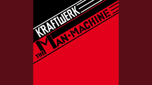
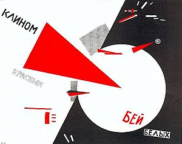

# sesion-01a

Clase 1 kemosión

<https://www.figma.com/board/2tv4jx75qGZa6Gua2UCVer/taller.maq.electr?node-id=9-45&t=aZ8HCSQeFZaROUsg-1>

## ENCARGOS

### encargo-01

MI CAJA NEGRA

### encargo-00

Barrio Universitario:

Sin duda lo más rescatable de la película es la intro y la actuación de Felipe Avello.

La intro con un estilo “epico” grabada en una toma.

En cuanto a los actores principales, Sergio Freire, Fabrizio Copano, Pedro Ruminot y Guatón Salinas,

todos interpretando personajes a excepción de Fabrizio Copano, quien pareciera nunca estar actuando y

uno como espectador nunca puede creerle que está interpretando a Miguel.

Una de las partes más extrañas es que Copano incluye partes de sus rutinas de Stand Up entre medio

de las escenas como si fueran conversaciones normales. Esto sucede con transiciones poco fluidas y

en mi opinión, entorpecen el ritmo de la película, entre otras cosas porque son las escenas más

largas de la película.

En cuannto a las actuaciones los más destacable sin duda es la actuación de Felipe Avello,

y la breve aparición de Iván Arenas. Mención honorífica para Luis Dubó como el profesor Gajardo,

y su monólogo cuando se entera del concurso. Mención honorífica para Antonia Zegers que tiene una

gran química con Luis Dubó y su actuación es super expresiva.

¡Viva el pueblo! ¡Vivan los trabajadores! ¡Vivan los computadores!

En cuanto al argumento de la película, me parece que los acontecmieniento de la misma,

están bien justificados y que la historia sea contada por un narrador testigo, le da

flexibilidad a la forma de contar la historia, además aporta un excelente momento cuando

el narrador se incluye a si mismo en la historia.

Si bien el final es poco extraño, me parece coherente que los estudiantes del colegio

Michael J Fox terminen perdiendo el concurso.

Momentos destacados de la película:
La intro grabada en una toma
El monólogo de el profe guajardo
El montaje final animación-collage
Todas las escenas de Felipe Avello
Los cameos: Ítalo Passalacqua, Iván Arenas, Paul Vásquez “El flaco”, Fernando Farías.

Nota final: 6/10

### The Man Machine - Kraftwerk

Escuche el disco “The Man Machine”
<https://open.spotify.com/intl-es/album/3eyz60xEK5dGEeZF1JJSi9>

Es el séptimo álbum de Kraftwerk estrenado en 1978(el nombre original del disco es

"Die Mensch-Maschine", el que yo escuche es su versión traducida al inglés).

Su portada fue realizada por el estudio de diseño gráfico Klefisch. Inspirado en

las obras del artista “El Lisitski”.

Lo que más me llamó la atención de las canciones fu los sonidos que utilizaban

para hacer música, los cuales son poco convencionales en comparación con la música

que escucho usualmente. Otra cosas que me llamo la atensión es la cohesión del album,

en el cual todas las canciones comparten un estilo e identidad.

Si bien objetivamente es música de mucho valor, este disco no conectó conmigo,

en palabras coloquiales lo llamaría “atrapante”.

Me gustaría escuchar otros proyectos de la banda, ya que me parece interesante lo que

proponen, pero este album no conectó conmigo

nota final: 6/10
