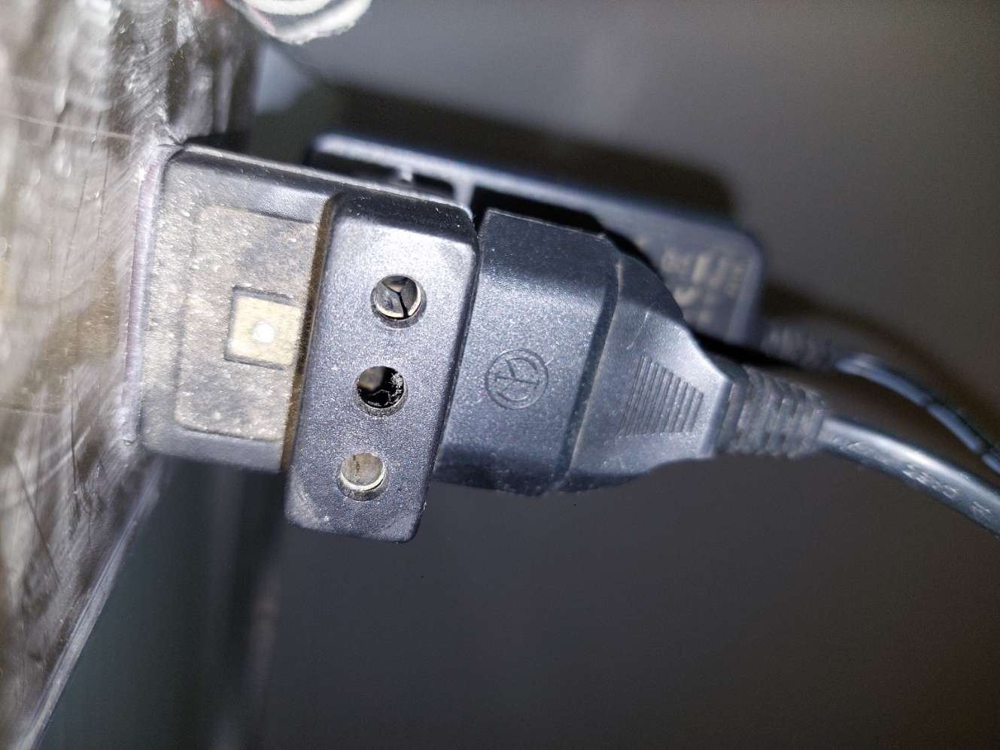

# sesion-01b

https://www.figma.com/board/2tv4jx75qGZa6Gua2UCVer/taller.maq.electr?node-id=0-1&t=aZ8HCSQeFZaROUsg-1

## ENCARGOS

# DIAGRAMAS ELÉCTRICOS 

# MÚSICA ELECTRÓNICA: Aphex Twin

## drukQs

Drukqs - Aphex Twins

Aphex twin es  un DJ compositor británico, el cual ha sido muy influencial en la música, se le considera pionera del IDM.

Drukqs, en el quinto album de Aphex Twin. Tras sacar albumes en 1995, 1996 y 1997, aphex dejó de sacar música durante años, hasta que en el 2001, perdió su mp3 en un viaje, por lo que, con la idea de “anteponerse ante una posible filtración” lanzó apresuradamente “drukQs”

fuente: <https://ibero909.fm/blog/drukqs-electrnica-rpida-inteligente-y-brutal-de-aphex-twin-a-20-aos>

Opinión: 
Lo que me llamó la atención en primer lugar fue su portada, la cual no se parecía a otras portadas del artista, y tampoco tenía la estética de una portada de un disco de IDM o musica electrónica. 

La portada no se ve “poco profesional” o improvisada. En sí, la imagen es hermosa, pero no cuenta con esa “espectacularidad” de las portadas de discos. La definiría como una escena de una película, ya que tiene ese trasfondo, justificación y coherencia que uno esperaría de cada una de ellas.

Lo segundo que más me llamó la atención fue la duración del disco, el cual cuenta con 30 canciones, y una duracion de 1 hora 30. 

El disco cuenta con sonidos muy experimentales y ritmos acelerados, que me recordaron a las improvisaciones de bajo. <https://www.youtube.com/watch?v=HJq-6y2IYEQ>

Lo puedo comparar con el disco “The Man Machine” de Kraftwerk, en el sentido de que sus melodías “atrapantes”, pero es un “atrapamiento” distinto, en el caso de de la banda alemana, era un atrapamiento que me dificultaba el concentrarme, en el caso de drukqs, es un atrapamiento que me ayuda a concentrarme. Me gusta la pensar que el ritmo de drukQs es similar al ritmo que lleva mi mente, por lo que se complementan bien.

Nota: 9/10

# CULTURA ELECTRÓNICA: Internets Own Boy

Internet's Own Boy es un documental producido por Lumina Media, estrenado en 2014.

<https://luminantmedia.com>

El documental relata como fue la vida de Aaron Swartz y la importancia que tuvo en el medio digital. Así como sus mayores méritos e ideales.

Aaron Swartz nació el 8 de noviembre de 1986. Entre sus méritos está la creación de un sitio que fue el antecedente de wikipedia, donde todos tenpian acceso a aportar con información. También fue copropietario de Reddit, y ayudó a definir el lenguaje markdown.

Del documental se destaca la motivación que tenía Aaron por ayudar al mundo, y ahcer de este un lugar mejor. Swartz decía que, una vez que sabes quehay cosas en el mundo que están mal y perjudican a la gente, y sabes que puedes hacer algo para cambiarlo, no puedes sacarte esa idea de la cabeza. "Programar es como tener superpoderes. ¿si tuvieras superpoderes los usarías para lucrar o para hacer el bien?"

Las políticas de derechos de autor y *copyright* existentes en la época no eran compatibles con las ideas de Swartz. Él quería que el conocimiento fuera accesible para todo el mundo. 

Aaron Swartz fue arrestado en 2011 por cargos que equivalen a 35 años de prisión. Por descargar artículos académicos de la biblioteca digital JStore, para publicarlos y hacerlos accesibles para todes. 

Al día siguiente de que su contraoferta fue rechazda por la fiscalía, Aaron fue encontrado muerto en su departamento.

Como antecdenete se puede destacar que, días después del ataque terrorista a la torres gemelas, se implementaron medidas fuertes en contra de delitos electronicos a través del
"Electronic Crimes Task Forces and Working Groups". Desde entonces se intensificaron las medidas en contra de los delitos de orden digital y electrónico.

Esto me hace pensar en cómo las malas intenciones de unos terminan por perjudicar a personas con buenas intenciones.
Tal como en los torniquetes de la micro. Las personas que no quieren pagar se lo saltan igual, y las personas con movilidad reducida se ven obstaculizadas por los torniquetes aun cuando pagan su pasaje.

En conclusión: Ver este documental deja senaciones amargas. Saber que una persona no solo talentosa y capaz, sino también bien intencionada y honrada, pudo tener un final tan espantoso. Me hace pensar mal del MIT, de JStore y de la policía de US. 
