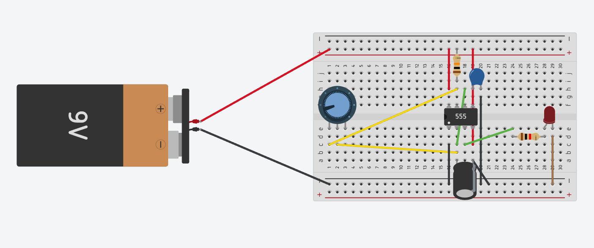

# sesion-03a

<https://www.markdownguide.org/cheat-sheet/>

[Mi lindo figma les invito a mirarlo](https://www.figma.com/board/2tv4jx75qGZa6Gua2UCVer/taller.maq.electr?node-id=129-560&t=cVq1IzUTy8WWUreN-1)

## EXPERIMENTACION

Me pasó que intenté recrear el el circuito viendo mis apuntes, y no pude, tbn viendo el diagrama electrico del datsheet, y tampoco pude, asiq ue recree el circuito en tinkercad viendo el apunte de la carpeta docentes, y ahí lo logré.

Video de lo que hice en mi casa subido a youtube
<https://youtu.be/Gu-Fglth_9U>

## INVESTIGACIÓN

<https://commons.wikimedia.org/wiki/Category:555_timer_IC>

<https://spectrum.ieee.org/chip-hall-of-fame-signetics-ne555?utm_source=chatgpt.com>

<https://www.ti.com/lit/ds/symlink/lm555.pdf?utm_source=chatgpt.com&ts=1743128418913&ref_url=https%253A%252F%252Fchatgpt.com%252F>

<https://www.digikey.com.mx/es/resources/conversion-calculators/conversion-calculator-555-timer?srsltid=AfmBOorxk8EcaH0e_1yWPRhC6H-kjQOrS8v62RXjU5ngcCk14ZUtc0FU>

[TUTORIAL DE PANA](https://www.youtube.com/watch?v=tn5-XiB8oJk&t=39s)
