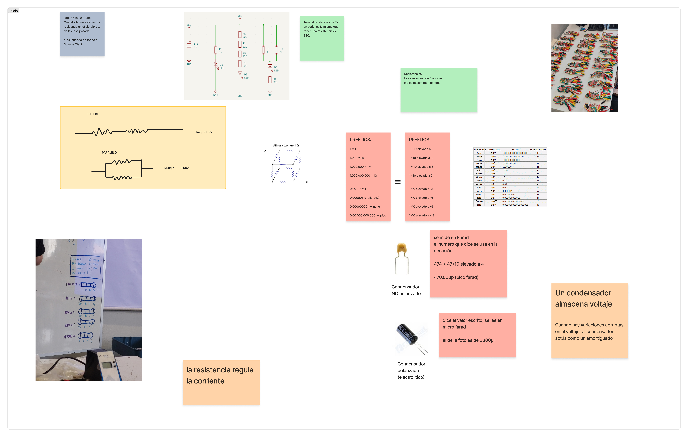
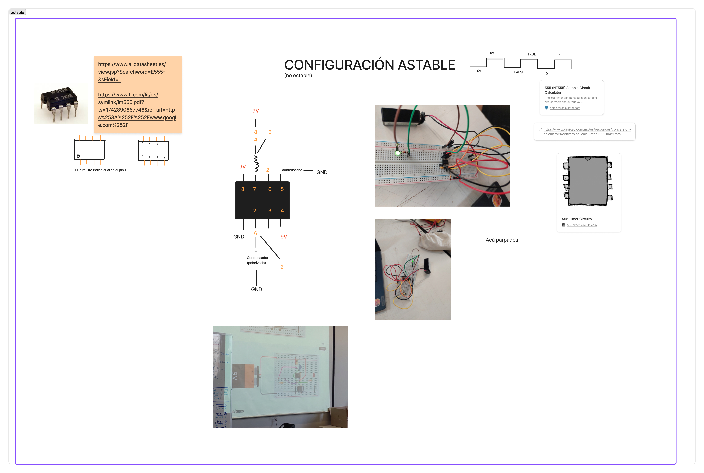
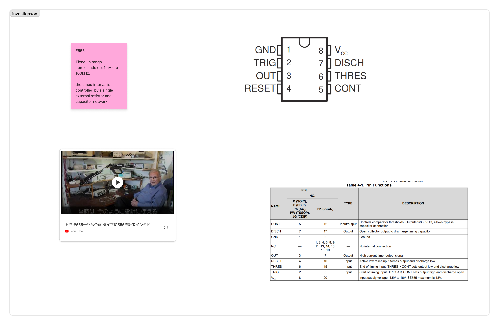

# sesion-03a

<https://www.markdownguide.org/cheat-sheet/>

[Mi lindo figma les invito a mirarlo](https://www.figma.com/board/2tv4jx75qGZa6Gua2UCVer/taller.maq.electr?node-id=129-560&t=cVq1IzUTy8WWUreN-1)

## EXPERIMENTACION

Me pasó que intenté recrear el el circuito viendo mis apuntes, y no pude, tbn viendo el diagrama electrico del datsheet, y tampoco pude, asiq ue recree el circuito en tinkercad viendo el apunte de la carpeta docentes, y ahí lo logré.

Video de lo que hice en mi casa subido a youtube
<https://youtu.be/Gu-Fglth_9U>

## INVESTIGACIÓN

<https://commons.wikimedia.org/wiki/Category:555_timer_IC>

<https://spectrum.ieee.org/chip-hall-of-fame-signetics-ne555?utm_source=chatgpt.com>

<https://www.ti.com/lit/ds/symlink/lm555.pdf?utm_source=chatgpt.com&ts=1743128418913&ref_url=https%253A%252F%252Fchatgpt.com%252F>

<https://www.digikey.com.mx/es/resources/conversion-calculators/conversion-calculator-555-timer?srsltid=AfmBOorxk8EcaH0e_1yWPRhC6H-kjQOrS8v62RXjU5ngcCk14ZUtc0FU>

[TUTORIAL DE PANA](https://www.youtube.com/watch?v=tn5-XiB8oJk&t=39s)

## ENCARGO MUSICAL

Decidí escuchar "dots and loops", ya que, cuando busqué los albumes de Stereolab, me di cuenta que ya tenía guardado este album en mis *me gusta*, pero nunca lo había escuchado.

El proyecto cuenta con 2 discos, el primero de 10 tracks, y el segundo de 14
Lo primero en llamar mi atención de su música es su frecuencia. Me hace pensar en montajes sobre cocina, o situaciones con un ritmo acelerado.

Del disco 1 la canción que mas me gustó fue Diagonal que tiene coro más pop y un ritmo que yo asocio al funk o al rap. 

el disco 2 tiene algunas de las instrumentales utilizadas para las canciones del disco 1. Y también algunas canciones etiquetadas como "(demo)". Las cuales parecen tener un sonido más "crudo", quizas no masterizado.

Para mi lo más rescatable del disco, es como stereolab logra producir instrumentales que convivan tan bien con la voz tan característica de su entonces vocalista Mary Hansen, quien falleció 5 años después en un accidente automovilístico.

La voz de Mary, en mi opinión tiene semejanzas con lo clérigo, lo ritualista, o lo sectario. Me recuerda a la ambientación que plantea el videojuego Far Cry 5, el cual juega con el extremismo religioso. <https://www.youtube.com/watch?v=UMOZ_r1o1lk>

Por lo mismo, me parece un gran logro que stereolab sea capaz de producir instrumentales que por un lado se sienten pegajosas, y cercanos a lo "mainstream", y por otro lado tan complejas en cuanto a la cantidad de sonidos y mezclas de estos que utiliza, y a su vez, que estan mismas instrumentales acompañen de una manera hermosa la voz de Mary Hensen.

nota final: 7.8/10

#### instrumentos utilizados por stereolab:

- moog opus 3 <https://www.vintagesynth.com/moog/opus-3>

- farfisa compact dúo <https://reverb.com/es/p/farfisa-compact-duo-49-key-dual-keyboard-organ>

- doepfer modular <https://doepfer.de/home_e.htm>

- korg ms20 <https://www.korg.com/cl/products/synthesizers/ms_20mini/>

  fuente: <https://www.reddit.com/r/stereolab/>

#### influencias:

stereolab se vio altamente influenciado por un movimiento/corriente de rock experimental surgido a finales de los 60 en la república federal alemana. El movimiento llamado krautrock se  caracterizaba por su alto contenido de instrumentos electrónicos, y su nombre surge porque a los alemanes se les llamaba de manera despectiva "kraut", que significa repollo, debido al alto contenido de repollo en sus comidas.

Como se puede notar en el disco "dots and loops" setereolab experimenta con muchos sonidos de distintos orígenes, por lo que sun influencias son muy variadas. Desde baladas brasileñas, asta pop francés.

fuente: <https://faroutmagazine.co.uk/playlist-music-shaped-stereolab/>
