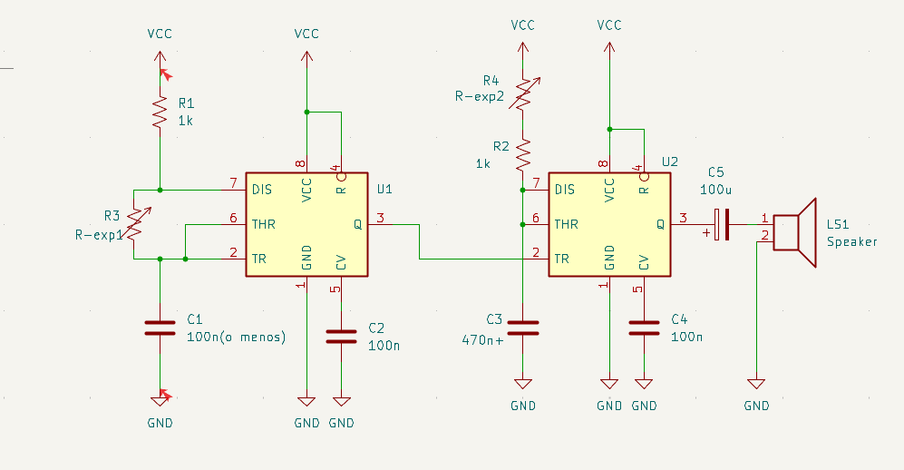
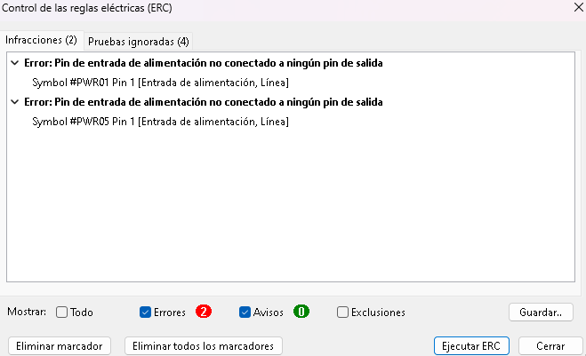
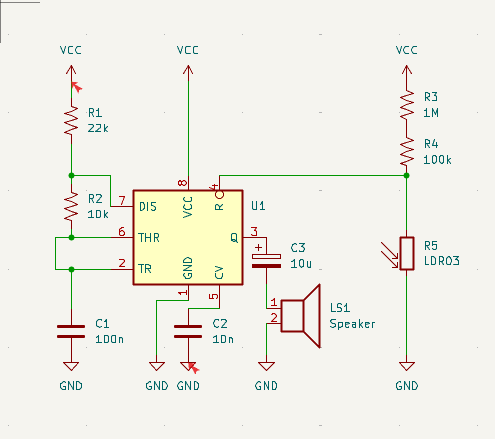
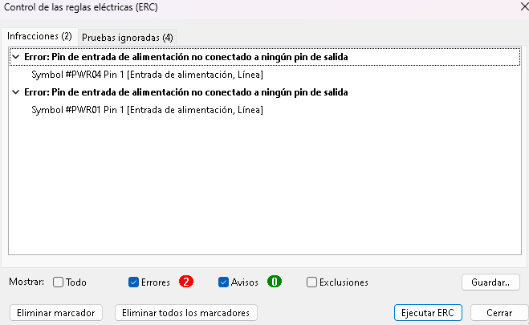
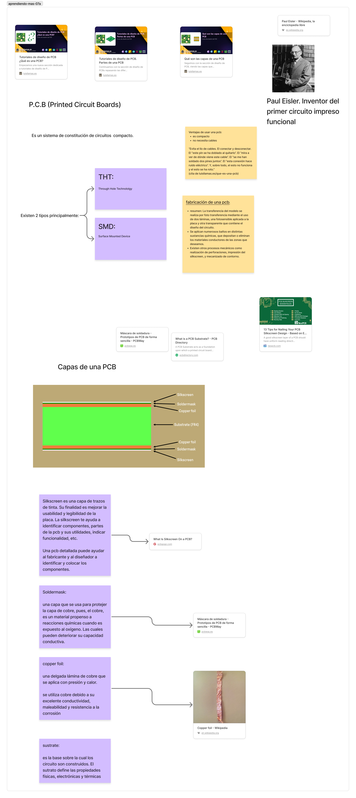

# sesion-07a

### encargo 14

este es el esquemático del circuito base Atari Punk Console.

al ejecutar el EDR, me tira esos errores.

busqué en internet, y según [este foro](https://forum.kicad.info/t/erc-falsely-reporting-pin-not-connected/32455/2) es posible que se deba a que algunos elementos no están alineados con la grilla.

Intenté alinear los elementos a la grilla pero sigue saliendo el mismo error.

este es el esquemátio hecho en kicad del circuito LDA. Basado en el circuito encontrado en la página <555-timer-circuits.com>

mi tira el mismo error, lo atribuyo a la misma causa que en el caso anterior, ya que pareciera no coincidir aquellos componentes que causan errores.

basado en el circuito [DARK DETECTOR](https://www.555-timer-circuits.com/dark-detector.html)

## kicad

### esquemático(SCH)
kicad es una suit de software, es decir, una colección de softwares. Este software permite diseñar esquemáticos, pcb, entre otras cosas. Las funciones se entrelazan, puesto que el programa permite sincronizar el esquemático y la pcb de manera automática.

para diseñar el esqumático necesitamos saber el valor símbolo y conexión de cada componente.

los componentes tienen ciertas características que los definen:

- nombre
- valor
- rating
- footprint
- símbolo

### pcb

la pcb está compuiesta por una serie de capas las cueles se muestran por separado en kicad:

- f. mask
- F. silkscreen (dibujitos)
- F. cu
- 1 edge cuts(fibra de vidrio)
- B. cu
- B. silkscreen(dibujitos)
- b. mask

esta capas se pueden separar en 3 grupos: front, back y center. la partel frontal y trasera son espejo entre ellas, separadas por una capa de fibra de vidrio.

dependiendo de en qué capa coloques elementos en kicad este tendrá distinto desenlace:

la capa edge cuts es donde se colocan  los vectores para personalizar la forma de la pcb.

la capa "cu" refiere al cobre, al colocar vectores en esta capa, se verán color cobre.

la capa "silkscreen" es donde se colocan las footprint e indicaciones para el fabricante.

finalmente, la capa "mask" es una capa protectora transparente que cubre toda la pcb por encima.

