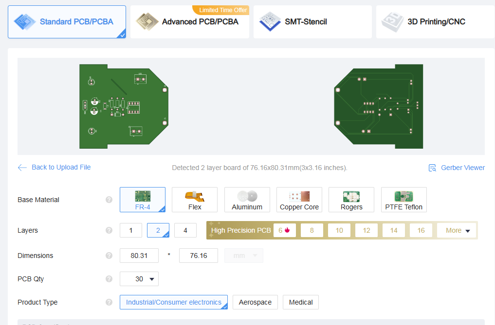
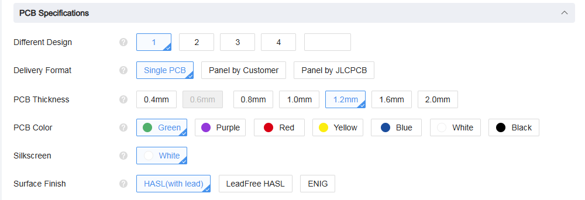
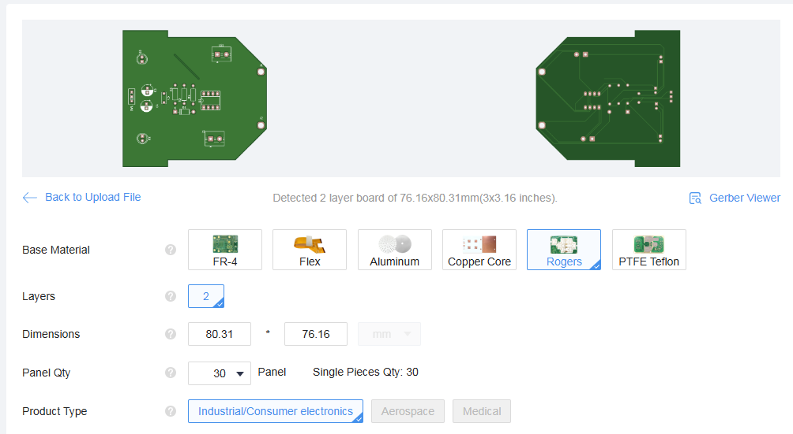
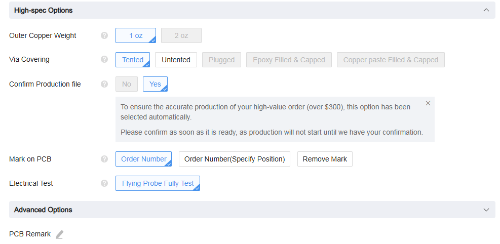
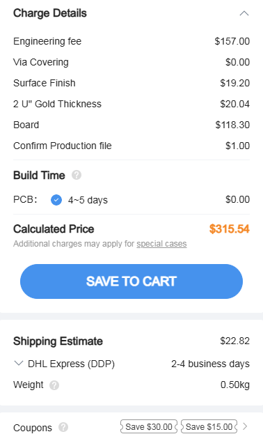

# sesion-07b

### encargo: cotizar pcb

para el primer caso, mi objetivo será manipular los parámetros para que la compra sea lo más barata posible.

### encargo experimental: cotizar pcb 

para el segundo caso, mi objetivo será llegar al precio máximo posible, con el objetivo de entender los parámetros

.

