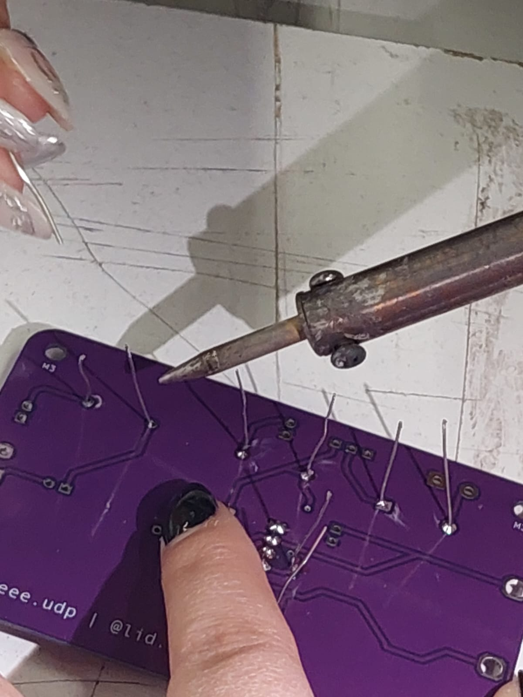
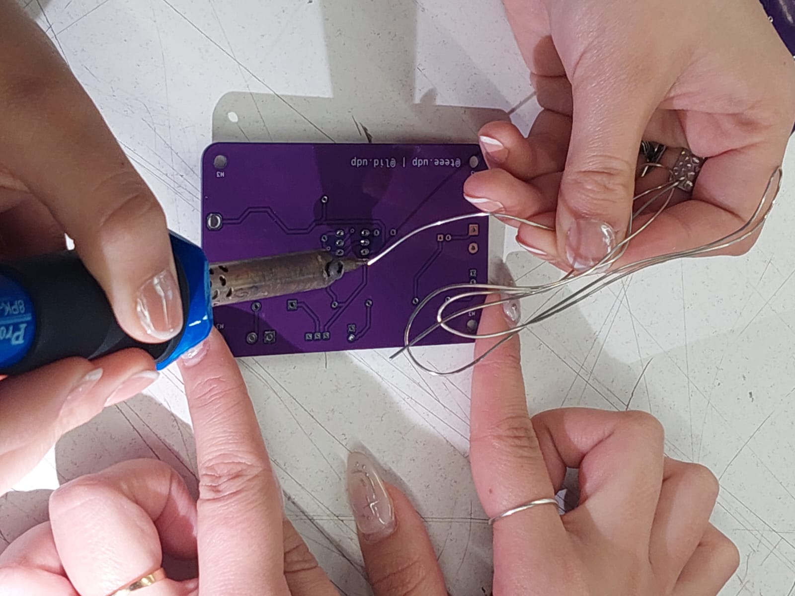
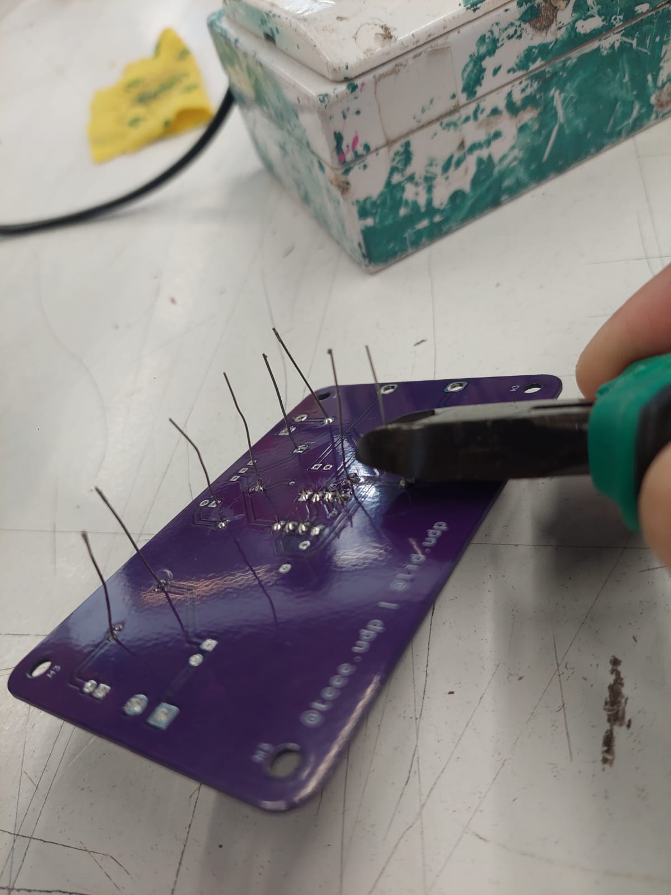

# sesion-10b

## encargo

|           Componente          | Cantidad |
|:-----------------------------:|:--------:|
| Socket de 8 pines             | 1        |
| Resistencias de 1k            | 3        |
| Diodo 1N4007                  | 1        |
| Condensador cerámico 100n     | 1        |
| Condensador electrolítico 1u  | 1        |
| Condensador electrolítico 47u | 1        |
| LED 5mm                       | 2        |
| TBLOCK_2                      | 1        |
| Speaker                       | 1        |
| Switch SPDT                   | 1        |
| Chip NE555                    | 1        |
| Clip para batería             | 1        |
| Parlante 8Ω                   | 1        |
| Cables caimán                 | 2        |

Paso 1: colocar el socket, donde posteriormente se insertará en E555

Paso 2: Colocar las resistencias en R2, R3 y R4, y un diodo en D1. Teniendo en cuenta la dirección en la que "apunta" el diodo.

Para el soldado, lo hicimos de a 2 personas por placa, una persona se encagaba de sostener los componentes la placa en su lugar, mientras la otra persona iba soldando.

El siguiente paso fue mejorar el oficio del soldado, a la vez que nos asegurábamos de que los componentes estuvieran lo más cercano posible a la pcb. Para esto, un integrante derretía el estaño, y el otro integrante "tiraba" el pin para asegurarse de que quedara pegado a la pcb. 

finalmente recortamos el sobrante de los pines. El equipo docente me recomendó dejar un poco del pin expuesto, y posteriormente recortarlo para que no sobresalga el pin por fuera de la soldadura.

PD: esta clase no traje mis componentes porque se me olvidaron. Anaisbmg me prestó los componentes necesarios para esta etapa y comprometí en devolvérselos a la brevedad.

- 3 resistores de 1k
- 1 capacitor electrolítico de 470uF, 16v
- 1 capacitor electrolítico de 1uF, 50v
- 1 capacitor cerámico de 100nF
- 2 leds azules
- 1 diodo 1n418

nota: ya los devolví

