# Manual de uso  para el volca modular

##

## Contexto

Un sintetizador es un instrumento musical electrónico que **genera señales eléctricas**, las cuales son **convertidas a sonido audible** a través de un altavoz.

-c: sonido perceptible-

Los sintetizadores **generan y procesan** señales, por lo que es capaz de generar un rango mucho más variado de sonidos que un instrumento tradicional. Un sintetizador tiene una **serie de procesos internos** los cuales dan como resultado distintos sonidos.

## volca modular

Volca Modular es un sintetizador **semi-modular**, esto quiere decir que permite al usuario manipular el **orden y presencia** de los procesos internos del sistema.

-c: presencia-

Dentro del volca modular existen 8 módulos independientes con funciones específicas que el usuario puede manipular para lograr distintos sonidos.

### precauciones

Los osciladores del volca modular están fabricados con circuitos analógicos discretos, por lo que su afinación puede variar dependiendo de factores ambientales como la temperatura.

Para afinar usar *FUNC* + *RATIO knob*

Factores que pueden acelerar el deterioro del volca modular:
Exposición a la luz del sol, temperaturas extremas, exceso de polvo/suciedad, vibración excesiva, campos magnéticos potentes.

## Interfaz

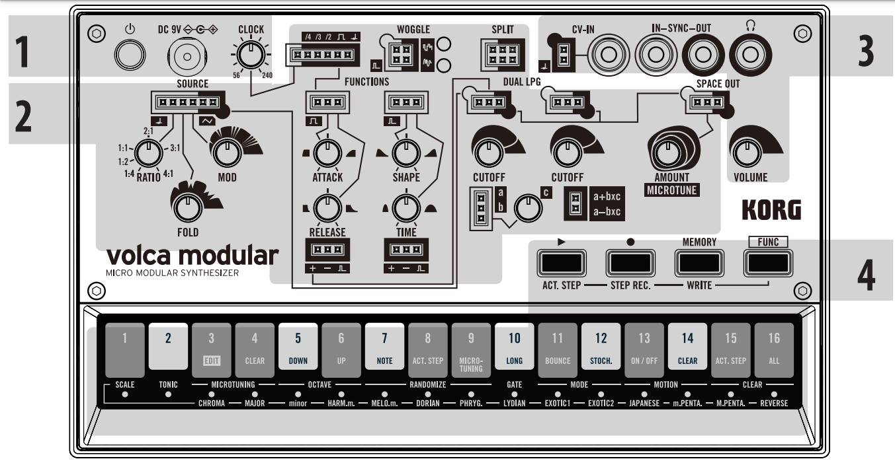

### setup

Compuesto por el **botón de encendido**, la entrada a corriente y **CLOCK knob.** Este último controla la velocidad del secuenciador.

### módulos

8 módulos:

- source
- function
- sequences
- woggle
- split
- dual LPG
- utility
- space out

ver más en la sección Módulos

### secuenciador

el secuenciador *agregar info

el secuenciador *agregar info

el secuenciador *agregar info

### conexiones

el volca modular contiene una serie de entradas y salidas mini jack

- **Jack CV-IN:** Permite controlar el tono con señales externas

- **Jacks SYNC IN, SYNC OUT:** Permiten la sincronización con dispositivos externos.

    - - IN: cuando esté conectado ignorará el reloj interno propio del volca modular. 
    - - OUT: manda señales de 5V el comienzo de cada step.

Salida de audífonos: al conectar audífonos el parlante del dispositivo dejará de sonar.

**VOLUME knob:** controla el volumen general del dispositivo

## Módulos

### uso

El proceso que lleva a cabo el volca modular consta de 8 módulos independientes e intercontables a través de cables dupont. Esto permite una variedad muy amplia de posibles sonidos.

*el volca modular tiene sus propias conexiones internas las cuales funcionan solo cuando no hay cables externos conectados*

### interfaz

Cada módulo cuenta con sus propias entradas(IN) y salidas(OUT). Éstas se diferencian por su contorno. 

Contorno con relleno = OUT
contorno sin relleno = IN 

### señales

los modulos se comunican mediante señales que varían entre 3V y -3V. el volca modular es capaz de emitir 4 tipos de señales: audio, control, gate y trigger

- audio: genera las señales
- control(CV): modifica las señales
- gate: la señal sube a 3V y permanece el tiempo que dure la nota
- trigger: la señal sube a 3V y desciende inmediantamente

### módulos

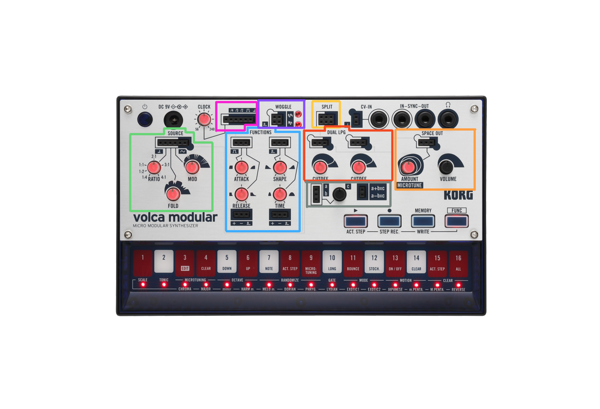

##### source(verde): 

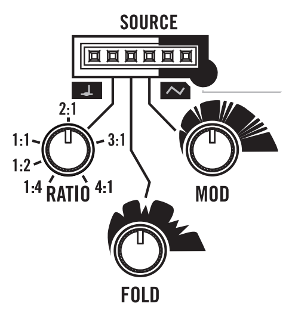

"Este módulo consta de un par de VCO triangulares (osciladores controlados por voltaje), uno llamado “carrier” (transportador) y el otro “modulator” (modulador). La señal generada por el modulador se utiliza para variar la frecuencia del transportador, y este proceso se denomina modulación de frecuencia (FM). La modulación de frecuencia permite a los usuarios crear sonidos con gran riqueza de contenido armónico, y frecuentemente con una característica metálica. La señal de salida pasa después a través de un circuito doblador de ondas controlado por el mando FOLD que invierte la forma de la onda a ciertos umbrales con el fin de aumentar aún más el contenido armónico."

- IN: pitch, ratio, fold, mod

- OUT: modulator, carrier

#### function(azul)

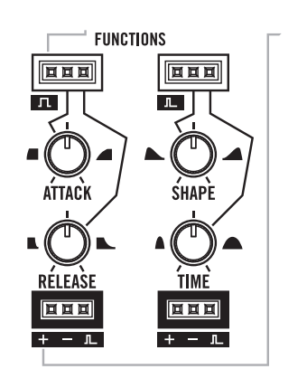

**AHR** (parte izquierda):

Este es un generador de tres fases: ataque,
mantenimiento y liberación. Genera una señal que
sube de acuerdo al tiempo de ataque en el comienzo
de una señal de puerta, se mantiene hasta el final de
la puerta, y a continuación cae durante el tiempo de liberación. Cuando se alcanza el tiempo de liberación, se envía un disparador a la salida de disparador final.

- IN: gate, attack, release

- OUT positive, inverted, end trigger

**raise-fall** (parte derecha)

"Este generador solo tiene dos fases: subida y caída. La forma determina el balance
entre el tiempo de subida y de caída, mientras que el tiempo determina la duración
global del ciclo de subida-caída. Cuando el ciclo termina, se envía una señal de
disparador a la salida de disparador final. Conectando la salida de disparador final a
la entrada de disparador del propio módulo, el generador Raise-Fall (subida-caída)
comenzará un bucle indefinido, lo que permite utilizarlo como una fuente de
modulación continua, de manera similar a un LFO."

- IN: trigger, shape, time
- OUT: positive, inverted, end trigger

#### sequences (rosado)

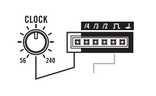

"Este módulo es la interfaz con el secuenciador
interno.
La salida de tono de afinación es el tono del paso actual. Se manda una señal de
puerta a la salida de puerta cuando debería reproducirse una nota para el paso
actual. También se mandará una señal de puerta a las otras salidas de acuerdo a un
contador de puertas:
• /4 (fourth): una vez cada cuatro puertas
• /3 (third): una vez cada tres puertas
• /2 (half): una vez cada dos puertas
La entrada de desplazamiento de reloj se puede utilizar para modificar el tempo del
secuenciador en +/- 20 BPM."

- IN: clock offset
- OUT: fourth, third, half, gate, pitch

#### woggle (morado)

"Este módulo es un circuito de muestreo y mantenimiento (sample
and hold) predeterminado para muestrear una fuente de ruido
rosa. Un circuito de muestreo y mantenimiento muestrea un voltaje cuando se
dispara y mantiene ese voltaje hasta que se dispara otra vez. La entrada de muestreo
puede utilizarse para anular la fuente de ruido y muestrear cualquier señal. Cada vez
que se recibe una señal de disparador en la entrada de reloj, el valor de la entrada de
muestreo se recuerda y se envía a la salida por pasos. La salida uniforme dará una
sensación similar a la salida por pasos, pero los cambios de valor fluirán de forma
suave en vez de saltar inmediatamente al siguiente valor muestreado."

- IN: sample, trigger
- OUT: stepped, smooth

#### split (amarillo)

"Este módulo duplica una entrada a dos salidas diferentes, de modo que una señal
pueda ser dividida y conectada a más de una salida. También es posible utilizar este
módulo al revés, en cuyo caso se convierte en un mezclador de señales pasivas,
combinando dos señales de control o de audio en una."

- IN:input 1, input2
- OUT: output 1-A, output 1-B, output 2-A, output 2-B

#### dual LPG (rojo)

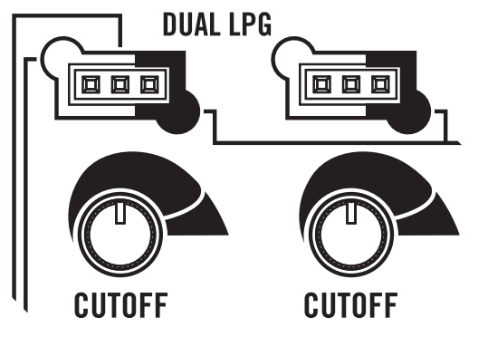

"Estos son dos circuitos de puerta de paso bajo
individuales que consisten en la combinación de un
filtro de paso bajo y un amplificador controlado por
voltaje. El nivel de entrada determina la ganancia de
la señal de entrada que pasa a la salida y también las frecuencias que se dejan pasar. Esto significa que un nivel alto dará un sonido
brillante y con volumen alto, mientras que un nivel bajo dará un sonido suave y
amortiguado. La frecuencia de corte máxima del filtro de paso bajo se determina
mediante el mando CUTOFF."

- IN: signal, level
- OUT: signal

#### utility (naranjo)

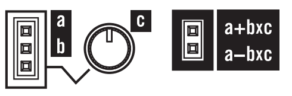

"Este módulo permite combinar y atenuar las señales
de varias maneras. 'c' se utiliza para atenuar la entrada 'b', y el resultado se suma a
la salida 'a' o se resta de ella. Todas las entradas puede ser polares o bipolares, y
son compatibles tanto con señales de control como de audio. Además, cuando no hay
conexiones en la entrada 'b', su valor predeterminado es 3,3 V, en cuyo caso se
puede aplicar una compensación de voltaje fija a 'a' controlando el valor de 'c'"

- IN: a, b, c
- OUT: a+bxc, a-bxcc

#### space out

"Este módulo aplica un efecto espacial digital a la señal de
audio de entrada y envía el audio al jack de auriculares y
al altavoz interno. La salida se puede utilizar para hacer
una conexión de parcheo del audio resultante a otra
entrada."

- IN: audio, amount
- OUT: audio

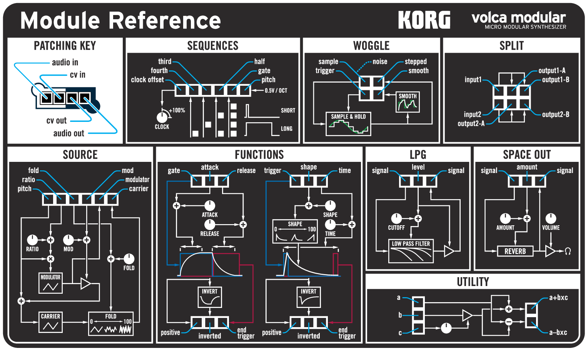

### patchs

dependiendo de cuáles pines  y en qué orden estén conectados, se lograrán disntitos sonidos. A éstas configuraciones se les llaman “patchs”. El patch define el flujo que sigue la corriente y qué módulos se ven involucrados.

Explorar los patch permite entender el comportamiento de los módulos y como éstos afectan al sonido resultante. KORG ofrece una serie de ejemplos básicos.

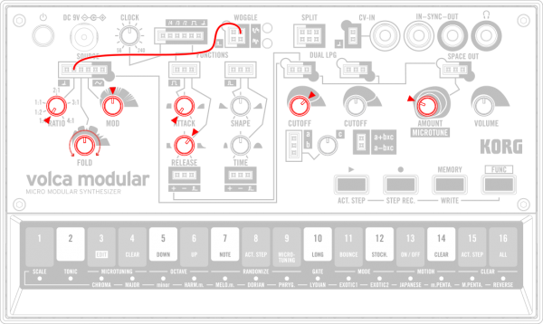

Western Bongo
Un sonido de percusión metálica producido mediante modulación FM y un wave folder. Se trata de un sonido básico del módulo SOURCE.

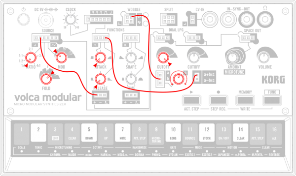

Random Release
El tiempo de liberación del generador ADH es variado al azar mediante sample & hold, aplicando un ritmo orgánico a la secuencia.

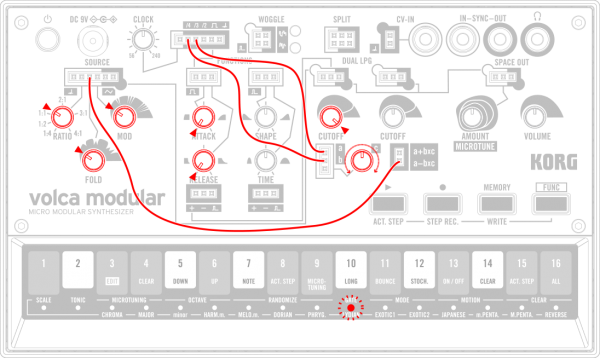

Gate Math
Se mezcla sustractivamente un contador de puerta de una frecuencia diferente. El mando UTILITY controla la cantidad de la mezcla, variando el ritmo del cambio tonal.

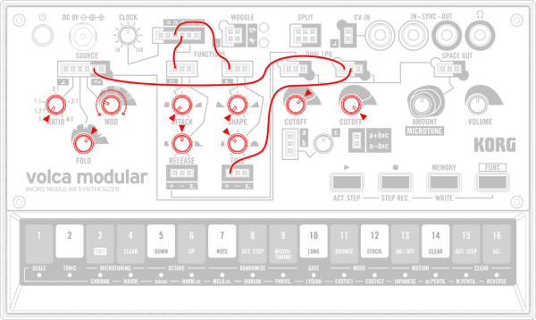

Polyrhythmic Duo
El modulador de FM se obtiene como audio de onda triangular, y haciéndola pasar por una función de puerta de paso bajo que es independiente del portador, se superponen polirrítmicamente dos tipos de frases.

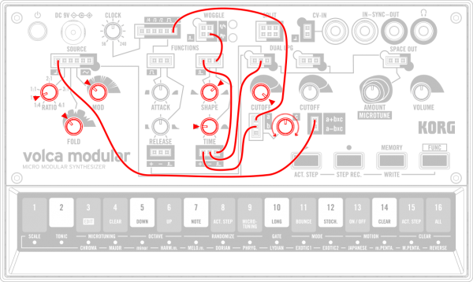

Generative
Se realiza un bucle del generador de ascenso-caída para crear un LFO que modula el tono y el corte. Puesto que la velocidad del LFO cambia irregularmente, se produce una variedad de caracteres tonales.

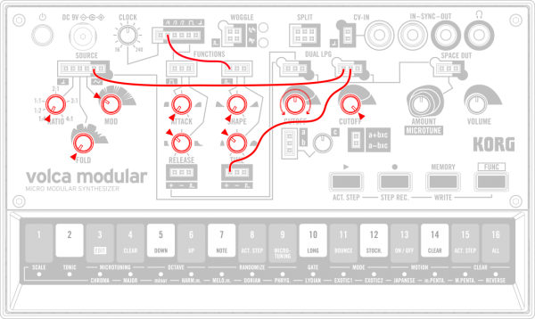

Walking Bass
Una onda triangular con el tono disminuido suena con una frecuencia baja mediante el contador de puerta. Esto hace que el bajo se añada a la secuencia principal una vez cada cuatro pasos.

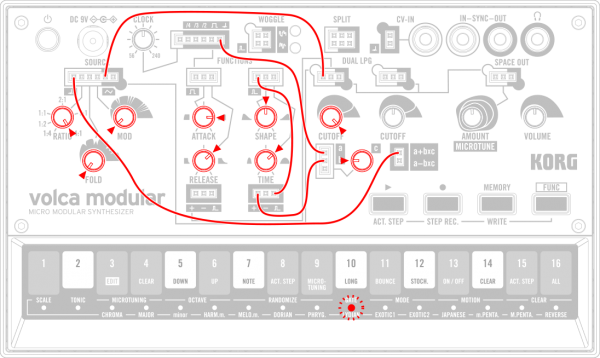

El LFO se utiliza para modular ligeramente el tono de una onda triangular, lo que permite tocar un suave sonido solista que recuerda sonoridades de cuerdas solistas. 

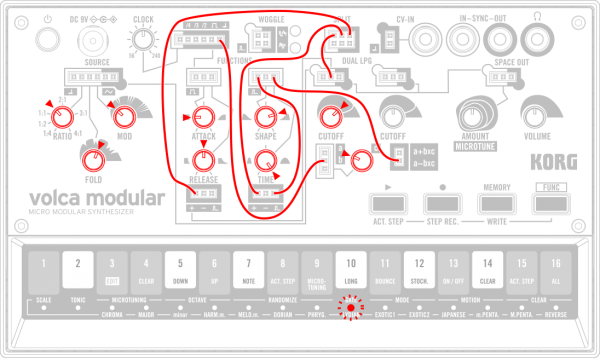

El LFO modula el corte de la puerta de paso bajo, haciendo que suene un bajo FM con una sensación de movimiento. UTILITY y SPLIT se utilizan para reducir la velocidad del LFO cuanto más bajo sea el tono.

Cuando quieres compartir y/o replicar un patch específico, es importante documentarlo. Si bien la página del volca modular propone estos diagramas para documentar los patch, hay una simbología que se propone en el libro "Patch and Weaks" que vale la pena mencionar.

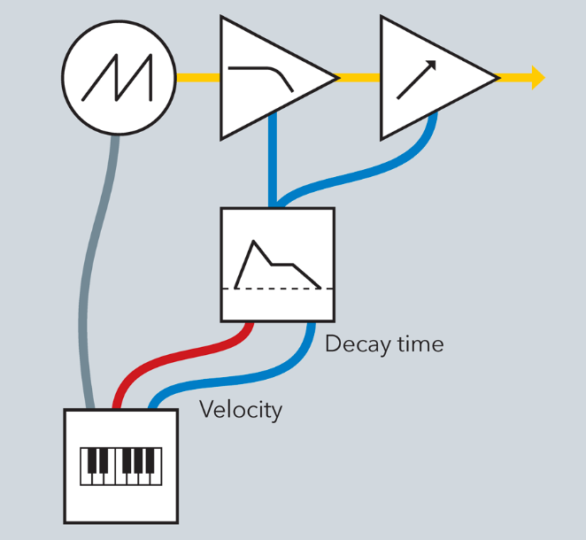

## Secuenciador

Muchas de las funciones del volca modular se encuentran ocultas en esta sección.

### grabación

**STEP REC**(activa modo grabación) >> **ACT STEP**(comienza a grabación)
**ACT STEP**(reproduce secuencia) >> **STEP REC**(comienza grabación)

### asignar notas

FUNC+STEP REC(grabación en STEP[1]) 
 >> STEP[1-16](asignar nota a STEP[1])
 >> STEP REC (asignar silencio)
 >> ACT STEP(reproducir nota ya asignada)

### guardar secuencias

FUNC+MEMORY > STEP[1-16](guarda secuencia en STEP[1-16])

### reproducir secuencias guardadas

MEMORY+STEP[1-16](seleccionar secuencia guardada en *STEP[1-16]*) >> *ACT STEP* (reproducir secuencia seleccionada)

### *FUNC*

las funciones avanzadas se desbloquean con el uso de *FUNC*

*FUNC* + *STEP[1]*(modo selección de escala) >> *STEP[3-16]*(activa la escala seleccionada)
*FUNC* + *STEP[2]* (modo selección de tónica) >> *STEP[1-12]* (activa la tónica seleccionada)
*FUNC* + *RATIO knob* (ajustar afinación global del oscilador)

para ver el resto de funciones especiales visitar el ["manual de uso del volca modular "](https://cdn.korg.com/jp/support/download/files/8a84fea394a4519c822e68f28ac5ab3b.pdf)

## Refrenecias

- [página del volca modular](https://www.korg.com/cl/products/dj/volca_modular/specifications.php)

- ["volca modular Owner's Manual"](https://cdn.korg.com/jp/support/download/files/8a84fea394a4519c822e68f28ac5ab3b.pdf)

- [simbológía "Patch and Tweaks"](https://www.patchandtweak.com/patch-symbols-explained/)

- [synthesizers wikipedia's page](https://en.wikipedia.org/wiki/Synthesizer)

- Bjooks. (2021). Patch & Tweak: The Book. Thomann.