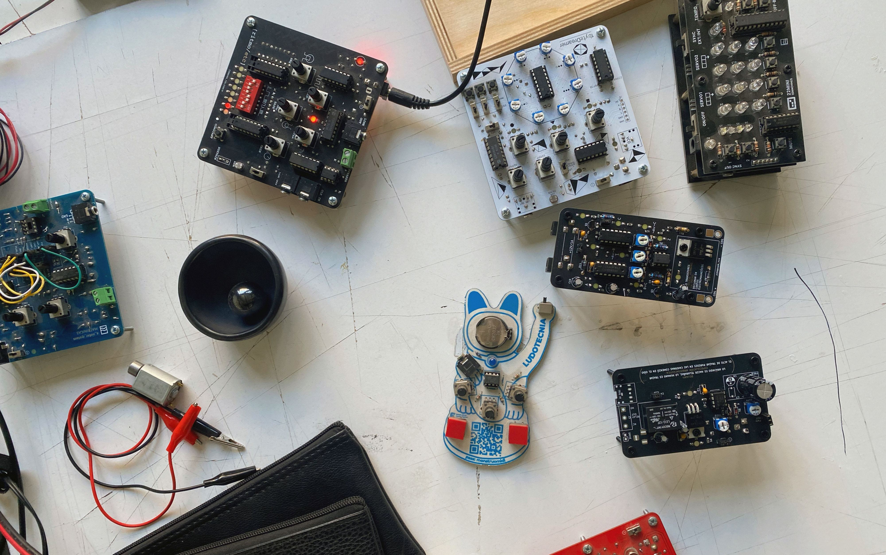
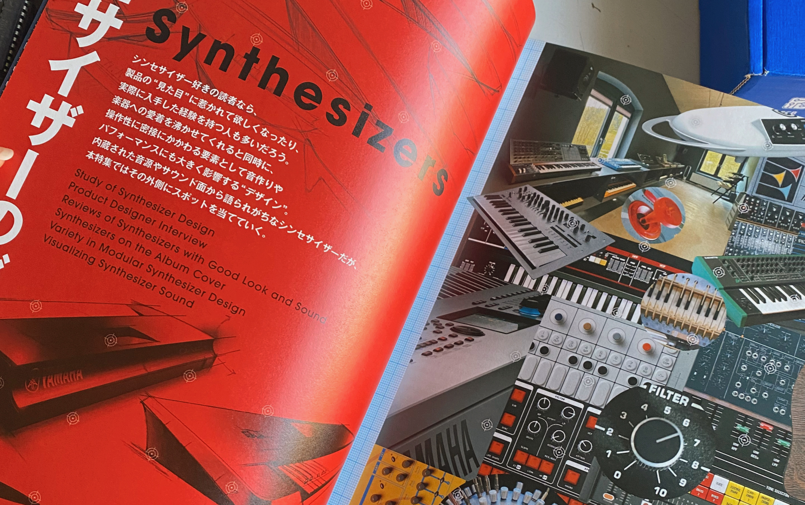
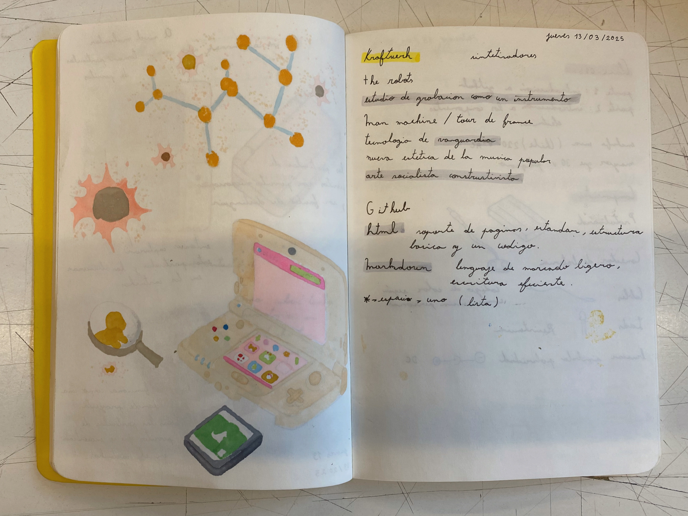
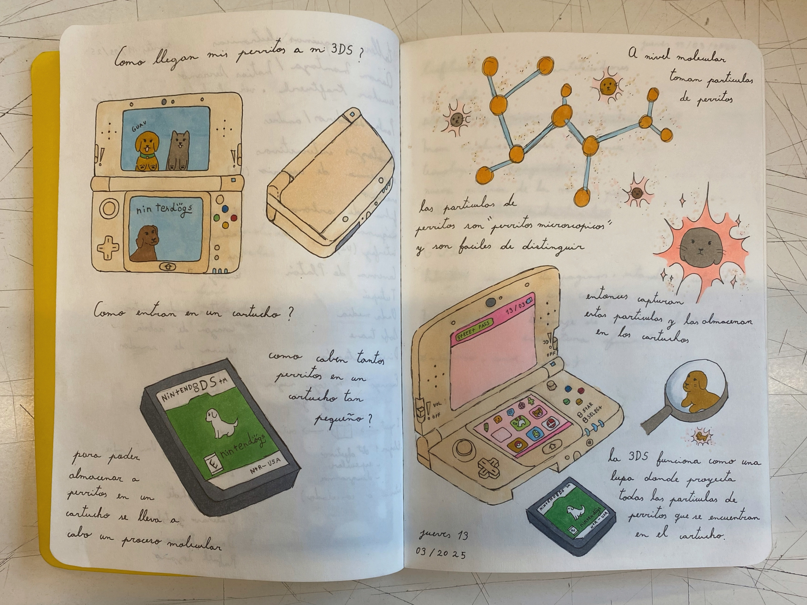

# sesión-01a

## Trabajo en clase / Martes

### Conociendo el Taller Máquinas Electrónicas

- ¿Qué experiencias hemos tenido con la electrónica?
- ¿Cuáles son nuestras expectativas para este taller?
- Tecnologías interactivas
- Concepto de tecnología
- Input y output
- Referentes varios de las artes electrónicas

## Encargos

### Encargo-00: Barrio universitario

- Barrio Universitario es una película chilena de comedia que se estrenó el 25 de julio de 2013.
- La historia se desarrolla en un contexto universitario. Los protagonistas se inscriben en una competencia de robótica con el objetivo de conquistar a una chica de una universidad más prestigiosa. Cuando reciben el primer fondo para comenzar a trabajar, lo gastan en puras tonteras, lo que los obliga a improvisar. De alguna manera, su proyecto, casi hecho de basura, es seleccionado por considerarse una propuesta sustentable. A lo largo de la película, atraviesan un largo proceso y logran crear un proyecto final de forma ingeniosa. Además de esto, también enfrentan tensiones, malentendidos y conflictos dentro de su grupo de amistades.
- En esta película se puede ver una clara crítica social y cómo se perpetúan ciertos estereotipos. Siento que lograron comunicar bien lo que querían transmitir a través del humor y la sátira. Aunque no tenía muchas expectativas, me gustó la película. En algunos momentos me pareció un poco lenta y predecible. No la volvería a ver, pero me alegra haberla visto.
- Les dejo este video con 42 razones para ver Barrio Universitario. <https://youtu.be/2eGPD23Sn10?si=gyEDcZvTY5J39IQv>

### Encargo-00: Kraftwerk

- Álbum Man Machine y Tour de France
- Tecnología de vanguardia
- Arte socialista constructivista

### Encargo-01: Mi caja negra y yo

- Ejercicio especulativo
- ¿Cómo llegan mis perritos a mi 3DS? ¿Cómo es posible que entren en un cartucho? ¿Cómo caben tantos perritos en un cartucho tan pequeño?
- Para poder almacenar perritos en un cartucho, se lleva a cabo un proceso molecular. A nivel molecular, se toman partículas de perritos. Estas partículas son como "perritos microscópicos" y se pueden distinguir con facilidad. Entonces, se capturan estas partículas y se almacenan dentro del cartucho.
La 3DS funciona como una especie de lupa, que proyecta todas las partículas de perritos contenidas en el cartucho, permitiendo así que los podamos ver y jugar con ellos.

