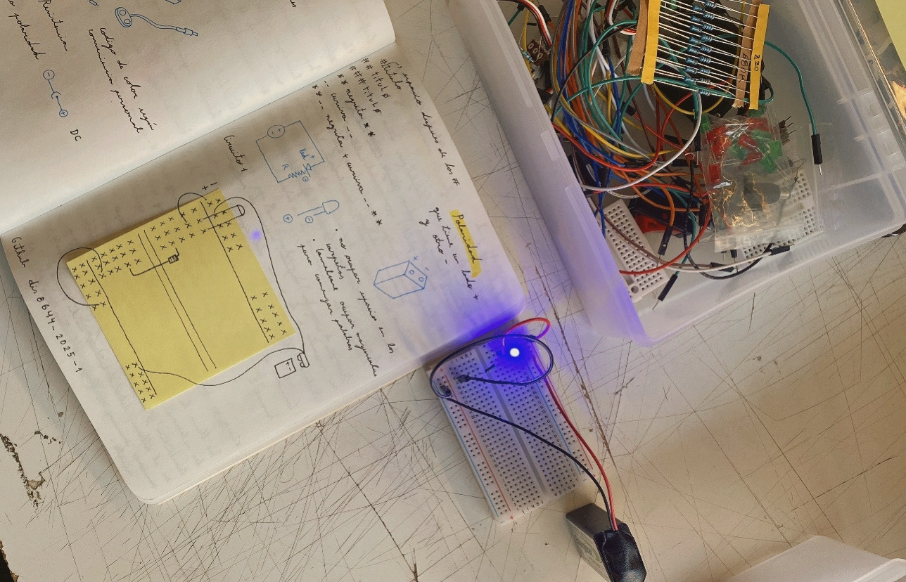
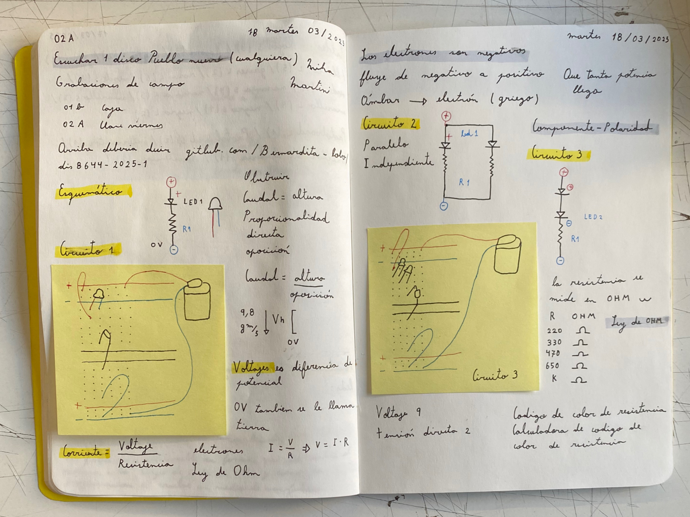
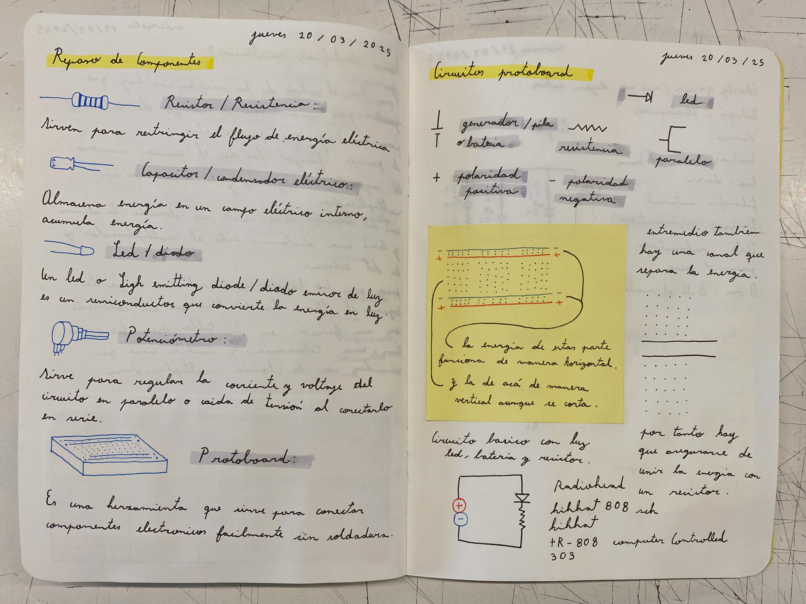

# sesion-02a

## Trabajo en clase / Martes 18 de Marzo

### Circuitos eléctricos

- Repaso GitHub
- Explicación de dibujos esquemáticos
- Voltaje y resistencia
- Circuitos paralelos e independientes
- Valores de las resistencias

## Encargo

### 04-Cultura electrónica chilena y latinoamericana

- Escuchar un álbum de Pueblo Nuevo
- Álbum El poder corrompe por Daniel Jeffs
- La presencia del tempo

### 05-Estudio de resistores y circuitos en serie y paralelo

- ¿Cómo identificar el valor de las resistencias a través de la tabla de códigos de colores?
- Componentes y circuitos
- Componentes repasados: resistencia, capacitor, diodo, potenciómetro y protoboard
- Simbología de los esquemas electrónicos
- Funcionamiento de la protoboard

