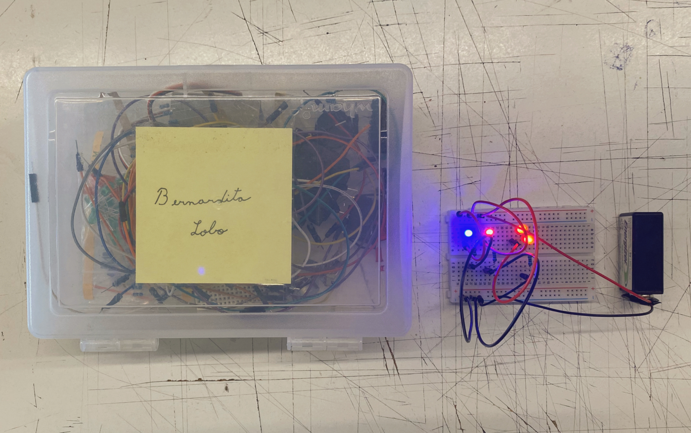
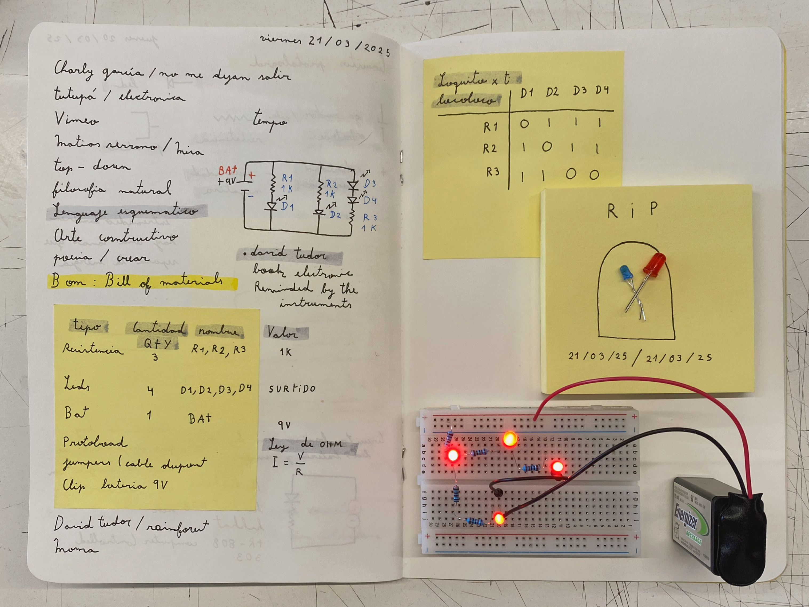
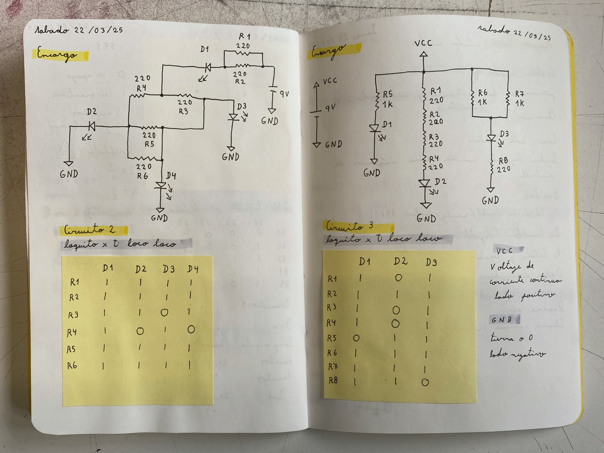

# sesion-02b

## Trabajo en clase / Viernes 21 de Marzo

### Circuitos y referencias varias

- Circuitos más complejos
- Repaso de lenguaje esquemático
- Bill of Materials
- "Loquito x ti, loco loco"

## Encargos

### Loquito x ti loco loco

- Circuitos complejos con testeo de extracción de resistencias

### Suzane Cianni

- Álbum Golden Apples of the Sun
- Música para máquinas de pinball
- La mezcla de los sintetizadores y sus habilidades para el piano

