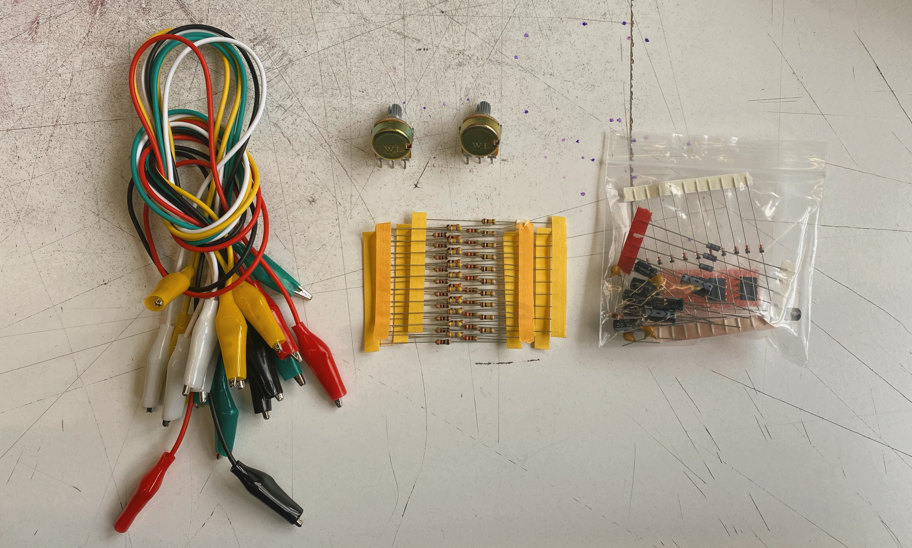
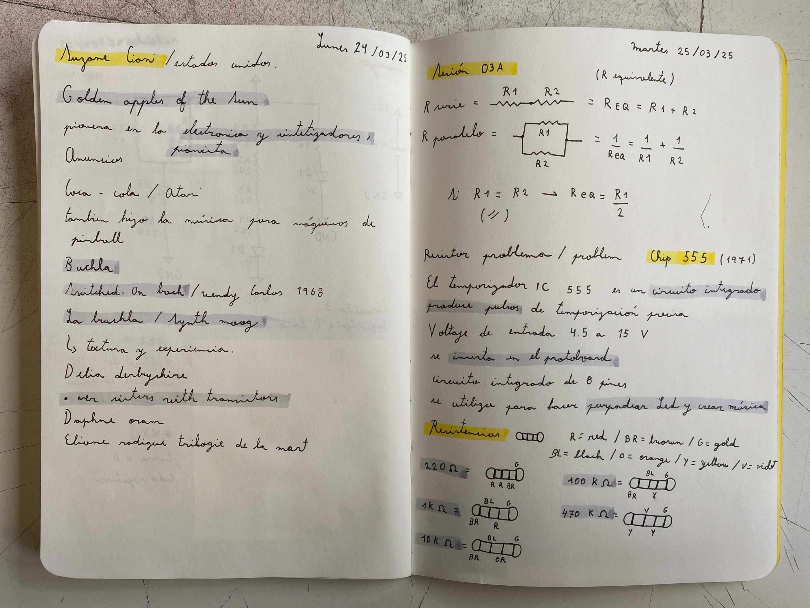
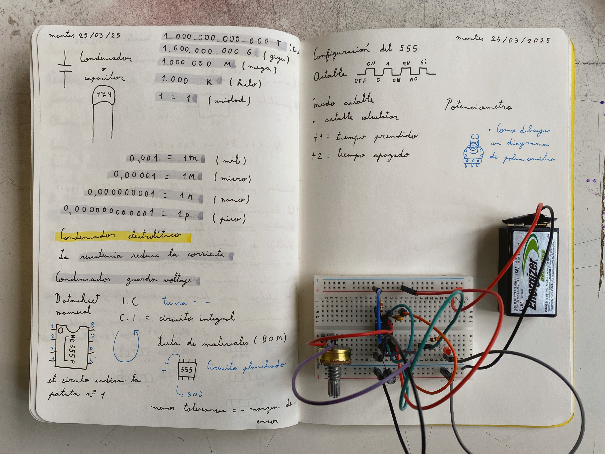

# sesion-03a

## Trabajo en clase / Martes 25 de Marzo

### Nuevos componentes

- Caimanes, potenciómetros, resistencias, capacitores y dos circuitos integrados 555
- Introducción al circuito integrado 555
- Valores de resistencias y capacitor
- Capacitor y condensador son lo mismo

### Primer circuito astable

- Unidades de potencia
- Datasheet/manual
- Circuito electrónico con circuito integrado 555
- Luz oscilante con potenciómetro

## Encargos

### Encargo-06: Cultura electrónica europea de los 1980s y 1990s

- Álbum "Perpetuum Mobile" por Einstürzende Neubauten
- Estilo industrial electrónico
- Ellos fabricaban sus propios instrumentos
- ¿Qué es el movimiento dadaísta?
- ¿Qué es un perpetuum mobile?

### Encargo-07: Apuntes sobre digerir, reflexión y expansión del chip 555

- Circuito integrado 555
- ¿Cómo funciona un circuito integrado 555 en mis palabras?
- Funciones de patillas del circuito integrado 555

