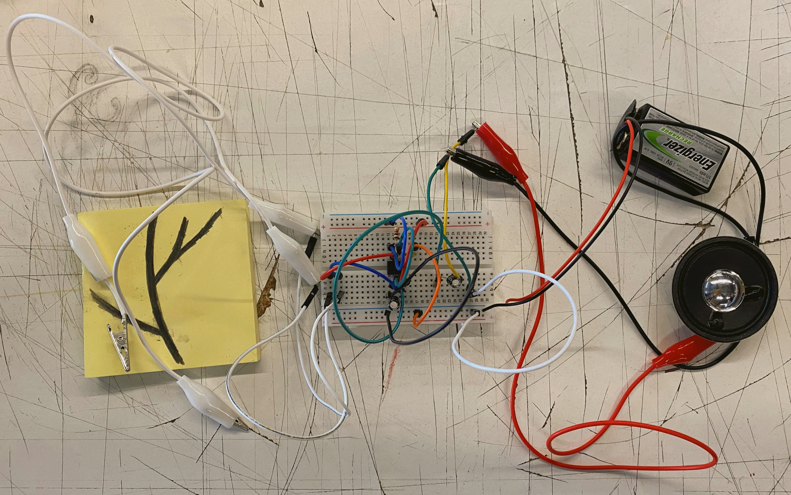
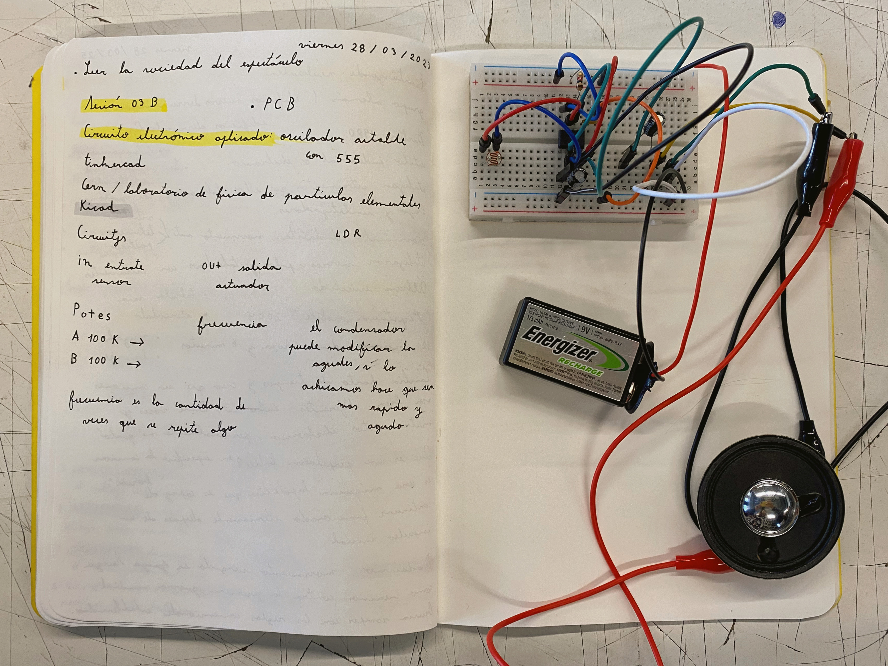
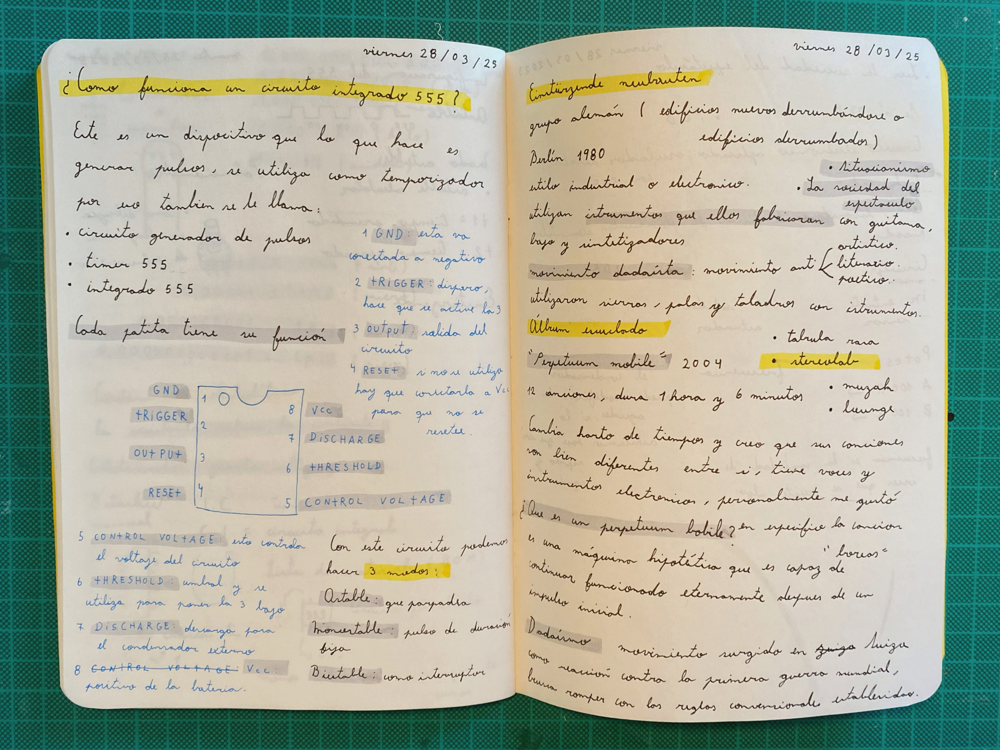
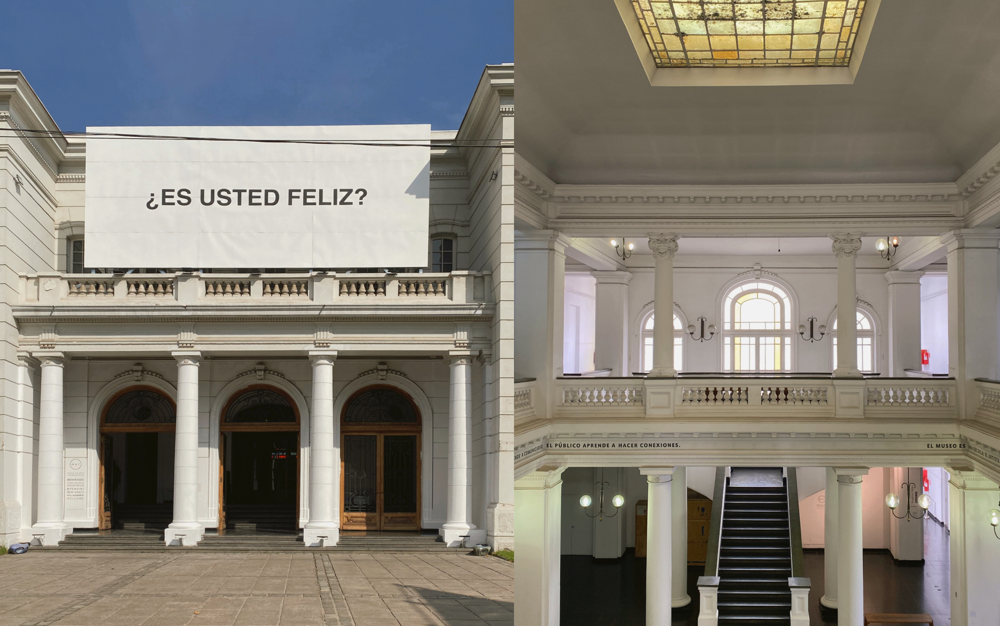
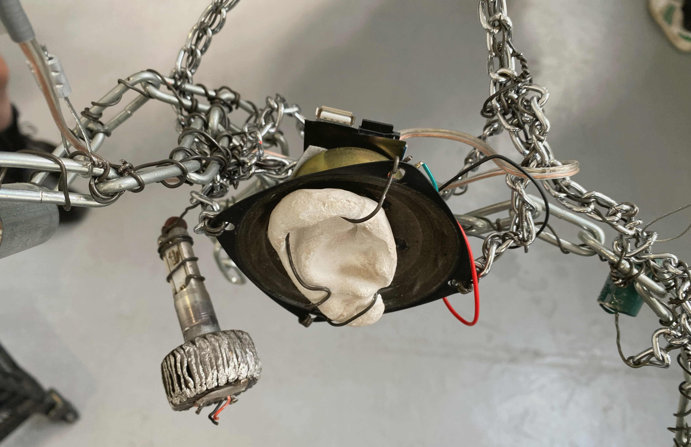
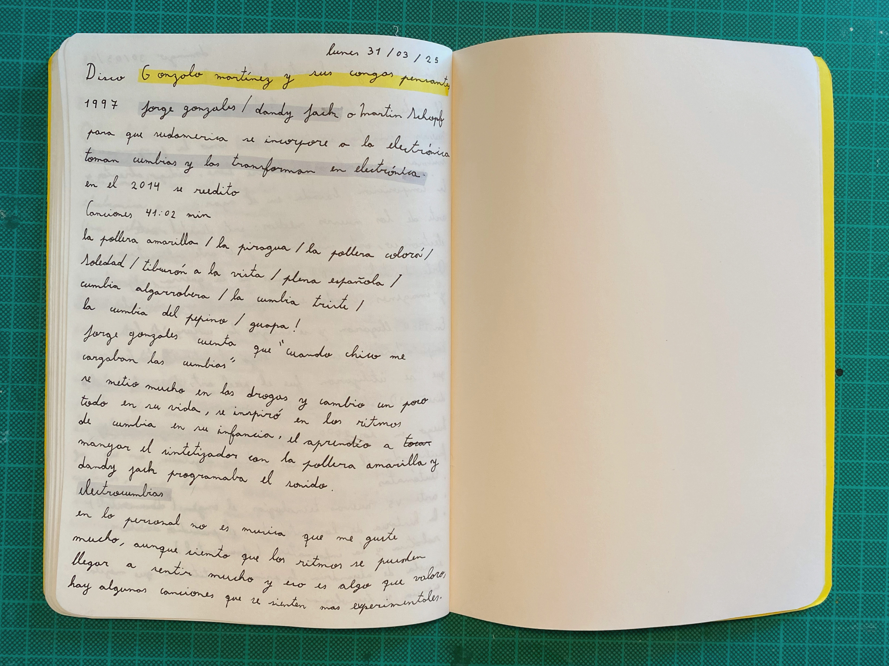
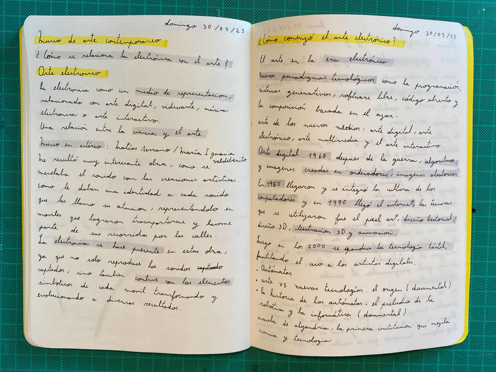

# sesion-03b

## Trabajo en clase / Viernes 28 de Marzo

### Circuito electrónico aplicado

- oscilador astable
- circuito electrónico con sensor de luz
- circuito electrónico con bocina
- orquesta de circuitos electrónicos con sensor de luz y bocina

### Visita al museo de arte contemporáneo

- museo de arte contemporáneo en quinta normal

## encargos

### encargo-08: cultura musical nacional

- gonzalo martínez y sus congas pensantes
- por jorge gonzález y dandy jack
- video "jorge gonzález habla del disco gonzalo martínez" <https://youtu.be/MGBKucEQzwk?si=bGuyuFHy3gRyJhxA>
- video "gonzalo martínez y sus congas pensantes" <https://youtu.be/owdi6iuhx9k?si=iSjnu-mXeoPZjEeD>
- cumbia electrónica para acercar la musica electrónico a sudamérica
- jorge gonzález aprendió a utilizar el sintetizador con la pollera amarilla
- en un principio no tuvo tanto éxito porque el público esperaba música más del estilo de los prisioneros.

### encargo-09: Apuntes sobre visita al museo de arte contemporáneo

- ¿cómo se relaciona la electrónica con el arte?
- exposición museo en estéreo
- sonidos con su propia identidad
- convive con los elementos simbólicos de cada móvil, reinterpretándolos

### ¿Cómo comenzó el arte electónico?

- video "historia del arte digital, curso de dibujo digital" <https://youtu.be/Yix028HJAyc?si=uyMaQ6E4KkcW0_8h>
- video "arte vs nuevas tecnologías. el origen documental" <https://youtu.be/AC0_wE5L4xc?si=ClOmJyXgqM0RGPVv>
- por los años 1940 surgen nuevos paradigmas tecnológicos como la programación, sistemas generativos, software libre, código abierto y la composición basada en el azar.
- a esto le llamamos arte de los nuevos medios, el cual puede ser arte digital, electrónico, multimedia y arte interactivo
- el arte digital en la decada de 1960-1970, surge después de la guerra, principalmente se basaba en algoritmos, imágenes hechas por computadoras e imágenes aleatorias.
- en 1980 se instauro la cultura de los computadores, junto con la llegada del internet en 1990, se utilizaron técnicas como el pixel art, el diseño vectorial, diseño 3d, ilustración 3d, la animación y el videoarte.
- luego en los 2000, se expandió la tecnología táctil y la realidad virtual, lo que permitió un enfoque en experiencias visuales interactivas, mediante el uso de sensores o pantallas táctiles. se comenzaron a crear plataformas en línea y sitios web como obras de arte, además los avances en los videojuegos impulsaron la búsqueda de gráficos más realistas.
- finalmente, en los 2010 además de perfeccionarse varias técnicas anteriores como la realidad aumentada, se incorporaron las instalaciones multimedia, creando experiencias inmersivas y sensoriales, se masificó el arte de los memes en redes sociales, la inteligencia artificial, así como el criptoarte y los nfts que cambiaron la manera de comercializar el arte.

