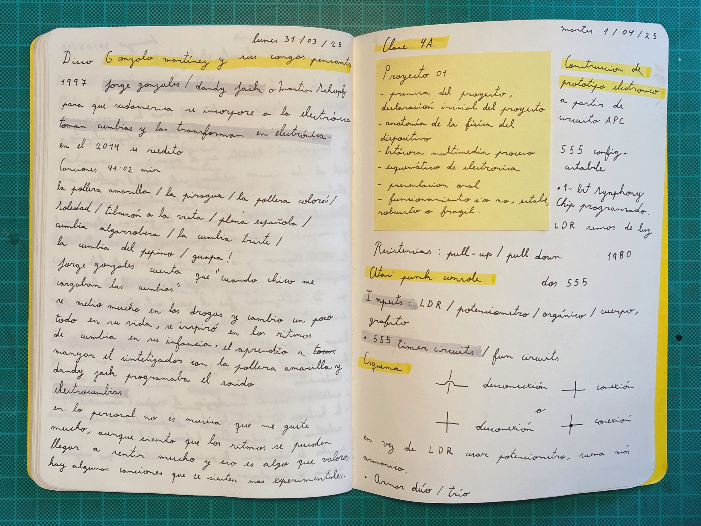
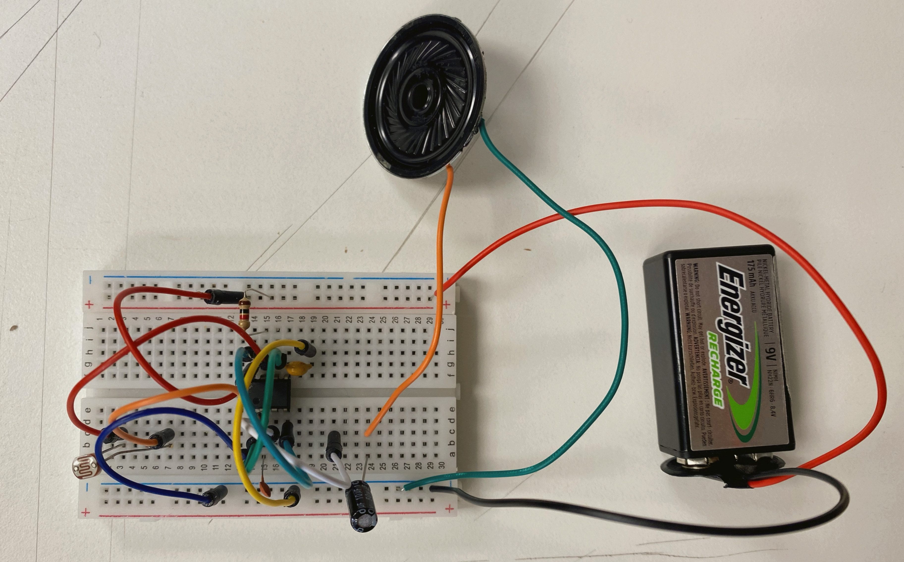
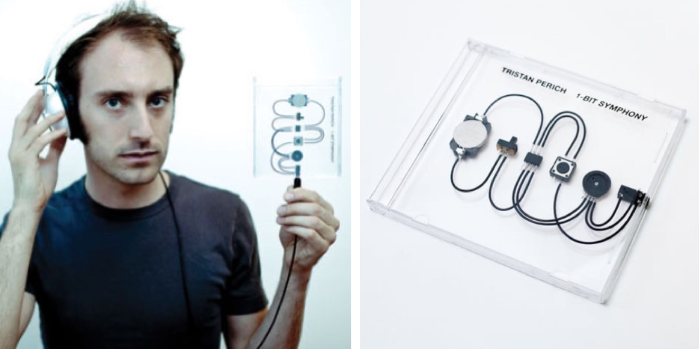
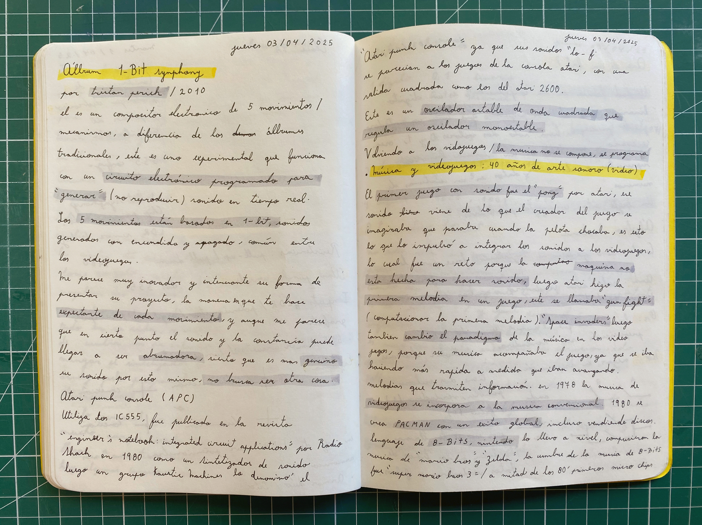
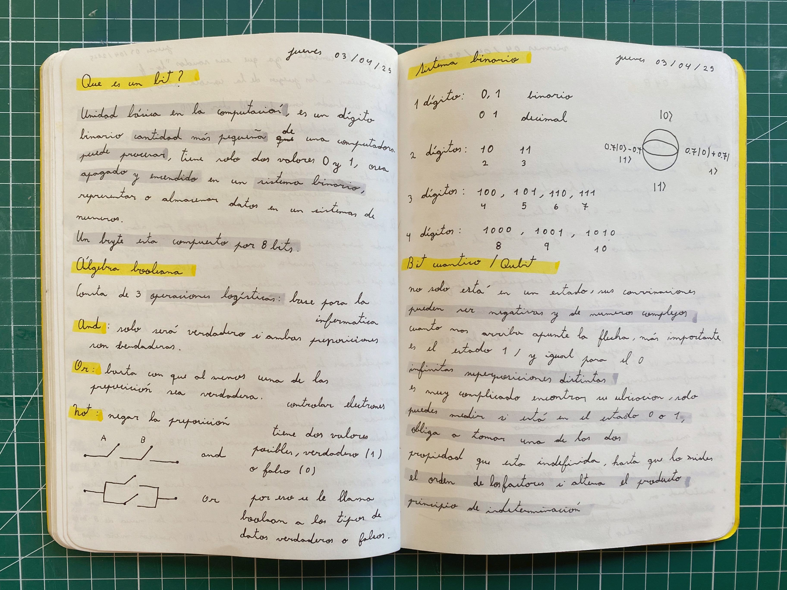

# sesion-04a

## Trabajo en clase / Martes 01 de Abril

### Introducción proyecto 01

- Declaración inicial del proyecto
- Anatomía de la física del proyecto
- Bitácora con el proceso
- Esquema electrónico
- Presentación oral
- Funcionamiento sí o no

### Atari Punk Console

- También conocido como APC.
- Es un oscilador astable de onda cuadrada que regula un oscilador monoestable.
- Fue llamado así porque sus sonidos se parecían a los juegos de la consola Atari 2600.
- Circuito electrónico con dos circuitos integrados 555.
- Puede estar compuesto con un sensor de luz LDR o con potenciómetro.
- Inputs: LDR, potenciómetro, orgánico, cuerpo.

## Encargo

### 1-bit Symphony

- Álbum "1-bit Symphony" por Tristan Perich
- Composición electrónica experimental de cinco movimientos.
- Circuito electrónico programado para generar sonido en tiempo real.
- Sonidos generados por encendidos y apagados, similares a los videojuegos.

Fuente <https://composerfocus.com/wp-content/uploads/2012/05/1bit01.jpg>

Fuente <https://f4.bcbits.com/img/0004731944_71.jpg>

### Primeros sonidos en los videojuegos

- Video "Música y videojuegos: 40 años de arte sonoro" <https://youtu.be/0zuqYId4s3Q?si=G7SqTVAYq9nPEjfa>
- El primer videojuego con sonido fue "Pong" de Atari. Este sonido se incorporó porque su creador, al jugar, se imaginaba un ruido cada vez que la pelota chocaba con las paredes del juego, por lo que sintió que debía agregarlo, o el juego estaría incompleto.
- Aunque esto lo impulsó a integrar los sonidos a los videojuegos, fue bastante difícil ya que la máquina no estaba hecha para reproducir sonidos; en este caso, la música no se compone, sino que se programa.
- Fue todo un éxito Pong, por eso Atari decidió trabajar en computar la primera melodía en un videojuego llamado "Gun Fight". Esto, para la época, fue muy innovador.
- Luego de un tiempo fue "Space Invaders" de Taito el juego que realmente cambió el paradigma en el mundo de los videojuegos y el sonido, ya que la música acompaña al juego y cumple una función, reproduciéndose cada vez más rápido a medida que avanza, transformándose en una forma de transmitir información y haciendo más completa la experiencia.
- En la música convencional se comienzan a utilizar elementos de los sonidos de los videojuegos; además salió el éxito global "Pac-Man", que incluso vendió discos con sus temas.
- Nintendo llevó el lenguaje de 8 bits a otro nivel al componer la música de títulos icónicos como "Mario Bros" y "Zelda". Sin embargo, fue "Super Mario Bros 3" el que alcanzó la cúspide de la música en 8 bits, destacándose por su alta complejidad, ya que cada elemento del juego contaba con su propio sonido.
- Finalmente, a mediados de los 80 salieron los primeros microchips. Esto permitió mejorar la capacidad de procesamiento y la calidad del sonido en los videojuegos, lo que hizo posible composiciones más complejas, marcando un antes y un después en la evolución de la música en los videojuegos.

### ¿Qué es un bit?

- Video "¿Qué es un sistema binario y cómo funciona?" <https://youtu.be/-V4AbHyR_x4?si=0-GHMUYRFrpOHk_y>
- Unidad básica de la computación
- Cantidad más pequeña que una computadora puede procesar
- Los bits se trabajan con el sistema binario
- Un byte está compuesto por 8 bits

### Álgebra Booleana

- Video "Qué es un Bit y un Byte, cómo funciona en la computadora" <https://youtu.be/9W7mDdoZ4xI?si=TLTqC9sdDKYtLT0m>
- Es la base para la informática
- Tiene dos valores posibles: verdadero (1) y falso (0)
- Compuesta por tres operaciones lógicas: AND, OR y NOT
- Sistema binario y sus decimales

### Bit Cuántico o Qubit

- Video "Todo lo que un Qubit puede enseñarte sobre Física Cuántica" <https://youtu.be/ilPfvMEOmCs?si=CfnE4m-FLaJtupRi>
- Principio de la indeterminación
- La propiedad está indefinida hasta que se le obliga a tomar una posición de 0 o 1
- Solo se puede medir si se encuentra en estado 0 o 1
- Puede estar en un estado negativo o incluso en números complejos
- Infinitas superposiciones diferentes
- Si mides su ubicación de manera vertical u horizontal, el orden de los factores sí altera el producto

