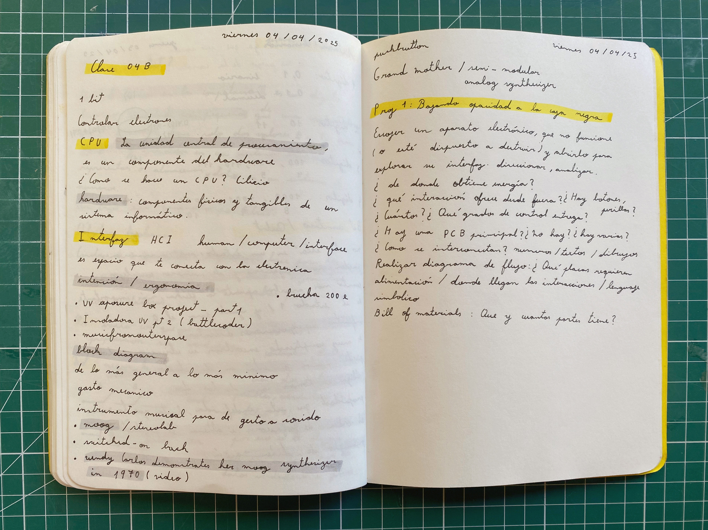
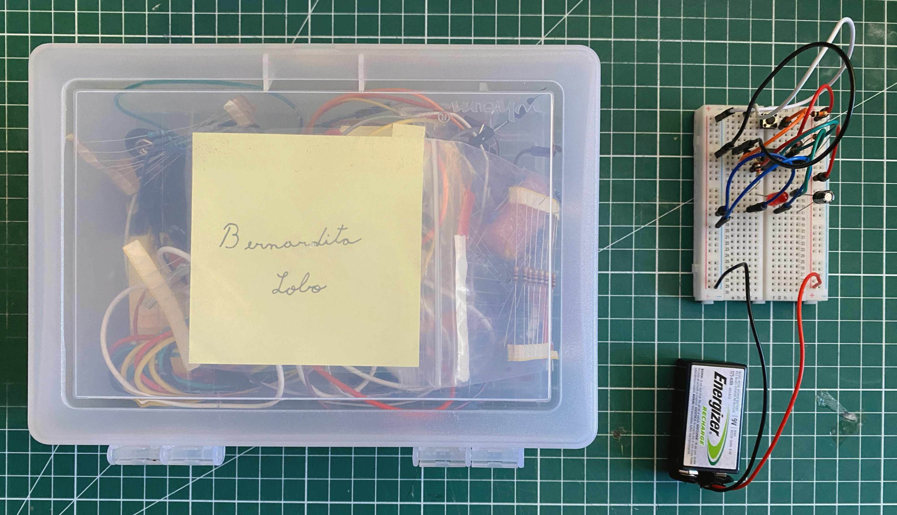
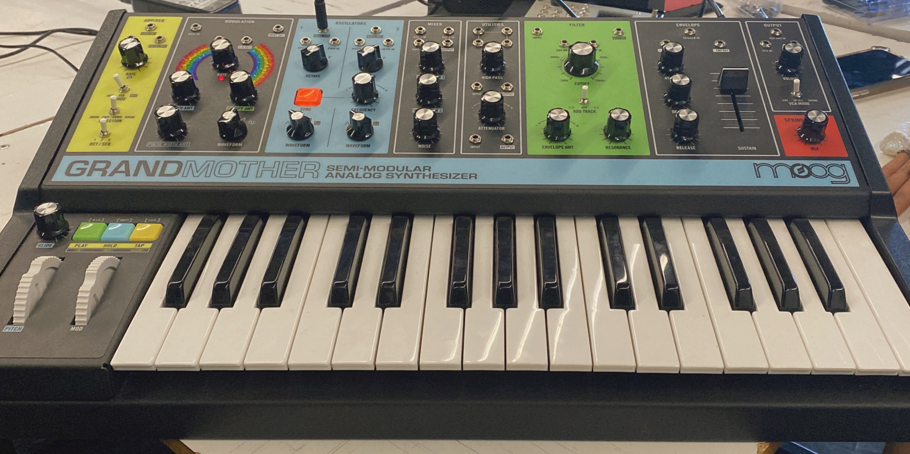
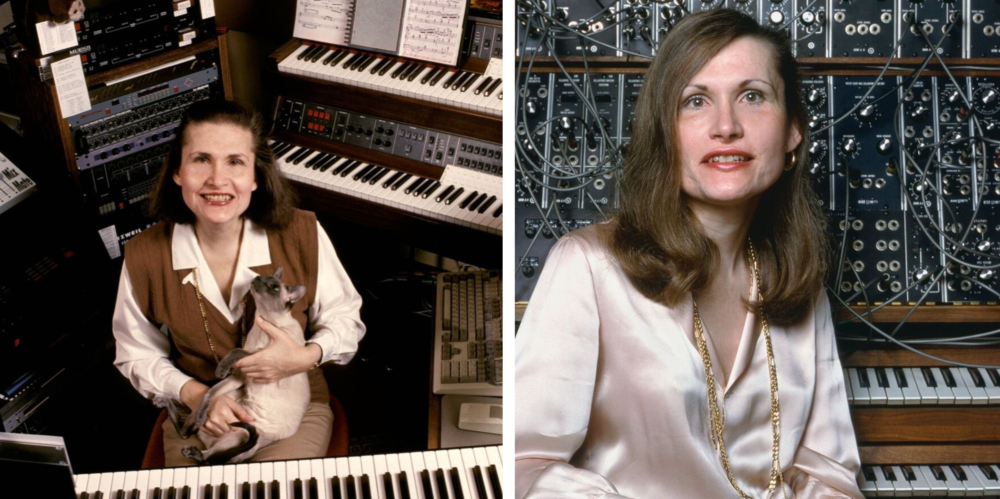
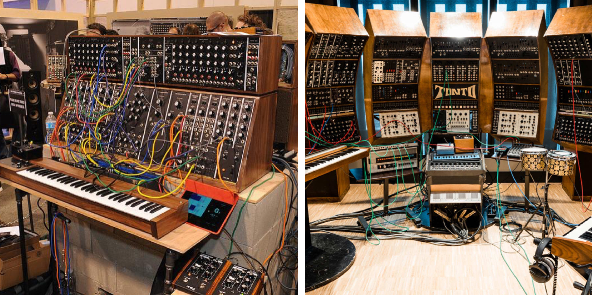
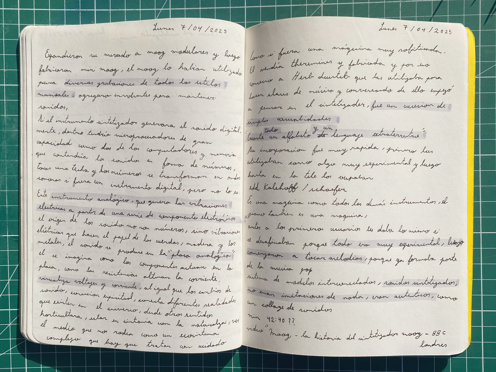
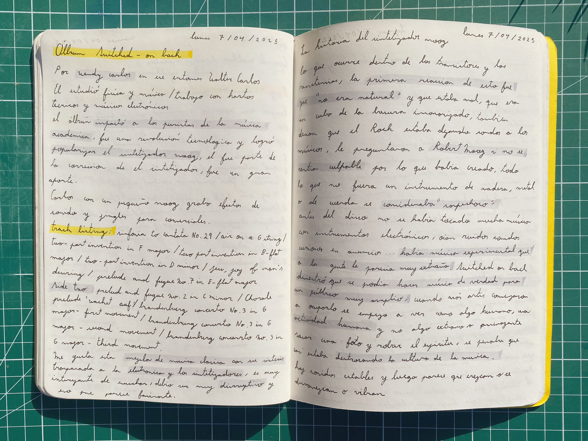
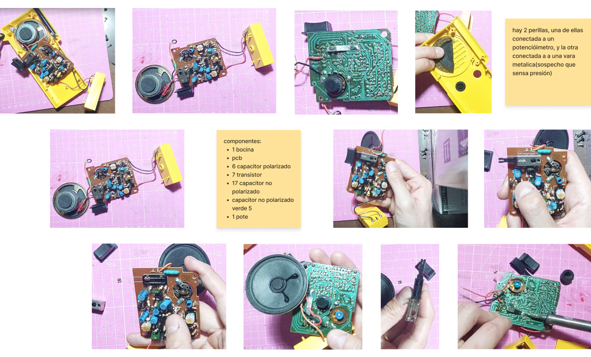
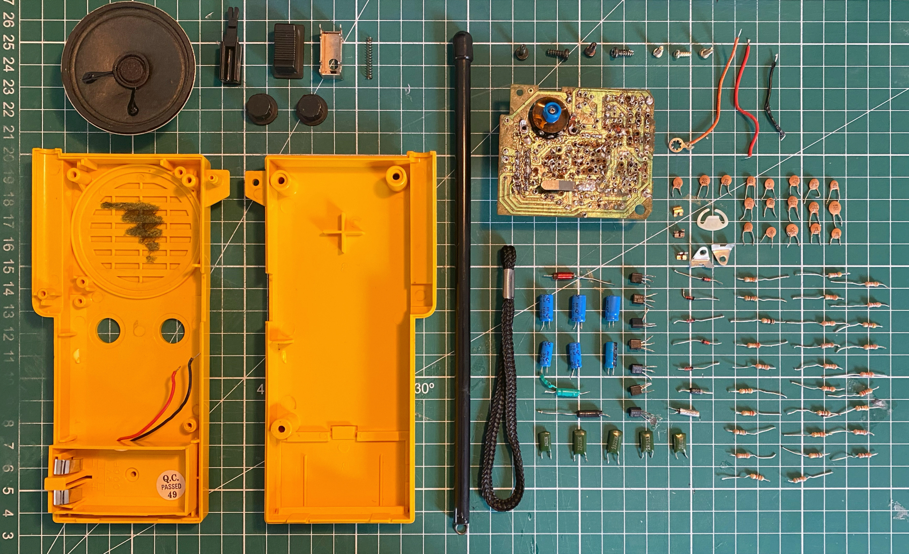

# sesion-04b

## Trabajo en clase / Viernes 04 de Abril

### Sistemas electrónicos

- Funcionamiento de 1-bit
- CPU es Unidad Central de Procesamiento; es un componente del hardware
- Hardware son los componentes físicos y tangibles de un sistema informático
- Analizamos el funcionamiento y sistema electrónico de una botonera
- Interfaz, intención y ergonomía

### Circuito electrónico monoestable

- Primer circuito con un botón
- Se mantiene estable hasta que es perturbado
- Emite un único pulso de corriente durante un tiempo determinado

### Grandmother

- Sintetizadores análogos Moog
- Un instrumento musical pasa de gesto a sonido
- Video: Wendy Carlos Demonstrates Her Moog Synthesizer <https://youtu.be/4SBDH5uhs4Q?si=6EMCE5zsOz8-7VFA>

## Encargos

### Encargo-10: Wendy Carlos

- Switched-On Bach por Wendy Carlos
- Video "Wendy Carlos" <https://youtu.be/_zjvv7n3mGQ?si=qLXQ_js-CSqN9ypS>
- Música clásica con su síntesis traspasada a la electrónica.
- Popularizó los sintetizadores Moog y revolucionó la tecnología musical.
- Efectos de sonido y jingles.
- Disruptivo para los puristas de la música.

Fuente <https://artemetraje.com/wp-content/uploads/2023/02/19b38a-20201111-wendy-carlos.jpg>

Fuente <https://npr.brightspotcdn.com/dims4/default/d597491/2147483647/strip/true/crop/1280x1280+0+0/resize/880x880!/quality/90/?url=http%3A%2F%2Fnpr-brightspot.s3.amazonaws.com%2Flegacy%2Fsites%2Fwxxifm%2Ffiles%2F202102%2Fwendy_carlos.jpg>

### La Historia de los Sintetizadores Moog

- Video documental "Moog - La Historia del Sintetizador Moog - BBC Londres" <https://youtu.be/1vRtgWH2d9Q?si=DEMKQfVymHAIr2w>
- Robert Moog fue el creador de estos sintetizadores. Estudió un bachillerato en la Escuela de Ciencias del Bronx, Física en el Queens College, después Ingeniería Eléctrica en la Universidad de Columbia y un doctorado en Ingeniería Física en la Universidad de Cornell. Es por esto que tenía una facilidad para sentir qué era lo que ocurría dentro de los transistores y las resistencias.
- La primera reacción a este invento fue de profundo disgusto, ya que pensaban que no era natural. En algunas entrevistas que dio Robert Moog, le preguntaban si no se sentía culpable por lo que había creado, ya que creían que estaba destrozando la cultura de la música.
- Si no era un instrumento de madera, metal o de cuerda, lo consideraban sospechoso.
- Antes del disco Switched-On Bach, la música que se tocaba con instrumentos electrónicos se escuchaba en anuncios con ruidos extraños o era muy experimental, y a la gente le parecía algo raro.
- Este disco demostró que se podía hacer música de verdad con instrumentos electrónicos para un público muy amplio.
- Mientras más artistas utilizaban este sintetizador, gradualmente se iba viendo como una actividad humana y no algo amenazante. Él compara este miedo a lo desconocido con cómo las tribus solían pensar que al sacarles una fotografía les robaban el alma.
- El mercado de los Moog se fue expandiendo y ya se había utilizado en diversas grabaciones de todos los estilos musicales.
- Los instrumentos sintetizadores "digitales" generan el sonido digitalmente. Para eso deben tener microprocesadores de gran capacidad, como los de los computadores, y memoria que contenga sonidos en forma de números. O sea que tocas una tecla y los números se transforman en ondas sonoras.
- Lo que hace tan bello a este instrumento es que es un sintetizador "analógico", lo que quiere decir que genera las vibraciones eléctricas a partir de una serie de componentes electrónicos. O sea que el origen de los sonidos no son números, sino vibraciones eléctricas que hacen el papel de las cuerdas, el metal y la madera. El sonido proviene de la placa analógica, que para Robert Moog es donde ocurre la magia, ya que él se imagina cómo los componentes actúan, cómo las resistencias alteran la corriente, se visualizan los voltajes, al igual que los cambios de sonido. Para él esto es como una conexión espiritual, que conecta diferentes realidades que existen en el universo desde otros sentidos.
- Para él, la creación del sintetizador fue una sucesión de simples casualidades.
- Después del minuto 42:40 del documental, Robert Moog, junto a unos artistas, hace una serie de comentarios machistas y cosificadores, así que dejé de verlo.

Fuente <https://media.wnyc.org/i/800/0/c/85/1/moog.jpg>

Fuente <https://edm.com/.image/ar_4:3%2Cc_fill%2Ccs_srgb%2Cfl_progressive%2Cq_auto:good%2Cw_1200/MTc2OTEzMTgxODQ1NzU5NTcx/cbkkt9otkxlgyjdxrmxl7y.jpg>

### Encargo-11: Bajando opacidad a la caja negra

- Elegimos, junto a mi compañero 08-clifford1one, un walkie-talkie, y nuestro proceso está en el Figma.
- Está diseñado para hablar, y sus interacciones son: mantener presionado para hablar, regular el volumen con la perilla y presionar el botón de frecuencia o señal.
- Tiene dos botones y una perilla. Uno de los botones simula ser una perilla, pero solo funciona como pulsador. Creemos que está diseñado para mantenerse en una señal, tal vez como un objeto de trabajo.
- Obtiene su energía de una batería de 9V.
- Tiene una placa PCB, una bocina y una antena que es flexible pero no extensible.
- Incluye textos para el volumen y la señal; también indica el + y −, los voltios y la marca.

### Proceso de trabajo

