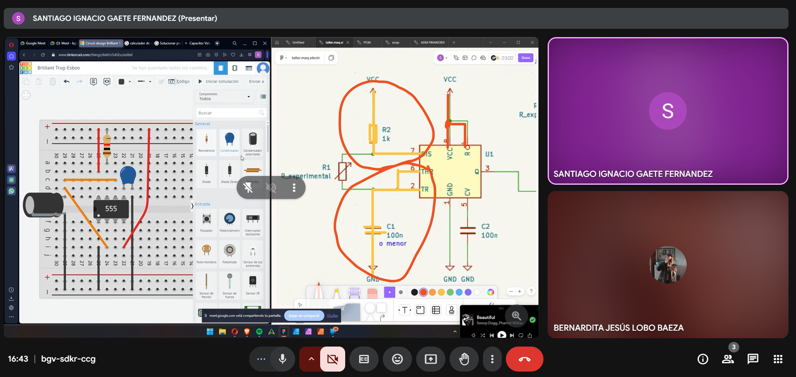
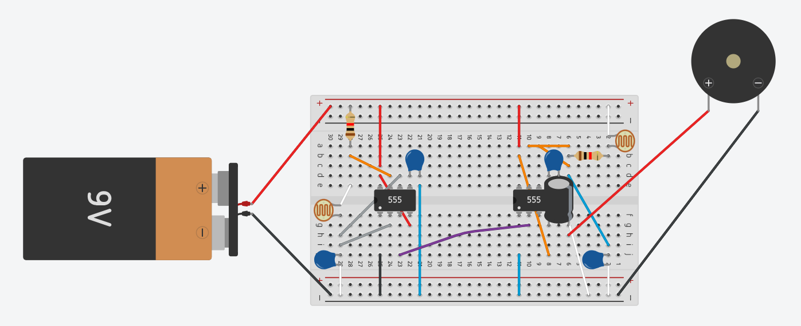

# sesion-05a

## Trabajo en clase / Martes 08 de Abril

### Feedback aprendido del desarme electrónico

- Existen componentes para soldarlos sobre la placa y otros componentes integrados.
- SMD (Surface-Mount Device) y SMT (Surface-Mount Technology).
- LED SMD (Surface-Mount Device).
- La velocidad del sonido depende de la temperatura y de la humedad.
- Pitch es cómo humanamente percibimos las frecuencias.

### Atari punk console

- Primera vez que logré hacer el circuito Atari Punk Console.
- Registro del montaje del APC en mi protoboard, realizado durante la clase.
- Me parece muy interesante todas las modificaciones que se le pueden hacer a este circuito.
- Modding Atari Punk Console y esquemático Atari Punk Console.
- Lista de componentes utilizados para el circuito.
- Tabla BOM (Bill of Materials) en Markdown.

### BOM

| Nombre | Cantidad | Componente                    |
|--------|----------|-------------------------------|
| 555    | 2        | temporizador                  |
| R      | 2        | 1K resistencia                |
| LDR    | 2        | fotoresistecia                |
| C      | 1        | 12nF capacitor                |
| C      | 1        | 33nF capacitor                |
| CP     | 1        | 1uF, 10V capacitor polarizado |
| C      | 2        | 100nF capacitor               |
| BAT    | 1        | baterÍa 9V                    |
| Pienzo | 1        | pienzo                        |

## Encargo

### Trabajo en casa

- Trabajo en grupo con 08-clifford1one para reintentar hacer el Atari Punk Console.
- Por primera vez siento que entiendo y logro traspasar un esquemático a la protoboard.
- Aprendí a hacer circuitos en Tinkercad; esto sirve para ir testeando y ordenando los componentes.
- Conversamos ideas para las modificaciones al Atari Punk Console.

