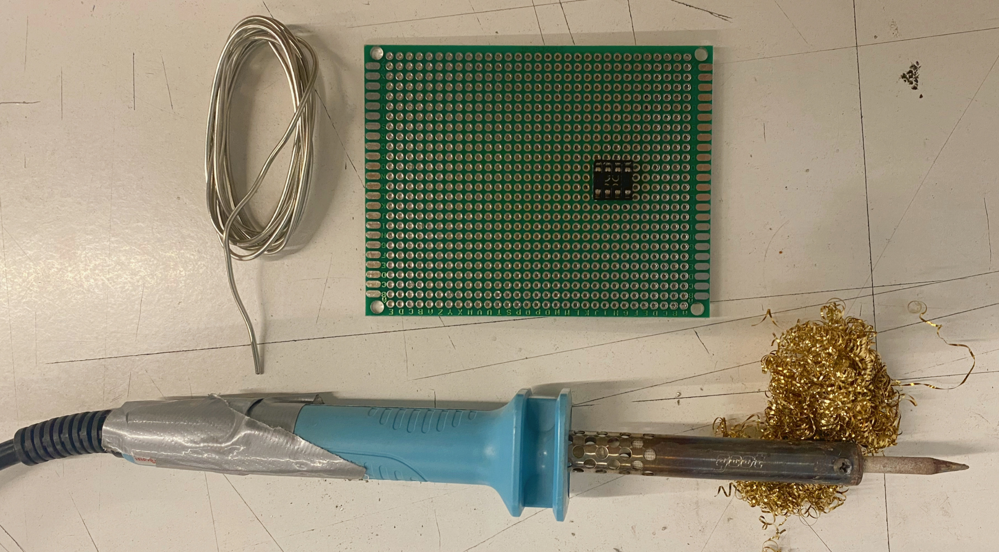
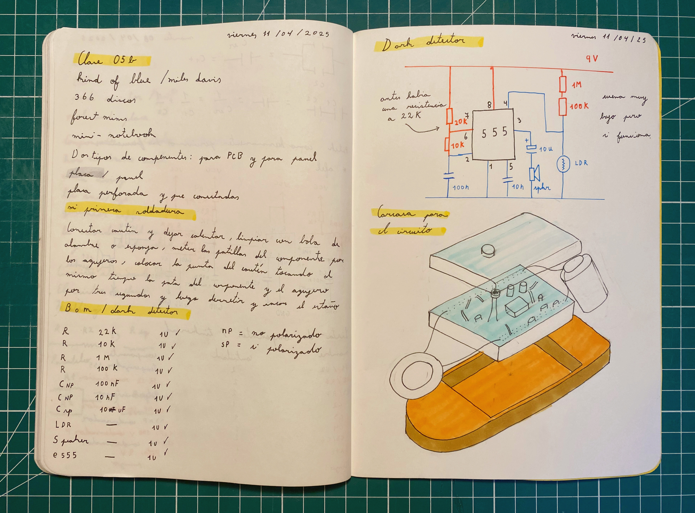
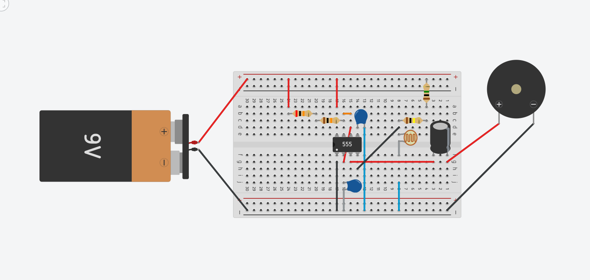

# sesion-05b

## Trabajo en clase / Viernes 11 de Abril

### Propuestas de modificaciones para el Atari punk console

- Presentamos tres ideas con mi compañero 08-clifford1one.
- La primera era un circuito que emitía una alarma cuando el otro estaba apagado, mostrando una idea con potencial conceptual.
- La segunda propuesta era una especie de ruleta, un poco compleja de realizar.
- La tercera propuesta, que fue finalmente la elegida, consiste en un circuito que emite una alarma cuando el LDR no detecta luz. Esta idea tiene una carga más sensible y puede resultar más práctica en su aplicación.

Fuente <https://www.555-timer-circuits.com>

### Componentes para PCB y para panel

- Componentes para PCB: Son aquellos que se sueldan directamente en la placa electrónica y tienen terminales diseñadas para encajar en la PCB, como los pines.
- En los componentes para PCB tenemos dos tipos: THT (Through Hole Technology), que es cuando los pines de los componentes atraviesan la placa a través de un agujero; y SMD (Surface Mount Technology), que es cuando los componentes se adhieren directamente a la superficie sin necesidad de perforaciones. Esto permite fabricar placas más pequeñas.
- Componentes para panel: Van en la carcasa del producto, no en la PCB. Se fijan con tornillos o tuercas y se conectan a la placa mediante cables.
- Hay dos lados en un PCB: el Top (que es donde están los componentes) y el Bottom (donde se sueldan los componentes).
- Para colocar chips en las PCBs o en un panel, hay que soldarles una base DIP, la cual es como una cajita en donde encaja el chip; por tanto, se puede retirar cuando sea necesario sin dañar el componente con el calor.

### Mi primera soldadura

- Aprendimos a soldar placas perforadas.
- Primero se conecta el cautín y se deja calentar unos cinco minutos.
- Limpia la punta con una bola de alambre o una esponja resistente al calor.
- Inserta las patas del componente a través de los agujeros de la placa perforada.
- Coloca la punta del cautín tocando al mismo tiempo la pata del componente y el agujero durante tres segundos.
- Acerca el estaño hasta que se derrita, retira el estaño y luego el cautín.

## Encargo

### Álbum "Kind of blue" por Miles Davis

- Fuente <https://www.chicagoacademyforthearts.org/heads-blog-2/2021/2/12/a-quick-intro-to-the-brilliance-of-miles-davis#:~:text=In%20addition%20to%20being%20widely,jazz%2C%20and%20%E2%80%9Cfusion%E2%80%9D>
- Video "Leyendas: Miles Davis" <https://youtu.be/TRF5EOQDmpQ?si=xu0QRHl0VvkuqtDj>
- Recomendación de Misa.
- También escuché el álbum Birth of the Cool.
- Miles Davis fue un trompetista y compositor. Se le atribuye impulsar el cool jazz, el jazz modal y el jazz fusión.
- Fue un hombre muy exitoso, increíblemente innovador y creativo, con una profunda sensibilidad y un fuerte compromiso como activista por los derechos raciales. Sin embargo, también se dice que tuvo una fuerte adicción a las drogas y que fue un hombre misógino y agresivo en sus relaciones de pareja.
- Nunca había escuchado un álbum de jazz, y me encantó lo lento, transitorio y relajado que es el álbum.
- Este Blindfold Test de la revista Down Beat me pareció muy interesante. <https://youtu.be/tZtSBz_6SSA?si=MgLMNVNjm5VXxtxe>

Fuente <https://www.latercera.com/resizer/v2/T56PABQ5HVFC5J4RRILVHVRKV4.jpg?auth=0a43f3ad7c2b2ce8060a2d7461267bf0a1c2b96c71a9737cd3d9516c8144d330&width=600&smart=true>

Fuente <https://is1-ssl.mzstatic.com/image/thumb/Music/7f/9f/d6/mzi.vtnaewef.jpg/600x600bf-60.jpg>

### Modificaciones APC Dark Detector

- Decidimos seguir trabajando con el circuito detector de oscuridad.
- Comenzamos traspasando el esquemático a la protoboard.
- Hicimos un circuito en Tinkercad para ordenar las ideas.

