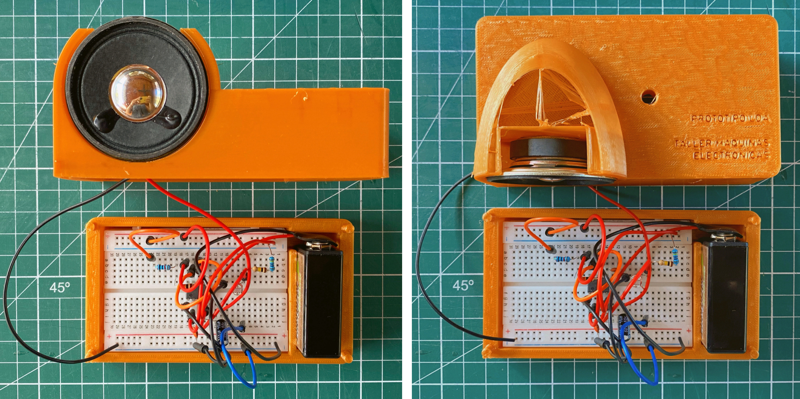
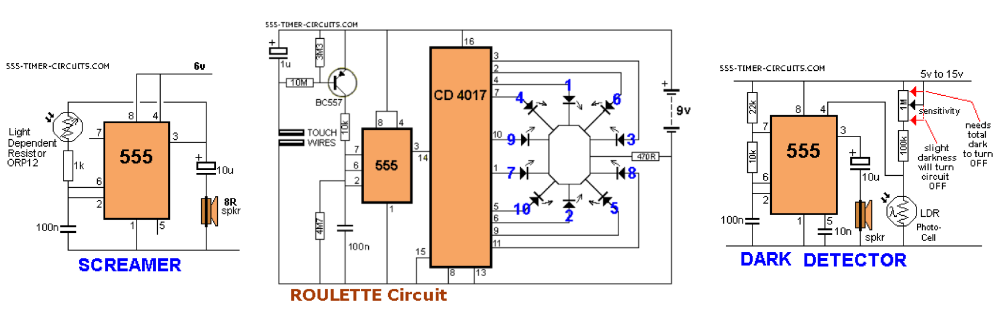
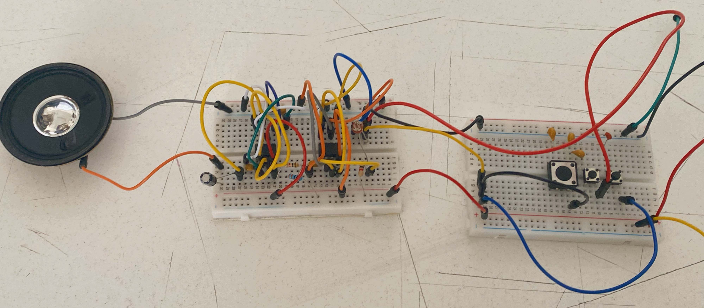
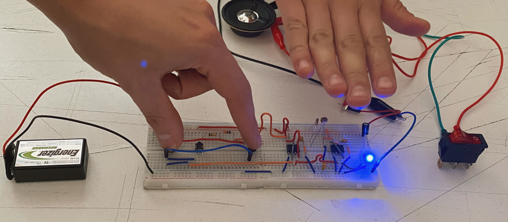
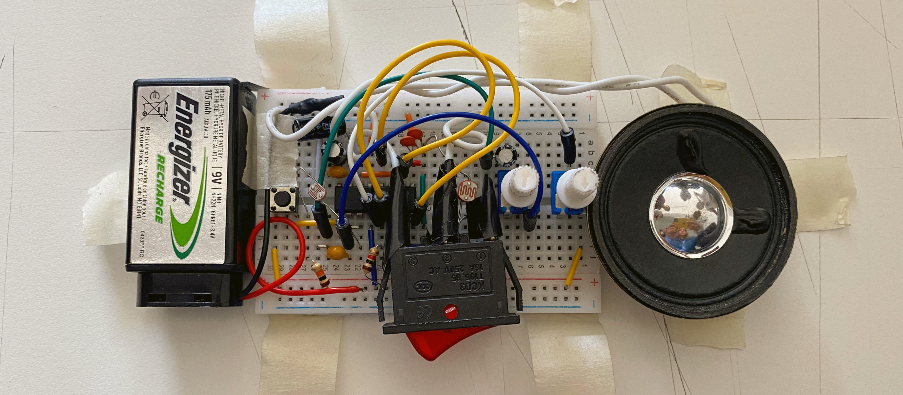
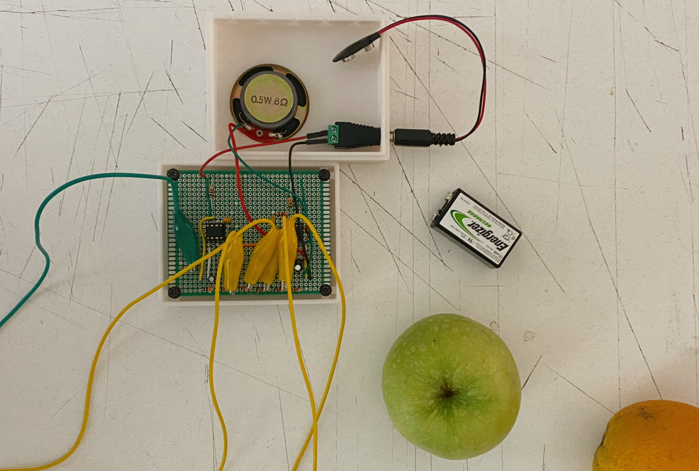

# sesion-06a

## Trabajo en clase / Martes 15 de Abril

### Proyecto-01

- Presentación de mi Grupo-07; LDA Light Dependant Awelita
- Todo nuestro proceso oficial en detalle está en la sesión 06A de Clifford1One y en el Figma <https://www.figma.com/board/2tv4jx75qGZa6Gua2UCVer/taller.maq.electr?node-id=0-1&t=aBNh63yuq9MDT4AI-1>

### Un poco del proceso

- Primero elegimos uno de los tres circuitos que nos habían llamado la atención de esta página <https://www.555-timer-circuits.com>
- Nos decidimos por el dark detector, ya que podía ser un proyecto con un potencial más sensible.
- Realizamos algunos intentos por separado del circuito dark detector en la protoboard.

fuente <https://www.555-timer-circuits.com>

- Después nos reunimos de manera online para realizar algunos cambios y mejorar el funcionamiento de acuerdo al usuario que habíamos escogido.
- Traspasamos el circuito dark detector a Tinkercad para poder ir testeando más rápido y en conjunto.
- Una vez decididos los cambios en el circuito, realizamos un BOM con todos los componentes necesarios.

### Bill of Materials

| Componente              | Valor | Unidades |
|-------------------------|-------|----------|
| Resistencia             | 10k   | 1        |
| Resistencia             | 22k   | 1        |
| Resistencia             | 100k  | 1        |
| Resistencia             | 1M    | 1        |
| Capacitor Cerámico      | 10nF  | 1        |
| Capacitor Cerámico      | 100nF | 1        |
| Capacitor Electrolítico | 10uF  | 1        |
| LDR                     |       | 1        |
| Bocina                  |       | 1        |
| 555                     |       | 1        |
| protoboard              |       | 1        |
| Cables Dupont           |       | 1        |
| Batería                 |  9V   | 1        |

## Presentaciones

### Grupo-02

- modificar el sonido
- tres pulsadores
- interruptor de dos tiempor que frena la energía
- objeto interactivo sonoro
- tres modificaciones

### Grupo-03

- incorponaron un motor y un LDR
- suena muy armónico
- metáfora de la sociedad y su circuito

### Grupo-04

- experimentación basada en las clases
- los LDR modifican la frecuencia de su bocina
- variación de interruptor
- interación de pulsador
- pulsadores en paralelo

### Grupo-05

- sintetizador pocket de uso recreativo
- un sonido más variable de escala descendiente
- recrear un sonido que hizo Wendy Carlos
- carcasa en impresión 3d

### Grupo-06

- hacer un teclado electrónico.
- ¿cómo se genera una nota musical?
- a mayor resistencia, menos oscilaciones por segundo
- frecuencia y notas musicales
- en vez de botones, experimentaron con caimanes
- carcasa hecha en impresión 3D
- circuito soldado no funcionó, pero es muy valorable que lo hayan intentado

