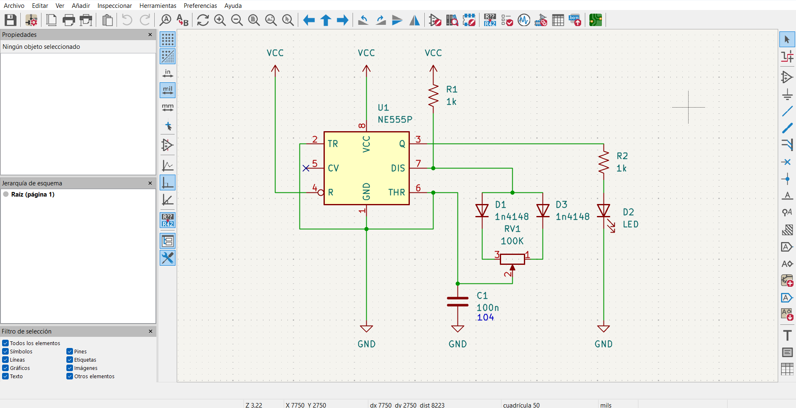
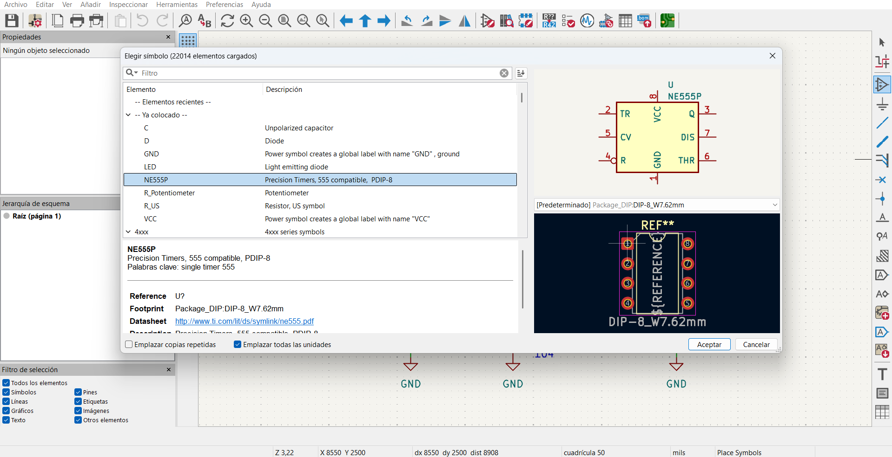
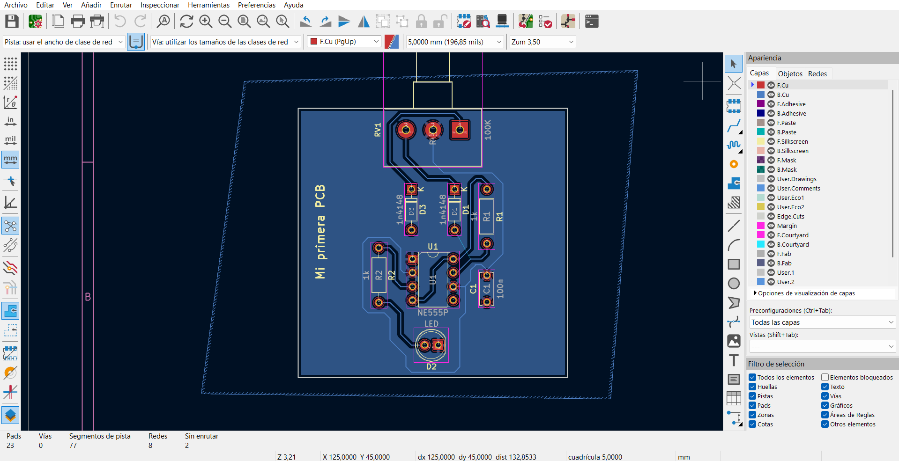
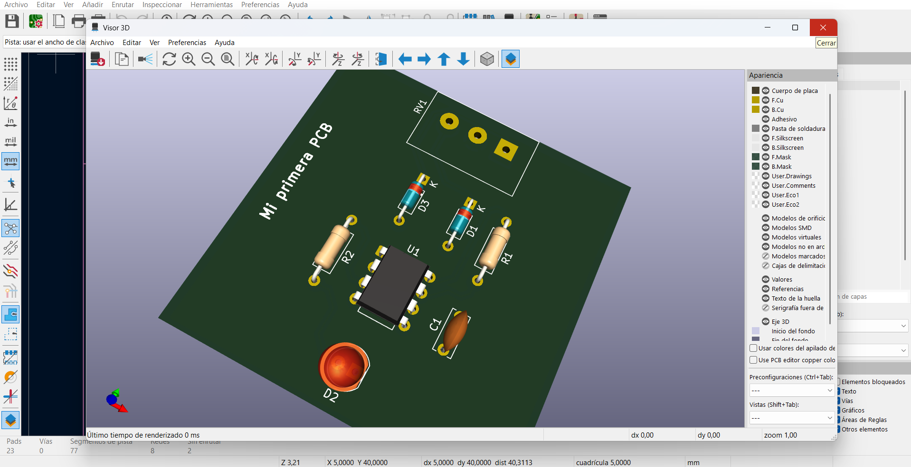
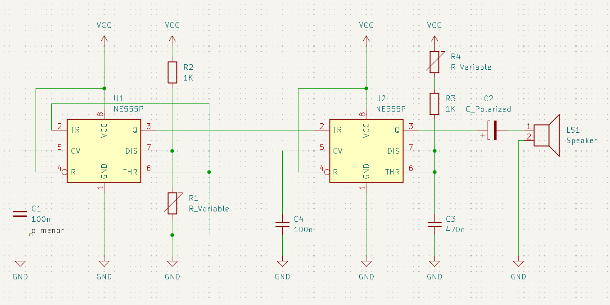

# sesion-07a

## Trabajo en Clase / Martes 22 de Abril

### Introducción al diseño de PCB

- La idea de este taller es que lleguemos a mandar a hacer nuestras propias PCB en China y que les soldemos los componentes para el examen.
- Vimos algunos programas que se pueden utilizar para simular circuitos o realizar esquemáticos. Uno de estos era SPICE, este es un poco más complejo. También vimos Osmond PCB, pero este está casi sin utilizar.
- También vimos la PCB de Misa, que la utiliza para sus exposiciones y como tarjeta de presentación.
- Algunos referentes variados: Diego Lorenzini, Kelly Heaton y Clacktronics.
- Finalmente, el programa que vamos a utilizar es KiCad, ya que es más amigable para comenzar y además es gratis.

### Primera parte de KiCad

- Componentes básicos de la electrónica: resistencias, capacitores, diodos y transistores.
- Datos de los componentes: nombre, símbolo, valor, rating y footprint.
- Se utilizan 7 capas: Edge.Cuts (contorno de 1 mm), F.Cu (capa frontal de cobre), B.Cu (capa posterior de cobre), F.Silkscreen (grabado frontal), B.Silkscreen (grabado posterior), F.Mask (máscara de color en la parte frontal) y B.Mask (máscara de color en la parte posterior).
- Todo en este programa se puede editar: los textos, tamaños, ubicación, los símbolos, las huellas e incluso las tipografías.

## Encargos

### Encargo-14: Diseñar esquemático en Kicad de Atari Punk Console

- Crear el esquemático en KiCad del Atari Punk Console con modificaciones, a menos que estas no funcionen del todo bien, como ocurrió en mi circuito.
- No fue necesario para esta ocasión agregar huellas, ya que era un poco difícil recordar las que utilizamos en clase.
- Me fui guiando por el esquemático que realizó Misa del Atari Punk Console.
- Lo más difícil fue recordar los nombres exactos de los componentes que escogimos y reorganizar el esquemático, ya que el 555 tenía otro orden.

### Encargo-15: Manual de supervivencia de KiCAD

- Plantear dudas respecto a KiCad o aprendizajes.
- Repasar en general me ayudó a procesar toda la información vista en clase, y ahora tengo más integrado cómo se llama cada componente que hemos utilizado en KiCad.
- Una de las cosas que aún no termino de entender es cómo se conectan los cables cuando hay muchos componentes que juntar, ya que a veces hay cables que impiden el paso de otros.
- ¿Cómo se puede modificar las patillas del componente 555 en KiCad?
- ¿Se pueden mandar a hacer PCBs con otras formas geométricas?
  
