# sesion-07b

## Trabajo en clase / Viernes 25 de Abril

### Cosas que conversamos en la mañana

- Ver el torniquete de República 180, tiene una silla justo adelante del torniquete.
- Diseño social, ¿cómo tienen que ser los edificios accesibles?
- El diseño como medio de solución a conflictos, compartir conocimiento, vivir en sociedad.

### Segunda parte de KiCad

- Profundizamos en las huellas de los componentes, estas huellas son las dimensiones que se utilizan para soldar los componentes posteriormente.
- Descargamos una carpeta que contenía una biblioteca de huellas específicas para nuestros componentes.
- A las patillas del 555 se les dice DIP, lo que significa Dual In-Line Package.
- Nos recomendaron agregar un pequeño circuito con una resistencia y un LED para que nos indique si está pasando energía en la PCB.
- Las PCB se pueden mandar a hacer con cualquier forma que tú traces.
- Puedes escribirles, agregar tipografía, dibujos y siluetas, la terminación de estos depende de en qué capa los coloques.
- No es necesario colocar la huella designada para cierto componente, se pueden utilizar otras, todo depende de lo que se necesite.
- Ordenamos los componentes de acuerdo a lo que nos convenía, yo no alcancé a llegar hasta esa parte.
- <https://cdm.link/> habla sobre la diversidad en la música electrónica y la necesidad de destruir metáforas gringas que describen la electrónica de forma violenta.

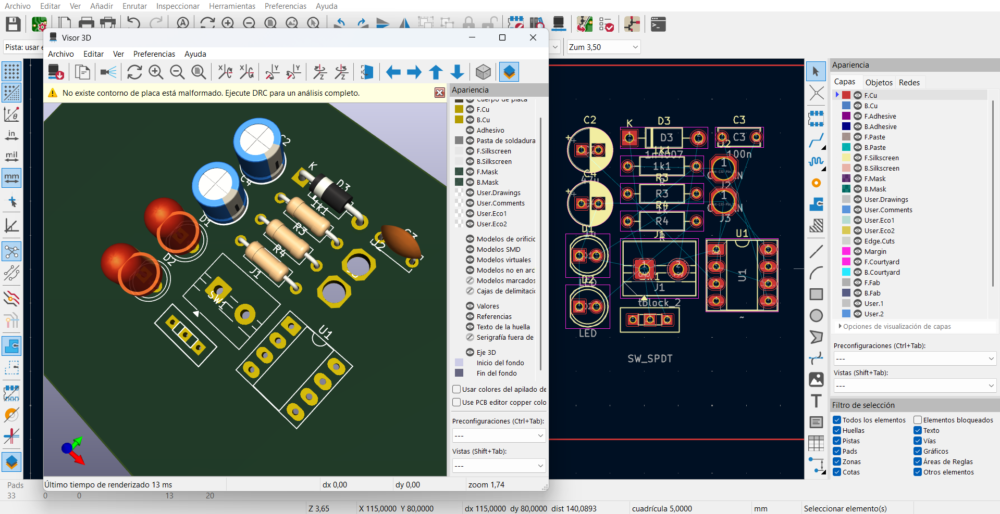

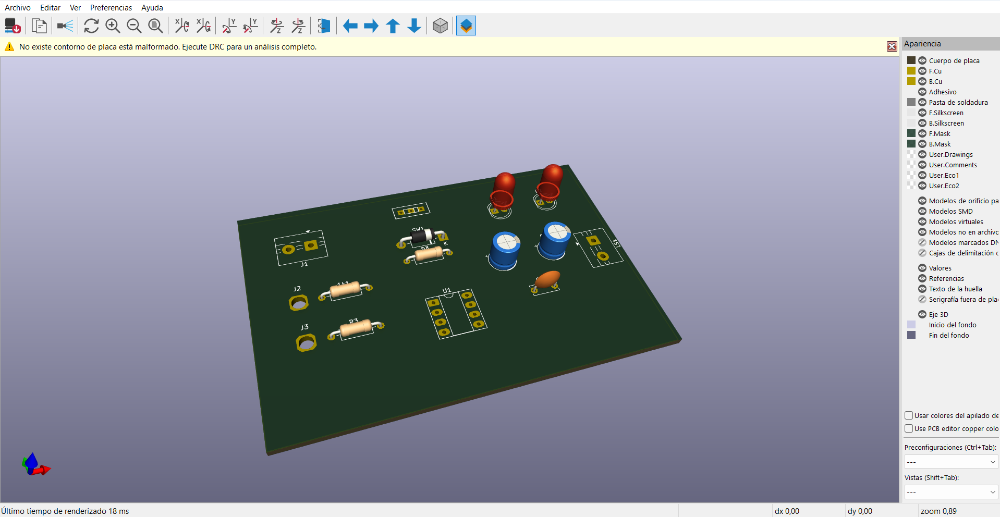

## Encargos

### Hacer una PCB en KiCad

- En clases no alcancé a terminar mi PCB y parece que hice mal el archivo, ya que no apreté la opción para crear una nueva carpeta y no se guardó nada, así que la tuve que hacer de nuevo.
- Me fui guiando por el video, aunque tuve algunos problemas con las bibliotecas que había que instalar. Las eliminé y las descargué varias veces hasta que funcionó.
- Creo que el problema pudo haber sido que me puse a ordenar mis carpetas, así que tal vez no lograba localizar los archivos correctamente.

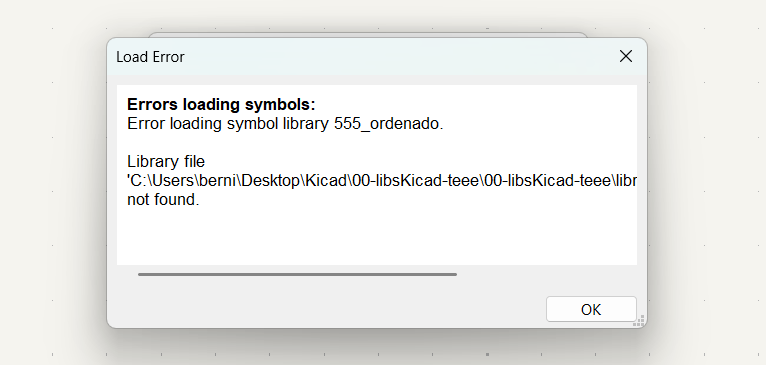

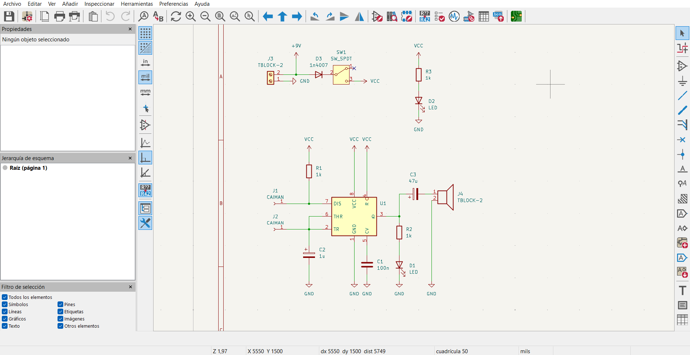

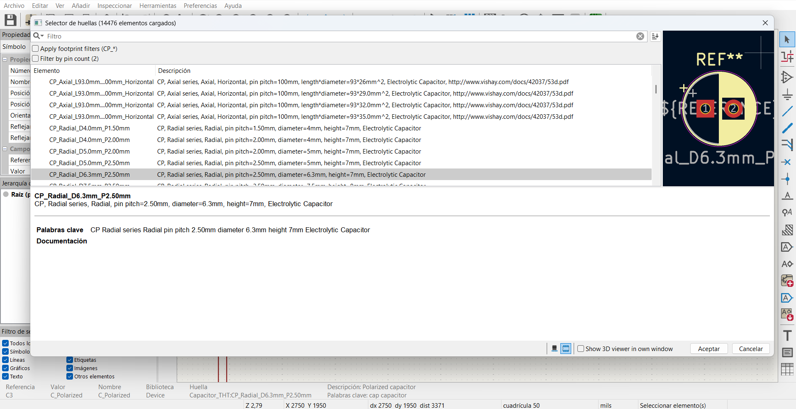

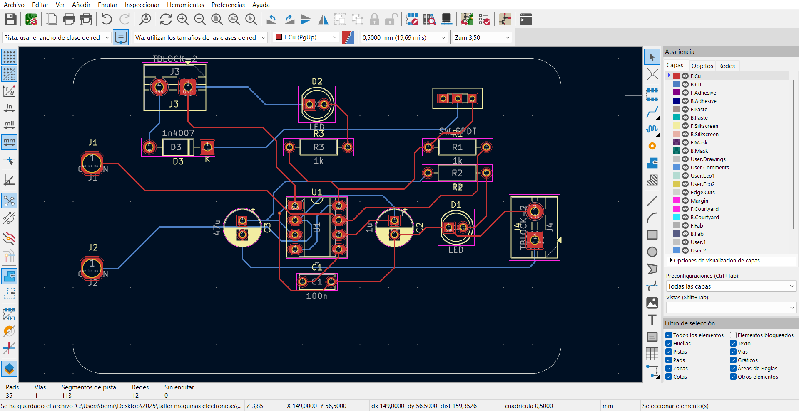

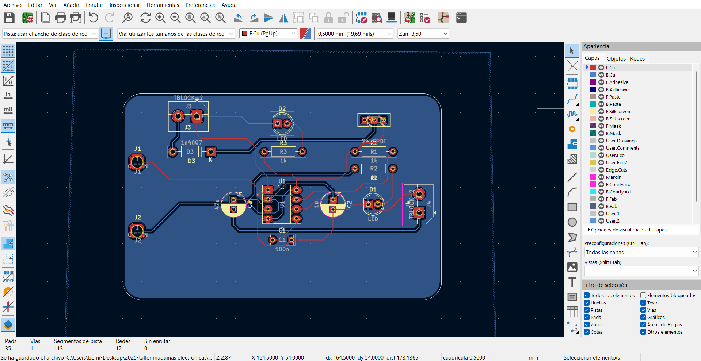

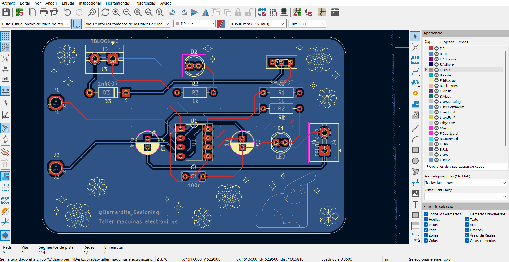

### Encargo-16: Cotizar ud_pudu en JLCPCB de forma productiva

- Primera cotización: 10 PCBs de 1.2 mm de espesor, color verde y acabado HASL (con cable). el costo es de $5.00 USD y el tiempo de entrega estimado es de dos días. el precio no varía si se elige un espesor de 1 mm, 1.2 mm o 1.6 mm.

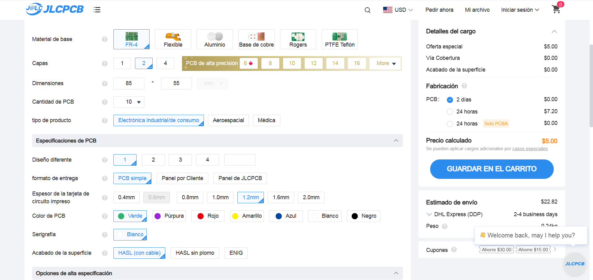

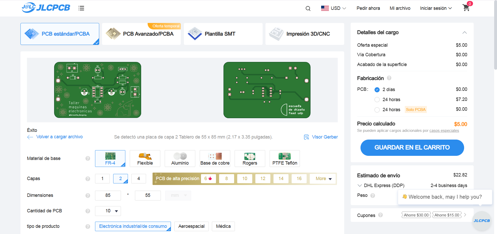

### Encargo-17: Cotizar udpudu en JLCPCB de forma experimental

- Segunda cotización: 10 PCBs de 1.2 mm de espesor, color blanco y acabado HASL sin plomo. El costo es de $22.73 USD, con un tiempo de entrega estimado de tres días. El precio se mantiene igual si se opta por un espesor de 1 mm o 1.6 mm.
- De manera más experimental, pude darme cuenta de que al elegir un espesor de 0.4 mm o 0.6 mm, solo se habilita la opción de acabado superficial ENIG. Este tipo de acabado es comúnmente utilizado en PCBs más delgadas, ya que ofrece una superficie más plana y precisa, además de ser más resistente a la oxidación.
- Es probable que no se permita seleccionar otros acabados, como HASL, en estos espesores más finos porque el proceso térmico que implica el HASL podría deformar la placa debido a su fragilidad. Esto hace que ENIG sea la opción más adecuada por sus propiedades físicas.
- Fuente <https://www.protoexpress.com/blog/surface-finish-pcb-manufacturing/>

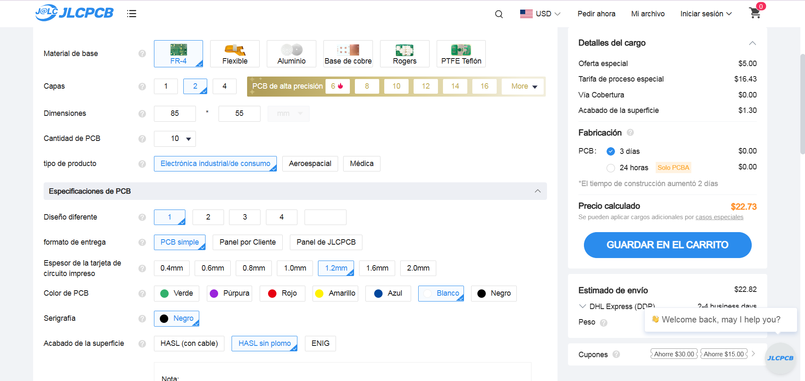

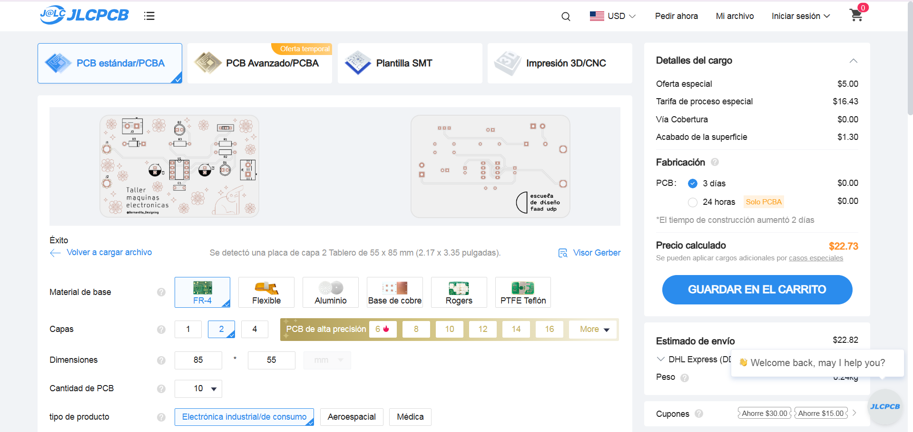

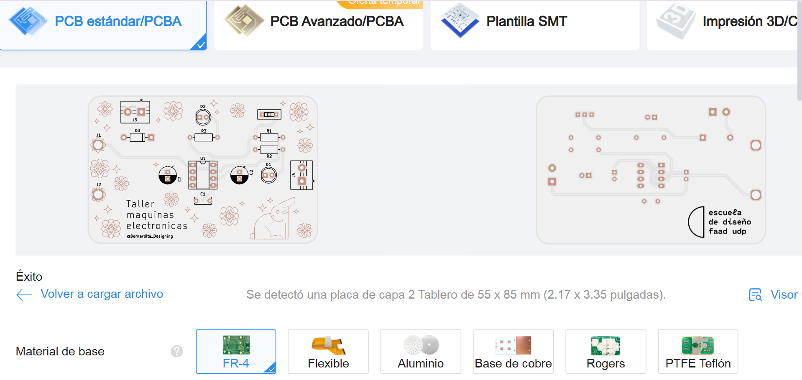

