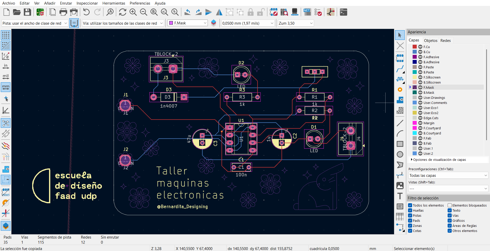
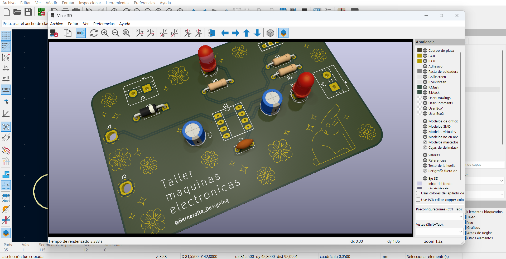

# sesion-08a

## Trabajo en clase

### Cosas que hablamos en la mañana

- Hablamos de cómo nos había ido terminando nuestras PCB que hicimos en KiCad. En general, no es un programa complejo, pero a mí igual se me hizo complicado, especialmente por todo el orden que hay que tener con las carpetas, ya que reordené las carpetas y se perdieron algunos archivos.
- Esta clase no nos dará encargo, ya que tenemos receso académico.

### KiCad

- Nos enseñaron cómo insertar una imagen SVG o DXF, archivos vectoriales con un contorno cerrado, en KiCad.
- Se cambia de capa con la letra E, donde están las propiedades.
- Para insertar, se utiliza el atajo Ctrl + Shift + F.
- Se utiliza el mounting hole para hacer las perforaciones para pernos M3.
- Pude cambiar de capa algunos dibujos que quería que quedaran en cobre, y también agregué el logo de la Escuela de Diseño.

### OpenSCAD

- En la clase nos instalamos OpenSCAD, aunque realmente no alcanzamos a hablar mucho sobre este.
- Fuente: https://www.3dnatives.com/es/openscad-modelador-3d/#!
- OpenSCAD es un software CAD gratuito y de código abierto para crear modelos 3D sólidos, dirigido a usuarios con más experiencia en programación.
- Este es un modelador 3D basado en scripts que utiliza su propio lenguaje de descripción.
- Con este programa no se puede seleccionar ni modificar interactivamente con el mouse el modelo.
- Las partes modeladas solo se pueden previsualizar una vez que se hayan codificado en el lenguaje del modelador 3D.

### Diseño Paramétrico, Impresión 3D y Automatización

- Bambu Lab, nos mostraron esta impresora 3D y su capacidad.
- El modelo paramétrico o diseño paramétrico, nos permite modificar los valores de ciertos parámetros para ajustar el diseño.
- Diseños prototípicos, modelos preliminares que permiten testear ideas.
- Plataforma MakerWorld, se pueden modelar objetos usando código y generar volúmenes automáticamente.
- Copiar códigos de GitHub y trasladarlos a OpenSCAD.
- Kena, instrumento latinoamericano, tiene diámetro interno, resolución, translate.
- La Cantata de Santa María de Iquique.
- Oskitone, tiene un proyecto de APC donde las carcasas están escritas en OpenSCAD, familia de elementos, donde comparten ciertas piezas.
- Sistema llamado Unix.
- Homebrew, herramienta para Mac que permite instalar utilidades desde la terminal.
- Winget, su equivalente en Windows, también para instalar herramientas por línea de comandos.
- Automatización con Python.

### github

- Repasamos cómo hacer un issue para pedir que evalúen bitácoras o encargos.
- GitHub Desktop, para clonar el repositorio.
- Repositorio clonado en el computador y repositorio clonado en la nube.
- Después de esto me perdí un poco, ya que fue mucha información.

## Encargo

### Trabajo en casa

- Como mencioné, esta clase realmente no nos mandaron ningún tipo de encargo ni carga académica de ningún tipo :)
- Durante este receso aproveché para ordenar mis apuntes y también le tomé fotos a un modelado que realicé en Rhino, el cual me sirve para organizar mis componentes.

