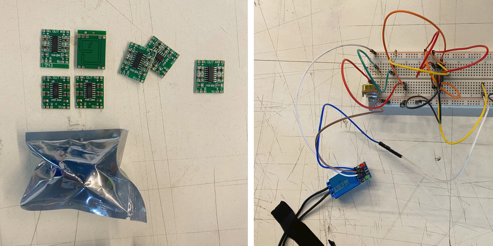
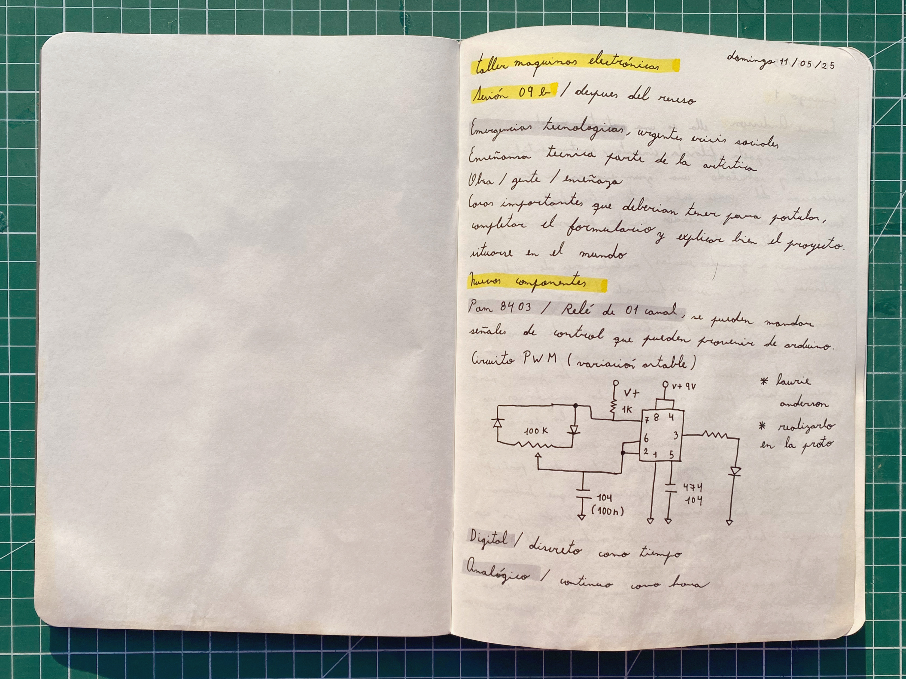
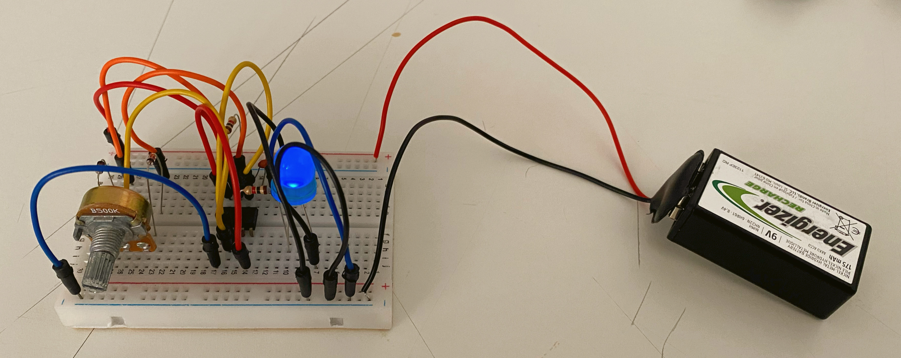
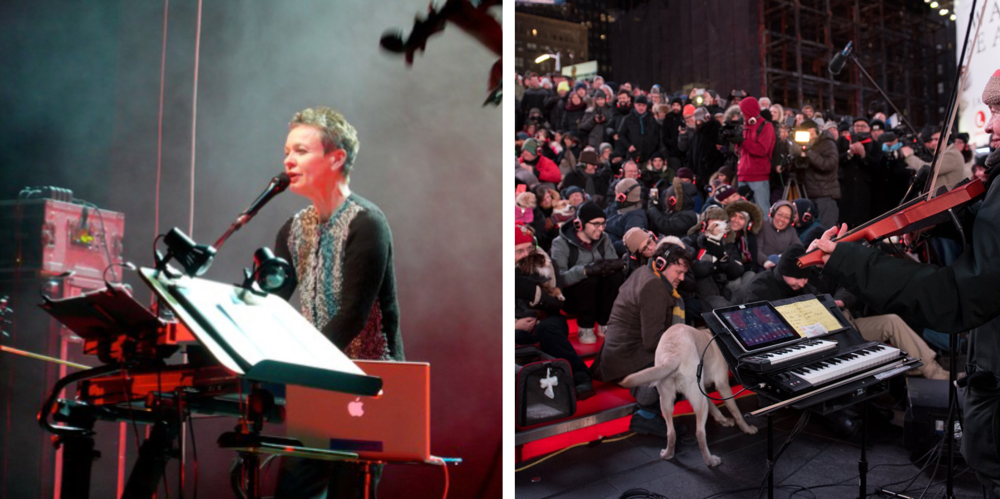
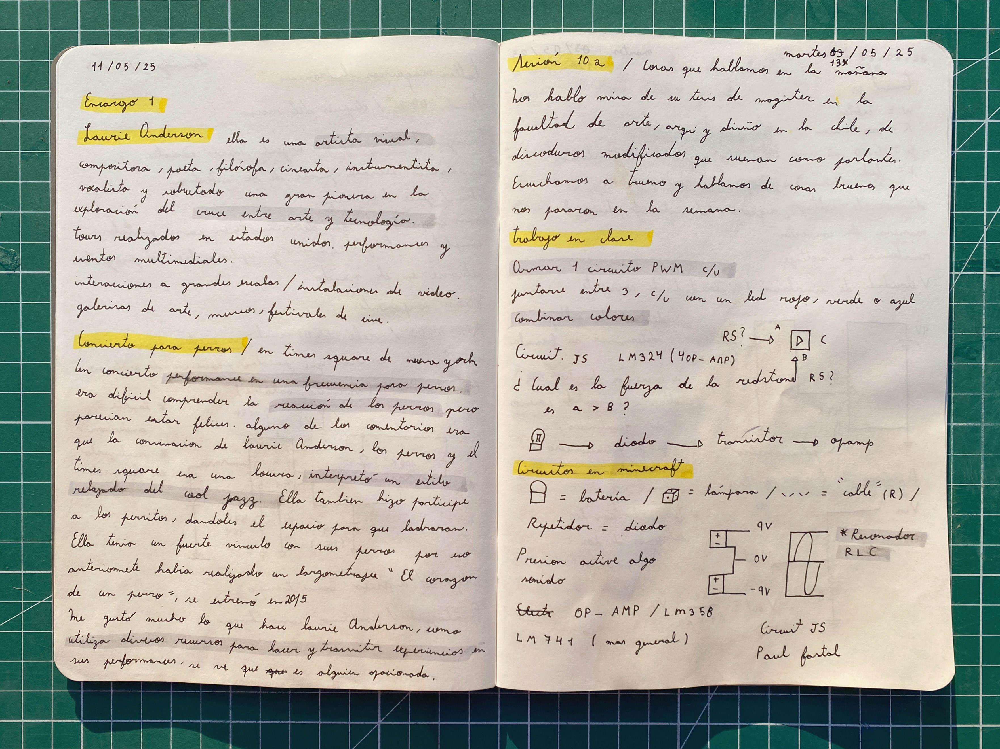

# sesion-09b

## Trabajo en clase / Viernes 09 de Mayo

### Cosas que conversamos en la mañana

- Emergencias tecnológicas, urgentes crisis sociales.
- Enseñanza técnica de la parte artística, obra, gente, enseñanzas.
- Cosas importantes que deberían tener para postular: completar el formulario y explicar bien el proyecto.
- Situarse en el mundo; nos mostraron unos rankings de universidades.

### Nuevos componentes

- PAM8403 y relé de 01 canal, se pueden mandar señales de control que pueden provenir de Arduino.
- Repasamos las configuraciones del 555, astables y monostables.
- Astable quiere decir que oscila de forma continua y presenta una señal periódica.
- Monostable funciona como temporizador, se mantiene en un estado hasta que es perturbado.
- Las salidas no necesariamente generan fenómenos, ya que también pueden usarse para crear avisos.
- Tenemos electrones que conducen a través de la materia; la materia la utilizamos para fabricar componentes como resistencias, capacitores, diodos y baterías; con estos componentes construimos circuitos astables, paralelos, APC y monostables; todo esto conforma nuestra caja negra.
- Diagrama de flujo, Misa nos contó que hizo un contador de botes, entonces tenemos el micrófono abajo del agua, seguidor de envolvente, tipo de pregunta IF, activa el contador, realmente activa una luz que activa un contador.

## Encargos

### Encargo-18: De tinkercad a protoboard

- Tomar el circuito que simulamos en Tinkercad y traspasarlo a la protoboard.

### Encargo-19: Cultura electrónica y Laurie Anderson

- Estudiar la obra de Laurie Anderson, incluir citas y referentes usados.
- Fuente <https://corpartes.cl/laurie-anderson-y-hsin-chien-huang/>
- Fuente <https://www.theguardian.com/music/2016/jan/05/laurie-anderson-music-dog-concert-times-square-new-york>
- Video visto de su Tiny Desk <https://youtu.be/ABjmQCxA7UU?si=ICaLvfyAoeu8RYAq>
- Video entrevista <https://youtu.be/dUo-dqMriY8?si=dYFoWuQjbEEcf1g->
- Laurie es una artista visual, compositora, poeta, filósofa, cineasta, instrumentista, vocalista y una pionera en la exploración del cruce entre arte y tecnología, y arte y feminismo.
- Ha realizado tours en Estados Unidos y otros países, con espectáculos que van desde performances simples hasta elaborados eventos multimediales.
- Sus proyectos incluyen interacciones a gran escala e instalaciones de video, creando obras que han sido exhibidas en prestigiosas galerías, museos, festivales de cine y programas de televisión a lo largo del mundo. Algunos de ellos son el MoMA, la Bienal de Venecia, la Bienal de Shanghái y el programa America’s Got Talent.
- Uno de sus proyectos más icónicos fue el concierto para perros que llevó a cabo en Times Square, Nueva York. Fue una performance especialmente pensada para canes, en la que interpretó un estilo relajado de cool jazz. Las reacciones de los perros eran difíciles de interpretar, pero muchos parecían estar felices, escuchando con atención. Laurie Anderson permitió que los perros formaran parte del concierto, dándoles espacio para ladrar y participar. La combinación de su música, los perros y el Times Square resultó en una experiencia artística única.
- "El arte de la performance trata de la alegría, de hacer algo tan lleno de una alegría salvaje que no se puede expresar con palabras." —Laurie Anderson.
- Me pareció muy bello su trabajo. Me encanta cómo utiliza diversos recursos para transmitir y crear experiencias en sus performances. Se nota que es una persona muy apasionada, y eso siempre será un gran referente para quienes buscan expresarse a través del arte.

Fuente <https://www.clarin.com/2022/04/30/iKzP83wTD_720x0__1>

Fuente <https://i.guim.co.uk/img/media/12dc6de1b8d76fdf8c32a349d6bd4ae487d405ad/0_203_2999_1800/master/2999.jpg?width=1200&height=1200&quality=85&auto=format&fit=crop&s=ad23c5198a6a76f83541d3540e1be797>

