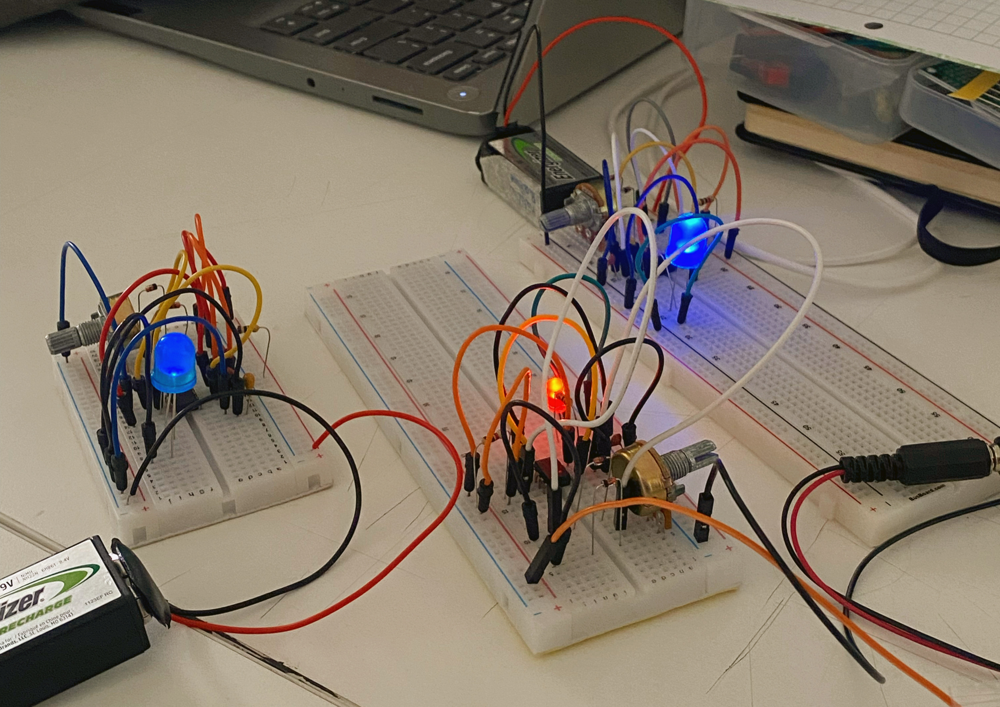
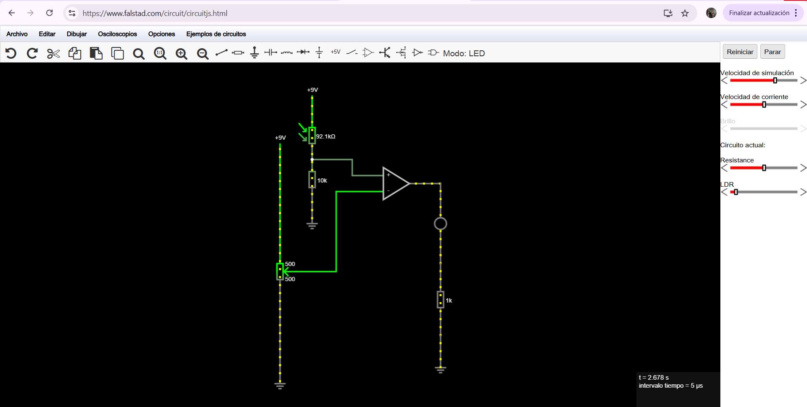
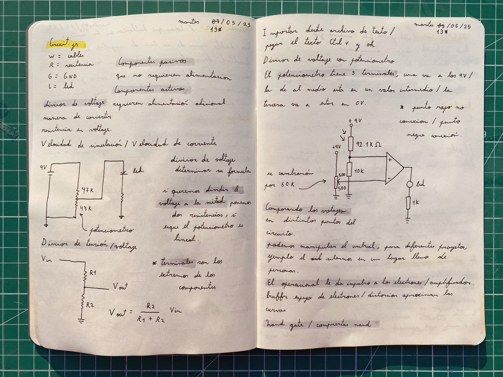
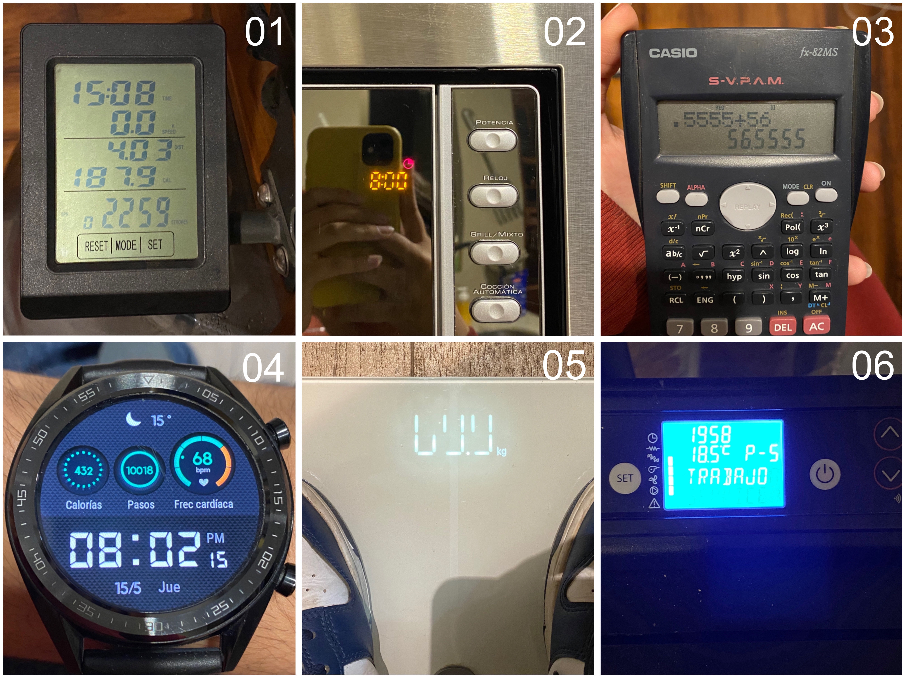
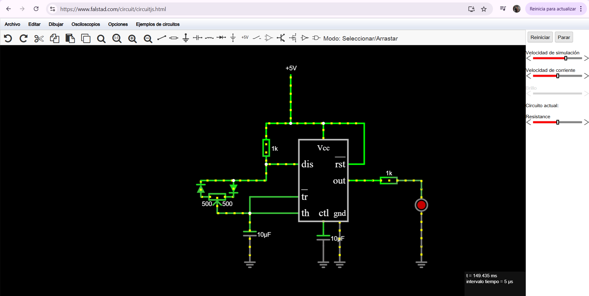

# sesion-10a

## Trabajo en clase / Martes 13 de Mayo

### Cosas que hablamos en la mañana

- Conversamos con Misa sobre su tesis de magíster que va a presentar en la Facultad de Arte, Arquitectura y Diseño de la Universidad de Chile, donde modificó discos duros para que sonaran como parlantes.
- Conversamos sobre cosas buenas que nos hayan pasado en el fin de semana; también hablamos y escuchamos a Trueno.

### Circuito PWM

- La modulación por ancho de pulsos (Pulse Width Modulation, PWM) de una señal es una técnica en la que se modifica el ciclo de trabajo de una señal periódica para controlar la cantidad de energía que se envía a una carga.
- Fuente <https://www.facilelectro.es/que-es-el-pwm-y-como-funciona/>
- Armar un circuito PWM por persona y juntarse entre tres, utilizando colores diferentes: LED rojo, verde y azul, para luego probar cómo se mezclan los colores bajo un papel.
- El color azul no logra apreciarse tan bien, ya que no alcanza su máxima luminosidad. Hay que bajarle la resistencia para que pase más corriente y por tanto, brille más.

### Circuitos en Minecraft y Falstad

- Si trasladamos los componentes electrónicos y los convertimos en elementos de Minecraft, la batería podría ser un bloque de redstone o una palanca; el LED podría ser una lámpara de redstone; los cables serían polvo de redstone, y el diodo, un repetidor de redstone.
- El redstone compara cuánta redstone hay en una parte con la de al lado, se "pregunta" cuál es la fuerza de la señal de redstone y según eso, decide si deja pasar la señal o no.
- Realizamos una simulación de circuito en <https://www.falstad.com/circuit/circuitjs.html>
- Vimos divisores de voltaje, que son una manera de convertir resistencias en voltaje, dividiendo su valor. Si queremos dividir el voltaje a la mitad, ponemos dos resistencias del mismo valor, siempre que el potenciómetro sea lineal.
- El potenciómetro tiene tres terminales: un extremo va a los 9 voltios, el otro extremo a los 0 voltios, y el terminal del centro entrega un voltaje intermedio.
- Con estos umbrales podemos crear proyectos que actúen en función de ellos y que dependan del contexto. También nos ayuda poder manipular esos umbrales. Por ejemplo, un circuito que se active cuando el espacio se encuentre en silencio, pero si está en un lugar lleno de gente donde el silencio no es el mismo, entonces el umbral se modifica.
- El operacional le da impulso a los electrones; funciona como un buffer, un espejo de electrones.

## Encargos

### ¿Por qué quedan de un color los píxeles en la tele?

- Existen dos tipos de errores: un píxel atascado (stuck pixel) muestra un color constante, y un píxel muerto (dead pixel) muestra un punto oscuro.
- Los píxeles muertos no afectan la funcionalidad general de la pantalla.
- Puede ocurrir por presión física o golpes, por desgaste con el tiempo, por algún cambio de temperatura y humedad, por algún problema de circuitos o fallos de fabricación.
- A primera vista, es difícil de reconocer, pero existen pruebas en las que los colores van cambiando y es posible ver con más claridad si hay algún punto diferente.
- Video de referencia <https://youtu.be/1Cgt_kG08Ls?si=Jb3A7WWmReN7_6mm>
- Fuente <https://www.whitescreen.org/es/reparar-prueba-de-pixeles-muertos/#google_vignette>

### Encargo-20: Pantallas de siete segmentos

- Subir fotos de su propia autoría de pantallas de siete segmentos y otras variantes que encuentren en su vida cotidiana.
- 01 es la pantalla de una máquina remadora, e indica la fuerza que se ejerce.
- 02 es la pantalla de un microondas, e indica la hora y el temporizador.
- 03 es la pantalla de una calculadora y muestra los resultados.
- 04 este es un reloj digital. Yo creo que no cuenta, pero al menos sigue el mismo lenguaje.
- 05 es una báscula digital y indica el peso.
- 06 esta es la pantalla de una estufa a pellet e indica la hora y la temperatura.

### Encargo-21 :Simulación de circuitos con 555 y/o comparadores hechos con opamps en Falstad

- Simular circuitos que hemos visto en clase con chips 555, usando el simulador de Falstad.

