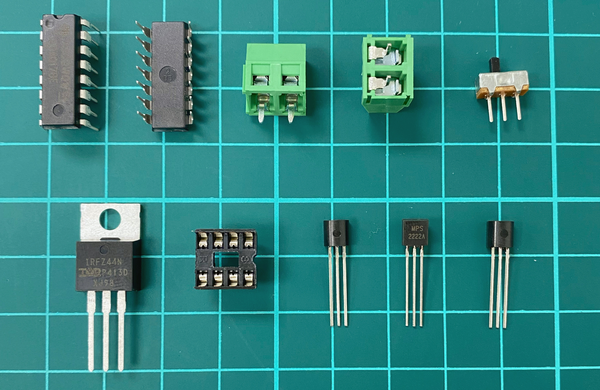
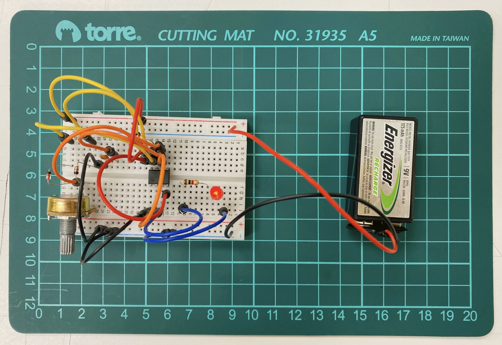
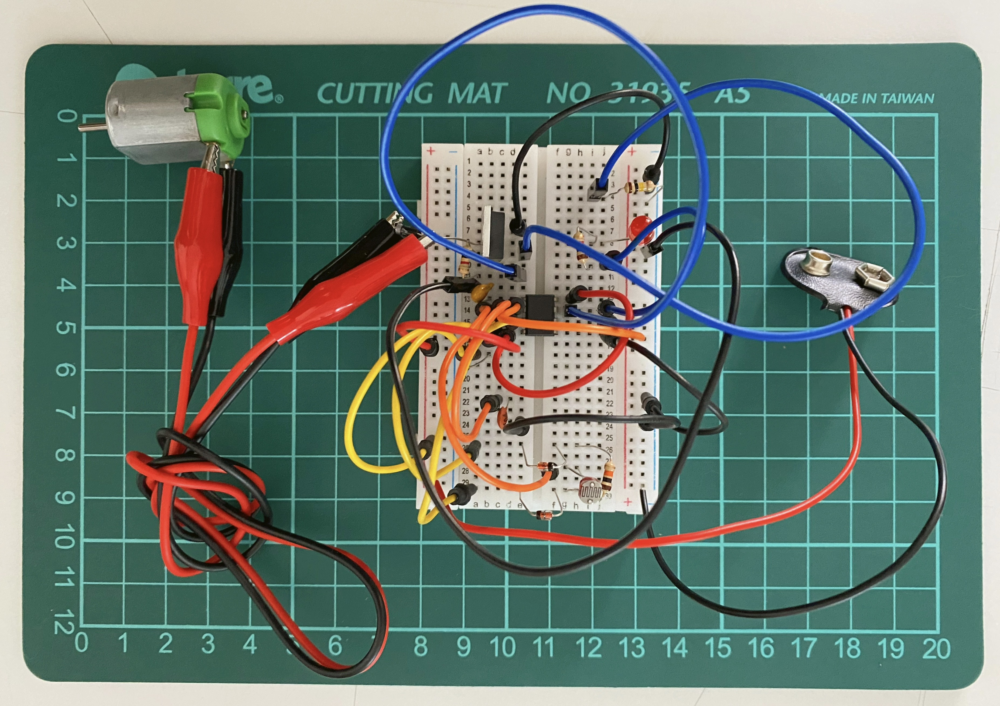
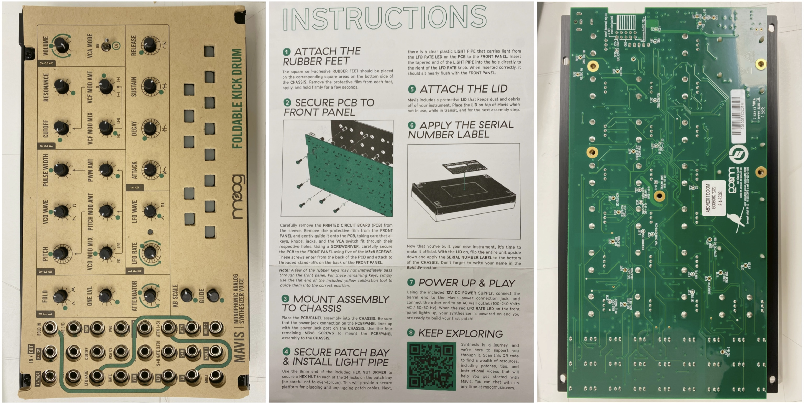

# sesion-11a

## Trabajo en clase / Martes 20 de Mayo

### Cosas que hablamos en la mañana

- Misa nos contó su primera experiencia en un concierto de arte electrónico, que consistía en arrastrar objetos.
- Centro Cultural de España
- Poeta sonoro, Vicente Huidobro, libro Altazor.
- Ursonate de Kurt Schwitters <https://youtu.be/rs0yapSIRmM?si=aofZW6TIdwVUOGRD>
- Movimiento dadaísta, cuestionaba los valores tradicionales del arte y la lógica.
- Alfabeto fonético, uso por fonoaudiólogo.
- MUSIC 6 1 2024 <https://www.youtube.com/watch?v=tO4WYX424rw>
- Patch and tweak <https://www.patchandtweak.com/>
- Caterina Barbieri, compositora italiana
- Patterns of concern
- object oriented conceps
- Filosofía del arte y estética <https://discordapp.com/channels/1259953568446808144/1318882679659171892/1374450801929355316>

### Nuevos componentes y circuitos

- Componentes: R, C, IC, D, POT, PS (Power Supply), GND, OP AMP, RELÉ, LDR, PROTO, SOLDAR, ESTAÑO (Sn), CAUÍN, PCB, Perfboard, Silicio, Cobre
- Circuito: APC (Astable, Monostable), PWM, Astable, Monostable
- Aplicaciones: APC, LED Dimmer, On/Off, Synth con R. Exp, Udpudu
- Vamos a implementar un motor de corriente continua al circuito PWM

### Proyecto 02

- La evaluación va a ser la primera semana de julio.
- ¿Cómo vincular nuestros adquiridos conocimientos de electrónica para una propuesta en nuestro examen?
- Buscar referentes de arte electrónico.
- Zimoun, Sound istallations sound y sound sculptures <https://youtu.be/VAzObWw4ezo?si=OfJamdn4g_1E4f5l>
- Oskitone, sintetizador DIY polifónico analógico de código abierto <https://musictech.com/news/oskitone-scout-is-an-open-source-synth-that-you-can-build-and-hack/>
- Para hacer arte tienen que ser muchos circuitos, gigantes y rojos o blanco y negro (es broma).
- Regleta eléctrica.

insertar foto de bitacora*

## Encargo

- No hay encargo por semana de solemnes.
- Próxima clase: traer powerbank o transformador USB-A y un cable con USB-A por un extremo para romper.
