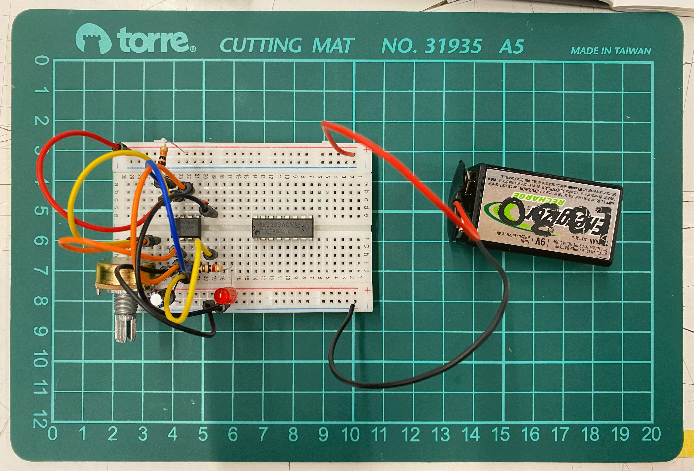
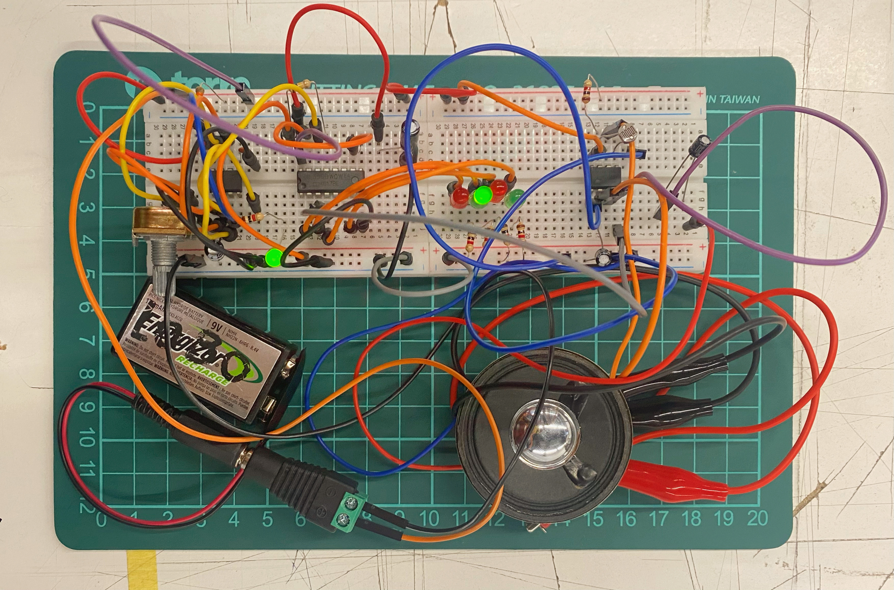

# sesion-11b

## Trabajo en clase / Viernes 23 de Mayo

### Cosas que hablamos en la mañana

- Hablamos de lo que está pasando con Harvard y en Estados Unidos en general, ya que están expulsando a todos los extranjeros de la universidad por las nuevas leyes de Trump.
- Hail to the Thief, Radiohead
- Video Radioheard there there <https://youtu.be/N19sz20EYpw?si=vnvCaswkuZnkHjJl>

### Circuito secuenciador con 4017 y 555

- Circuito electrónico con el chip secuenciador 4017. El chip 4017 tiene 16 patillas y puede contar hasta diez pulsos, luego vuelve a comenzar.
- Señales de reloj (clock) y reinicio (reset): CLK y RST.
- Se envían pulsos a una frecuencia determinada mediante el chip 555 configurado en modo astable.
- Tenía cuatro luces que se iban alternando; al llegar a la primera, sonaba el speaker. El sonido era muy interesante y se podían hacer muchas variaciones al circuito.
- No pueden prenderse y sonar dos al mismo tiempo.
- Diagrama de flujo.

