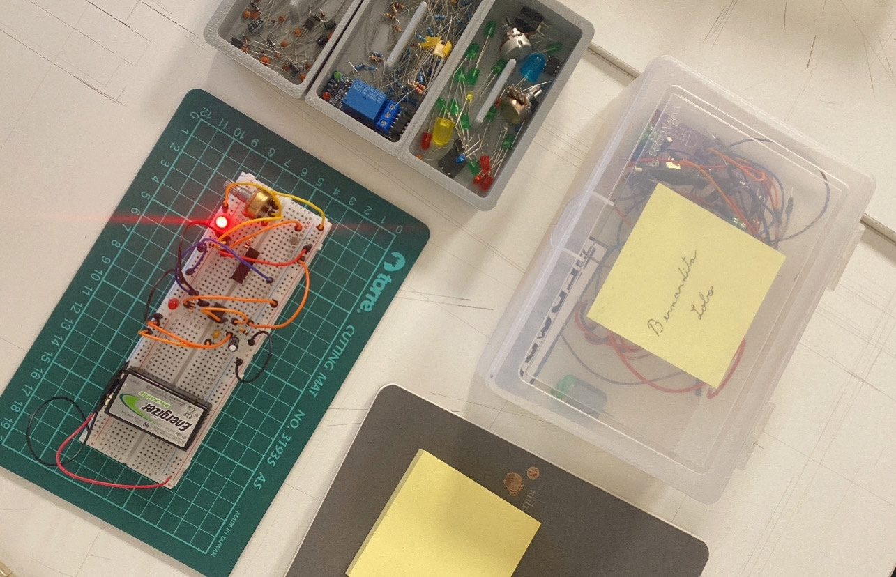
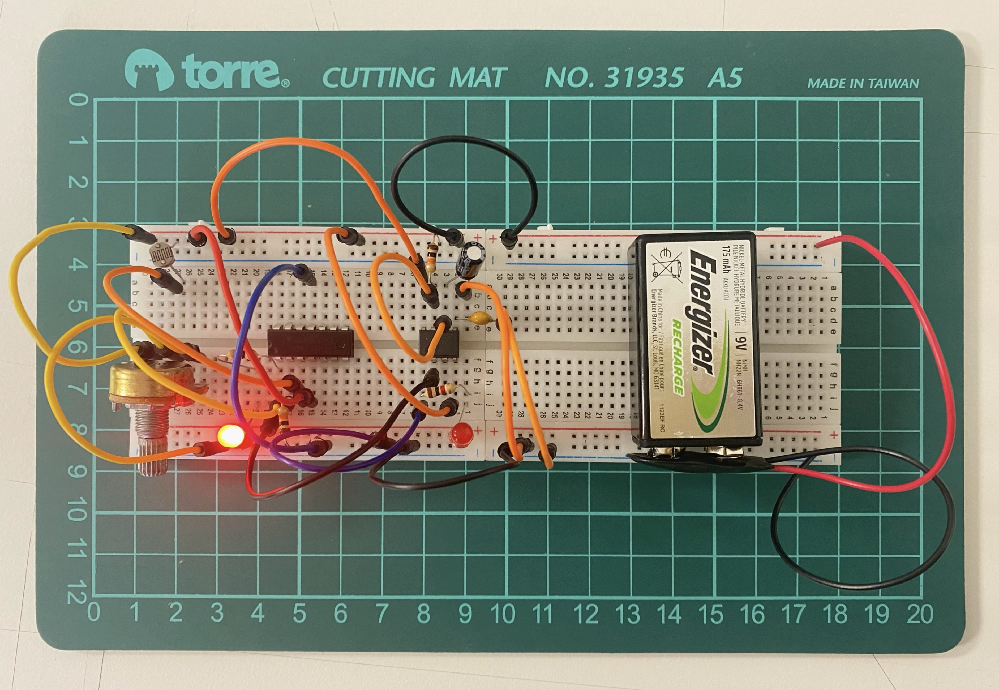
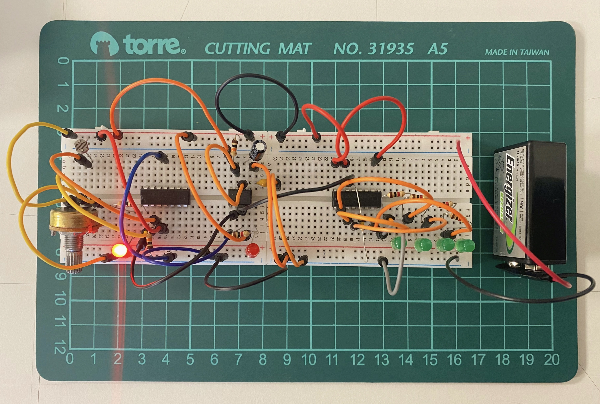

# sesion-12a

## Trabajo en clase / Martes 27 de Mayo

### Cosas que hablamos en la mañana

- Hablamos de cosas que hicimos en la semana. Fue el Día del Patrimonio, por lo tanto muchos museos y paseos patrimoniales abrieron al público.
- Yo al menos no pude ir a ninguna exposición, pero Misa nos contó que, al parecer, se desvirtuó un poco el objetivo, y que la gente solo iba por las cosas gratis jaja.
- Nos preguntamos: ¿todo lo antiguo es patrimonio?

### Circuito con secuenciador

- Retomamos el circuito con el chip secuenciador 4017 y el chip 555 que hicimos la semana pasada.
- El circuito envía pulsos con distintas frecuencias.
- ¿Cómo podríamos hacer que nuestro circuito varíe los tiempos, como en los semáforos?
- Amarillo: 4 segundos, rojo: 6 segundos, verde: 6 segundos.
- Circuito detector de sombra, indica cuando el LDR no percibe luz.
- Esquemáticos divididos en primera etapa, segunda etapa y tercera etapa.

### Chip 4017 y lógica digital

- Documento con las características del chip 4017.
- Diagrama de tiempo y diagrama de lógica.
- Condicionales y George Boole.
- Libro The Mathematical Analysis of Logic.
- Además, repasamos cómo subir fotos a GitHub: cargar las fotos en archivos y luego agregar el texto para que aparezca la imagen.

