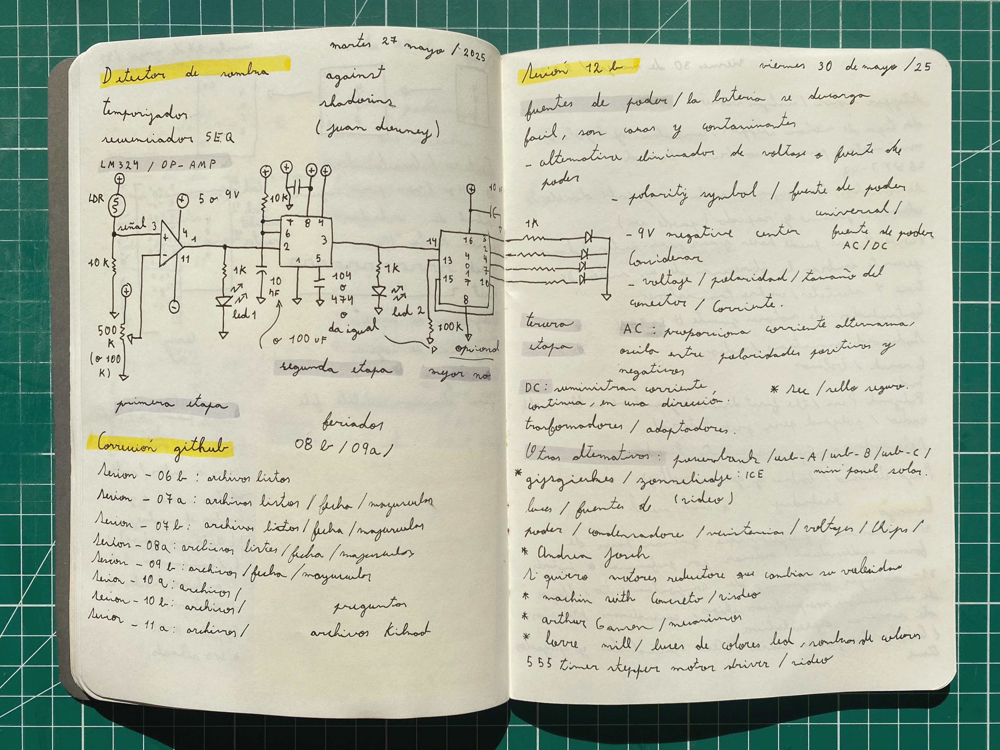

# sesion-12b

## Trabajo en clase / Viernes 30 de Mayo

### Cosas que hablamos en la mañana

- Cristian Oyarzún, artista y programador. Arte y tecnología, arte de internet y Photoshop
- Elementos de diseño de Web 1.0, Web 2.0: aparecieron obras (investigar)
- RSS Feed / Inicio personalizado en el usuario
- Net Art: diagrama de cómo funciona el Net Art, entre dos computadoras está el arte
- Olia Lialina, Summer (demasiado cool)
- Problema del año 2000, fin del mundo y computadoras
- Bienal de Artes Mediales / Drum Circle
- Tutupá
- General MIDI Showdown: instrumento virtual, sonido dosmilero / VST (Virtual Studio Instrument)
- Documental en Netflix: Joshua: Teenager vs. Superpower
- Web 3.0 / Web Ring: comunidad de sitios web; antes eran sitios web amateurs y ahora es algo poco común
- Twitter Tear Gas / libro
- Primavera Hacker
- Wafaa Bilal, Domestic Tension
- WeiweiCam
- Diseño especulativo

## Encargos

### Idea 01

- Un circuito con un motor que sostenga algún elemento que asemeje a la naturaleza (o directamente algo de la naturaleza, como una flor) y que se esté moviendo constantemente, como si tuviera vida, hasta que se emita un sonido en el espacio y se detenga.

- El motor se pone en movimiento > se emite un sonido > el motor se detiene > el sonido se detiene > el motor vuelve a ponerse en movimiento.

Fuente <https://proyectoidis.org/zimoun/>

### Idea 02

- Un circuito con un LDR y un speaker que suene indicando cuando no reciba luz. En este caso iría junto a una planta, como si la planta estuviera gritando que quiere luz.

- Se va la luz > el speaker y el LED se encienden > vuelve la luz > el speaker y el LED se mantienen apagados.

### Idea 03

- Un circuito con un motor que sostenga algún elemento que se asemeje a la naturaleza (o directamente algo de la naturaleza, como una flor) y que active el motor en cuanto le llegue luz.

- Motor detenido > le llega luz > el motor se pone en movimiento > se detiene la luz > el motor se detenido.
