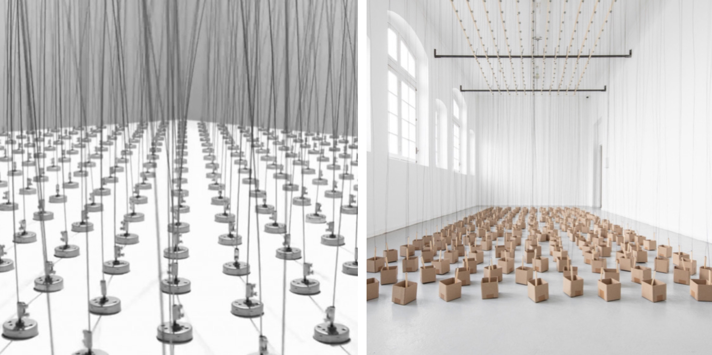
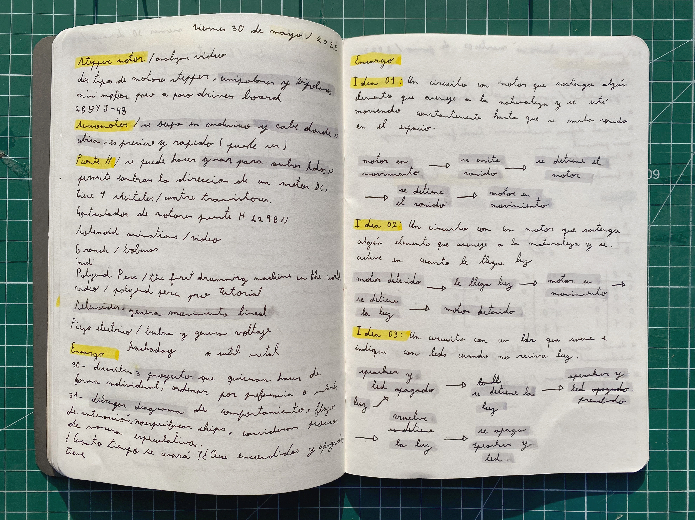

# sesion-12b

## Trabajo en clase / Viernes 30 de Mayo

### Cosas que hablamos en la mañana

- Cristian Oyarzún, artista y programador. Arte y tecnología, arte de internet y Photoshop
- Elementos de diseño de Web 1.0, Web 2.0: aparecieron obras (investigar)
- Web Ring: comunidad de sitios web; antes eran sitios web amateurs y ahora es algo poco común
- RSS Feed / Inicio personalizado en el usuario
- Net Art: diagrama de cómo funciona el Net Art, entre dos computadoras está el arte
- Problema del año 2000, fin del mundo y computadoras

### Referentes para los proyectos

- Bienal de Artes Mediales / Drum Circle
- Tutupá
- General MIDI Showdown: instrumento virtual, sonido dosmilero / VST (Virtual Studio Instrument)
- Documental en Netflix: Joshua: Teenager vs. Superpower
- Olia Lialina, Summer (demasiado cool)
- Libro Twitter Tear Gas <https://es.wikipedia.org/wiki/Twitter_and_tear_gas>
- Primavera Hacker <https://phacker.org/>
- Wafaa Bilal, Domestic Tension <https://wafaabilal.com/domestic-tension/>
- WeiweiCam <https://actipedia.org/project/weiweicam>
- Diseño especulativo

### Fuentes de poder

- Baterías de 9 V
- Fuente de poder AC/DC
- Power bank: USB-A, USB-B
- USB-C es un  poco mas complejo
- Micro pantallas solares
- Pilas de 1.5 V
- Pilas para reloj de 3 V
- Voltajes: 4.5 V, 5 V, 7 V, 9 V, 12 V, 15 V, 18 V, 25 V
- Polaridad y dimensiones físicas

### LEDs

- LEDs
- Ampolletas domésticas
- LEDs de 3 W
- Tiras LED programables

### Motores

- Motores DC 6 V
- Motores DC (genéricos)
- Motor paso a paso

### Transistores

- Bipolar: 2n2222
- MOSFET: IRFZ44n

### Sonido

- Parlantes activos
- Parlantes pasivos
- Buzzers
- Reproductor de audio
- Micrófonos
- piezo eléctrico

## Encargos

### Encargo-24: Proyectos de máquinas electrónicas

- Describir de forma textual 3 proyectos de máquinas electrónicas que quieran hacer de forma individual, ordenar por preferencia o interés de que sea desarrollado.

- Idea 01 Circuito interactivo, naturaleza sensible al sonido: El circuito estará diseñado para mantener el motor en funcionamiento continuo mientras no haya ruido en el ambiente. Cuando se detecta un sonido (a través de un micrófono o sensor de sonido), el sistema reaccionará y detendrá el motor, como si la "vida" del objeto se interrumpiera por el ruido, creando un contraste entre lo orgánico y lo tecnológico.

- Idea 02 Fotosíntesis sonora: Este circuito se colocará junto a una planta, de modo que cuando la planta quede en la sombra o en oscuridad, el sistema “grite” simbólicamente, como una forma de expresar que necesita luz para vivir. La planta se convierte en una especie de entidad comunicadora, alertando a través de una señal sonora.

- Idea 03: un poco parecido al primer proyecto, el circuito con un motor que sostenga algún elemento que se asemeje a la naturaleza (o directamente algo de la naturaleza, como una flor) y el motor se activa cuando un LDR detecta la presencia de luz, generando movimiento.

### Referentes

Fuente <https://artishockrevista.com/wp-content/uploads/2020/01/Zimoun-2019-297-2330.jpg>

Fuente <https://proyectoidis.org/zimoun/>

### Encargo-25: Dibujar diagrama de comportamiento

- Dibujar diagrama de comportamiento, flujos de interacción. No específicar chips. Considerar procesos de manera especulativa. ¿Cuánto tiempo se usará? ¿Qué encendidos y apagados tiene? ¿Cómo se interactúa?

- Idea 01 Naturaleza sensible al sonido: El motor se pone en movimiento > se emite un sonido > el motor se detiene > el sonido se detiene > el motor vuelve a ponerse en movimiento.

- Idea 02 Fotosíntesis sonora: Se va la luz > el speaker y el LED se encienden > vuelve la luz > el speaker y el LED se mantienen apagados.

- Idea 03: Motor detenido > le llega luz > el motor se pone en movimiento > se detiene la luz > el motor se detenido.

