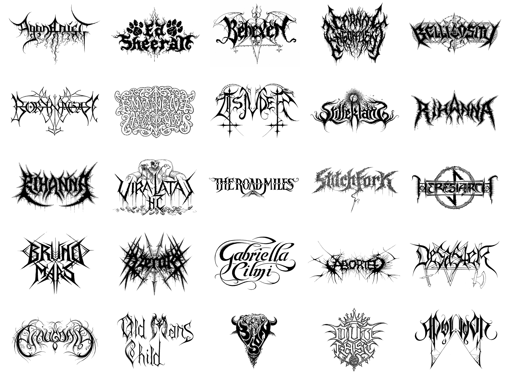
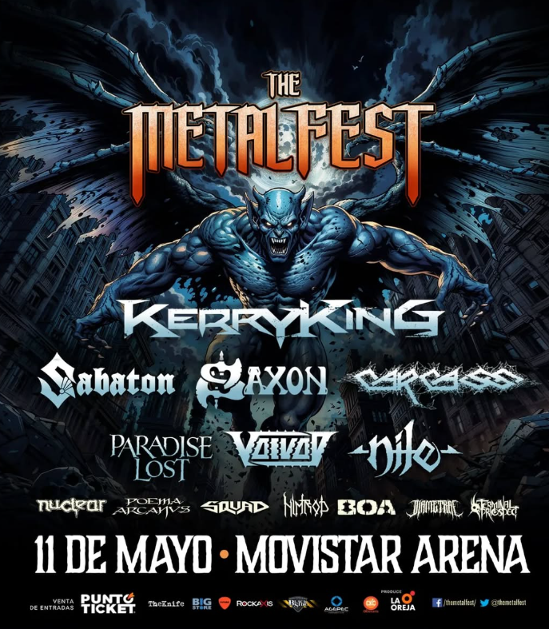
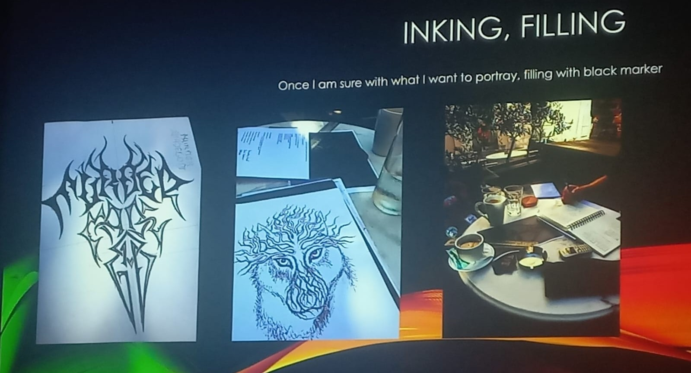

# sesion-09b

## Primer bloque
- Los profes nos comentaron que Christophe Szpajdel "Lord of the Logos", dariá una charla en la facultad de derecho. Este es conocido por diseñar logotipos para bandas de black y death metal.
  
- Configuración - Modos de 555 - ASTABE = oscilación - MONOSTABLE = timer

- MIC HIDROFONO: Los hidrófonos convierten ondas sonoras en señales eléctricas para captar sonidos bajo el agua, útiles en investigación, monitoreo de fauna marina y vigilancia submarina.
- POWER SUPPLY

## Segundo bloque
- Junto a algunos compañeros asistimos a la charla de Christophe Szpajdel.
- Me perdí la clase, pero colocare cosas de la charla

## The lord the of logos
### Christophe Szpajdel.

Desde hace años que me ha gustado escuchar música rock, especialmente géneros como el metal y el heavy metal. Desde hace tiempo, algo que siempre ha captado mi atención es el estilo tan particular de los logos que usan muchas de estas bandas. La mayoría de ellos son complejos, extraños, difíciles de leer e incluso grotescos, pero al mismo tiempo resultan fascinantes y únicos. Me preguntaba por qué este tipo de estética visual es tan común dentro del metal.

Aprovechando que "The Lord of the Logos" venía de visita a dar una charla en la universidad, no quise perder la oportunidad de asistir. Aproveche para entender el significado y la intención detrás de estos logos tan característicos. Gracias a su charla, pude entender que estos diseños no son solo una cuestión estética, sino que también reflejan la identidad, el tono y la filosofía de cada banda. Suelen comunicar fuerza, oscuridad, caos o rebeldía, valores muy presentes en el metal, y en muchos casos, el hecho de que sean ilegibles no es un error, sino una declaración de pertenencia a una subcultura específica.

La visita de Christophe Szpajdel a Chile fue parte de la celebración del Metal Fest Chile 2025, un evento que se llevó a cabo el domingo 11 de abril, donde se presentaron diversos grupos de renombre del género. Aunque no estuvieron muchas de las grandes bandas, el evento contó con un buen repertorio que permitió disfrutar de una gran jornada. Aprovechando la ocasión, la universidad lo invitó a ofrecer su charla.

Fue la primera vez que Szpajdel visitó Chile, y me sorprendió gratamente escuchar que habló en español con bastante fluidez. Casi toda la charla fue en español, lo que reflejó su amplia trayectoria y experiencia. Nos compartió que, al trabajar con bandas de diversas partes del mundo, es esencial poder comunicarse en el idioma de sus clientes para entender mejor lo que buscan y ofrecer un trabajo adecuado.

Uno de los aspectos más interesantes de su charla fue su proceso creativo. A muchas bandas, cuando les realiza sus logotipos, les pide escuchar sus tracks o álbumes. Esto le permite conectar más profundamente con la esencia de la banda y crear un diseño que resuene con su música, haciendo que el logo sea aún más representativo y auténtico.

En cuanto al diseño de logotipos, Szpajdel explicó que la función principal de un logo es distinguirse y ser diferente. Un buen logotipo debe ser simple y visual, pero debe capturar la esencia de la banda de manera clara y poderosa. Esto ha hecho que sus diseños sean muy valorados en la escena del metal y en subculturas relacionadas.

Una anécdota interesante fue que uno de sus primeros logotipos, Epitaph (1989), fue inspirado directamente por la banda chilena Sadism, lo que refleja su conexión con la escena metalera de Latinoamérica.

Szpajdel también compartió lo que lo inspira en su trabajo: la naturaleza, la fauna, los animales, elementos históricos y los panteones de diversas culturas. También mencionó su fascinación por la tradición japonesa. Abordó la noción del tiempo en sus diseños, combinando elementos antiguos y prehistóricos con toques futuristas y sofisticados, lo que da como resultado logotipos atemporales que representan tanto el presente como la esencia eterna de las bandas.

Mostró parte de su proceso de trabajo y explicó cómo se comunica con las personas que solicitan sus diseños, destacando que prefiere mil veces trabajar con alguien que demuestra interés por lo que él hace, en lugar de quien solo busca que le haga una 'peguita' rápida y le pague sin involucrarse.

En sí, la charla estuvo muy buena. Christophe fue bastante comunicativo con el público y se mostró cercano en todo momento. Sin embargo, hubo un par de cosas que me descolocaron un poco. Por un lado, se notaba que la tecnología lo ha superado un poco: mencionó que trabaja con diseñadores gráficos que se encargan de digitalizar y vectorizar sus diseños. Yo pensaba que, dado su apodo de "The Lord of the Logos", dominaba completamente todas las etapas del proceso gráfico en distintos formatos. Por otro lado, la presentación que utilizó era una plantilla genérica de PowerPoint, lo cual se sintió un poco simple o poco acorde a su figura artística. No es algo grave, pero esperaba una puesta en escena visual más representativa de su estilo.

A pesar de esos detalles, fue muy enriquecedor escuchar a un referente como Szpajdel. Me dejó claro que el diseño, incluso desde lo oscuro o grotesco, puede ser una forma poderosa de comunicar identidad y conectar con la esencia de la música.

## encargo-18: de tinkercad a protoboard
les pedimos que por favor tomen el circuito que simulamos en tinkercad y lo traspasen a su protoboard, usando los componentes que tienen en su kit de materiales.

## encargo-19: cultura electrónica y laurie anderson
estudiar la obra de laurie anderson, incluir citas y referentes usados, explicar qué y por qué les gusta o no de su trabajo.
ALBUM escuchado: Big Science.

De entrada para este encargo comence escuchando "Big science", este es el album con el cual hace su debut. 

